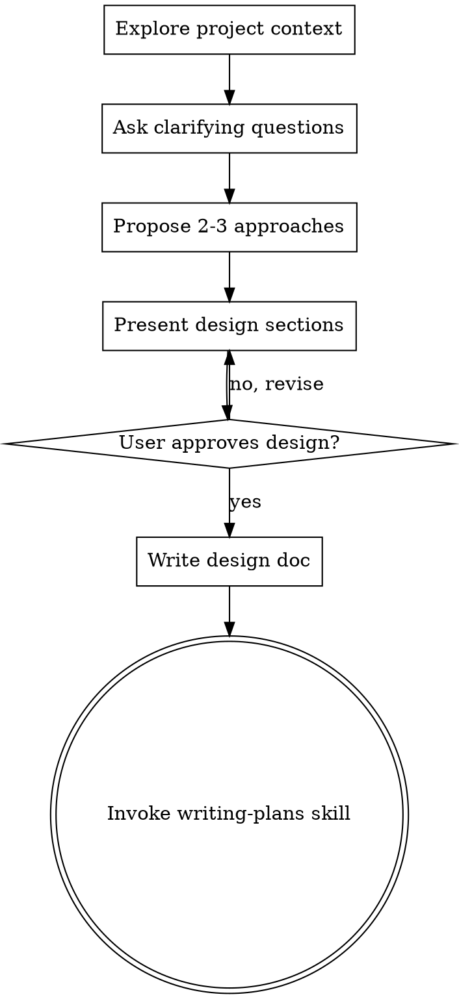

# Brainstorming Ideas Into Designs

## Overview

Help turn ideas into fully formed designs and specs through natural collaborative dialogue.

Start by understanding the current project context, then ask questions one at a time to refine the idea. Once you understand what you're building, present the design and get user approval.

<HARD-GATE>
Do NOT invoke any implementation skill, write any code, scaffold any project, or take any implementation action until you have presented a design and the user has approved it. This applies to EVERY project regardless of perceived simplicity.
</HARD-GATE>

## Anti-Pattern: "This Is Too Simple To Need A Design"

Every project goes through this process. A todo list, a single-function utility, a config change — all of them. "Simple" projects are where unexamined assumptions cause the most wasted work. The design can be short (a few sentences for truly simple projects), but you MUST present it and get approval.

## 기존 프로젝트 변경 시 (Change Request)

새 프로젝트가 아니라 기존 프로젝트의 기능 변경인 경우 (예: 이메일 로그인 → 소셜 로그인), 프로세스를 조정한다:

1. **영향 범위 분석** — 변경이 영향을 미치는 화면/문서를 모두 파악한다. 직접 변경 대상뿐 아니라 연쇄적으로 영향받는 화면도 식별한다.
2. **기존 문서 읽기** — 관련 UI 스펙, 디자인 시스템, 기획 문서를 먼저 읽는다.
3. **변경 전/후 비교** — 현재 플로우와 변경 후 플로우를 명확히 대비하여 제시한다.
4. **2-3 접근법 제안** — 동일하게 적용.
5. **설계 문서 작성** — `docs/plans/YYYY-MM-DD-<topic>-design.md`에 저장.

영향 범위 분석 예시:
- 로그인 방식 변경 → 로그인 화면 + 회원가입 화면 + 관련 API 모두 변경 필요
- 역할 추가 → 홈 화면 + 네비게이션 + 권한 관리 모두 변경 필요

## Checklist

You MUST create a task for each of these items and complete them in order:

1. **Explore project context** — check files, docs, recent commits
2. **Ask clarifying questions** — one at a time, understand purpose/constraints/success criteria
3. **Propose 2-3 approaches** — with trade-offs and your recommendation
4. **Present design** — in sections scaled to their complexity, get user approval after each section
5. **Write design doc** — save to `docs/plans/YYYY-MM-DD-<topic>-design.md` and commit
6. **Transition to implementation** — invoke writing-plans skill to create implementation plan

## Process Flow

**Terminal state:**
- **코드 구현이 필요한 경우** → writing-plans 스킬을 호출한다.
- **디자인/스펙 변경만 필요한 경우** (Pencil 디자인, UI 스펙 수정 등) → 설계 문서 작성 후 바로 변경 작업을 진행한다. writing-plans 호출은 불필요하다.

## The Process

**Understanding the idea:**
- Check out the current project state first (files, docs, recent commits)
- Ask questions one at a time to refine the idea
- Prefer multiple choice questions when possible, but open-ended is fine too
- Only one question per message - if a topic needs more exploration, break it into multiple questions
- Focus on understanding: purpose, constraints, success criteria

**Exploring approaches:**
- Propose 2-3 different approaches with trade-offs
- Present options conversationally with your recommendation and reasoning
- Lead with your recommended option and explain why

**Presenting the design:**
- Once you believe you understand what you're building, present the design
- Scale each section to its complexity: a few sentences if straightforward, up to 200-300 words if nuanced
- Ask after each section whether it looks right so far
- Cover: architecture, components, data flow, error handling, testing
- Be ready to go back and clarify if something doesn't make sense

## After the Design

**Documentation:**
- Write the validated design to `docs/plans/YYYY-MM-DD-<topic>-design.md`
- Use elements-of-style:writing-clearly-and-concisely skill if available
- Commit the design document to git

**Implementation:**
- 코드 구현이 필요한 경우: writing-plans 스킬을 호출하여 구현 계획을 생성한다.
- 디자인/스펙 변경만 필요한 경우: 설계 문서 커밋 후 바로 UI 스펙 수정, Pencil 디자인 반영 등을 진행한다.

## Key Principles

- **One question at a time** - Don't overwhelm with multiple questions
- **Multiple choice preferred** - Easier to answer than open-ended when possible
- **YAGNI ruthlessly** - Remove unnecessary features from all designs
- **Explore alternatives** - Always propose 2-3 approaches before settling
- **Incremental validation** - Present design, get approval before moving on
- **Be flexible** - Go back and clarify when something doesn't make sense
