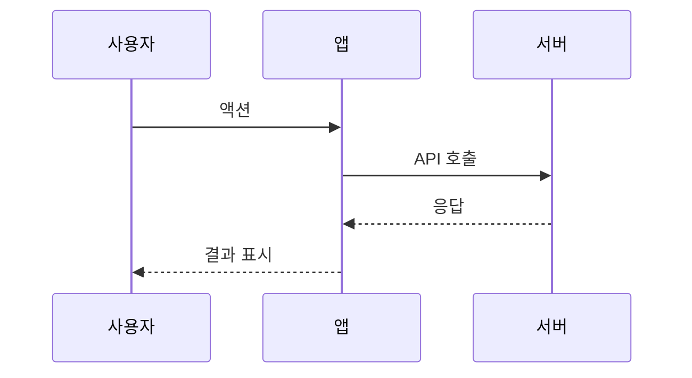

# 유스케이스: UC-{N} {제목}

## 1. 개요

### 1.1 목적
[이 유스케이스가 달성하고자 하는 목표]

### 1.2 범위
- **포함**: [다루는 기능]
- **제외**: [다루지 않는 기능]

### 1.3 액터
- **주요 액터**: [유스케이스를 시작하는 주체]
- **부 액터**: [실행에 참여하는 다른 주체 — 시스템, 외부 서비스 등]

---

## 2. 선행 조건

- [조건 1]
- [조건 2]

---

## 3. 기본 흐름

### 3.1 단계별 흐름

1. **[액터/컴포넌트]**: [액션]
   - **입력**: [필요한 입력값]
   - **처리**: [수행되는 로직]
   - **출력**: [생성되는 결과]

2. **[액터/컴포넌트]**: [액션]
   - ...

### 3.2 시퀀스 다이어그램

---

## 4. 대안 흐름

### 4.1 [대안 시나리오명]

**분기 조건**: [기본 흐름의 어느 시점에서 분기되는지]

1. ...
2. ...

**결과**: [최종 상태]

---

## 5. 예외 흐름

### 5.1 [예외 시나리오명]

**발생 조건**: [예외가 발생하는 상황]

**처리**:
1. ...
2. ...

**에러 코드**: `ERROR_CODE` (HTTP 상태 코드)
**사용자 메시지**: "[사용자에게 표시되는 메시지]"

---

## 6. 후행 조건

### 6.1 성공 시
- **DB 변경**: [어떤 테이블에 어떤 변경]
- **시스템 상태**: [최종 상태]
- **부수 효과**: [Push 알림, 이메일 등]

### 6.2 실패 시
- **롤백**: [어떤 데이터가 롤백되는지]
- **시스템 상태**: [실패 시 상태]

---

## 7. 테스트 시나리오

### 7.1 성공 케이스

| ID | 입력값 | 기대 결과 |
|----|--------|----------|
| TC-{N}-01 | ... | ... |

### 7.2 실패 케이스

| ID | 입력값 | 기대 결과 |
|----|--------|----------|
| TC-{N}-02 | ... | ... |

---

## 8. 관련 유스케이스

- **선행**: [이 유스케이스 전에 필요한 유스케이스]
- **후행**: [이후 실행될 수 있는 유스케이스]
- **연관**: [관련된 유스케이스]
