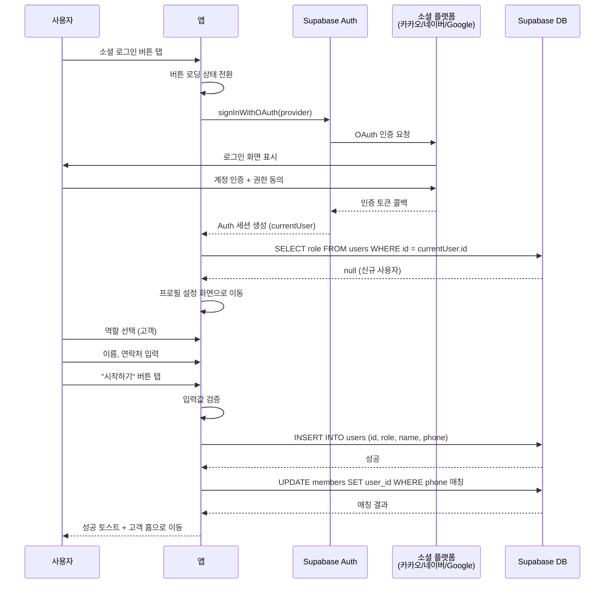
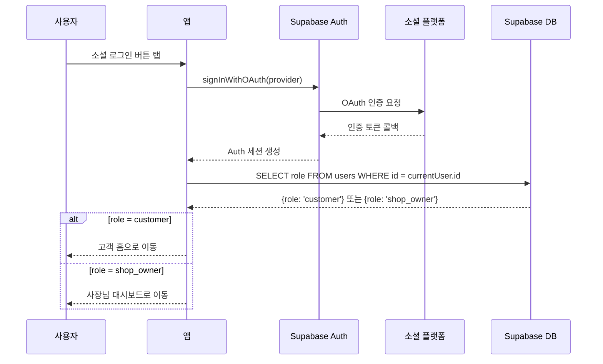

# 유스케이스: UC-1 소셜 로그인 + 프로필 설정

## 1. 개요

### 1.1 목적
소셜 로그인(카카오/네이버/Google)으로 간편하게 인증하고, 신규 사용자는 프로필 설정(역할 선택 + 이름 + 연락처)을 완료하여 서비스를 시작한다. 기존 사용자는 역할별 홈 화면으로 바로 이동한다.

### 1.2 범위
- **포함**: 소셜 OAuth 인증, 신규/기존 사용자 판별, 프로필 설정(역할 선택, 이름, 연락처 입력), `users` 테이블 생성, 기존 `members` 자동 매칭, 역할별 화면 라우팅
- **제외**: 샵 등록(UC-2에서 다룸), 비밀번호 기반 인증, 프로필 수정, FCM 토큰 등록

### 1.3 액터
- **주요 액터**: 사용자 (미인증 상태)
- **부 액터**: Supabase Auth (OAuth 인증), 소셜 로그인 제공자 (카카오/네이버/Google), Supabase DB (`users`, `members` 테이블)

---

## 2. 선행 조건

- 앱이 설치되어 있다
- 네트워크에 연결되어 있다
- Supabase Auth 세션이 없는 미로그인 상태이다
- 사용자가 카카오, 네이버, Google 계정 중 하나 이상을 보유하고 있다

---

## 3. 기본 흐름

> 소셜 로그인 → 신규 사용자 → 고객 역할 선택 → 프로필 설정 완료 → 고객 홈

### 3.1 단계별 흐름

1. **사용자**: 로그인 화면에서 소셜 로그인 버튼(카카오/네이버/Gmail) 중 하나를 탭한다
   - **입력**: 소셜 로그인 버튼 탭
   - **처리**: 선택한 소셜 플랫폼의 OAuth 인증 페이지로 이동
   - **출력**: 버튼이 로딩 상태로 전환, 나머지 버튼 비활성화

2. **소셜 플랫폼**: OAuth 인증 화면을 표시한다
   - **입력**: 사용자의 소셜 계정 인증 정보
   - **처리**: 사용자가 계정으로 로그인하고 권한을 동의한다
   - **출력**: 인증 토큰을 앱으로 콜백 전달

3. **앱 (Supabase Auth)**: `signInWithOAuth`를 통해 Supabase Auth 세션을 생성한다
   - **입력**: OAuth 콜백 토큰
   - **처리**: Supabase Auth가 `auth.users` 테이블에 인증 정보를 저장하고 세션을 발급한다
   - **출력**: `auth.currentUser` 객체 (id, email, displayName 등)

4. **앱**: `users` 테이블에서 `auth.currentUser.id`로 사용자 존재 여부를 조회한다
   - **입력**: `auth.currentUser.id`
   - **처리**: `users` 테이블에서 `id`가 일치하는 레코드를 `maybeSingle()`로 조회
   - **출력**: `null` (신규 사용자)

5. **앱**: 프로필 설정 화면(`profile-setup`)으로 이동한다
   - **입력**: 소셜 프로필에서 가져온 displayName
   - **처리**: 이름 필드에 displayName을 기본값으로 설정
   - **출력**: 프로필 설정 화면 표시 (역할 미선택, 이름 기본값 채워짐, 연락처 빈 값)

6. **사용자**: 역할 선택 카드에서 "고객"을 탭한다
   - **입력**: 고객 카드 탭
   - **처리**: `selectedRole`을 `customer`로 설정, 버튼 텍스트를 "시작하기"로 변경
   - **출력**: 고객 카드가 선택 상태로 전환 (녹색 테두리 + 체크 아이콘), 스텝 인디케이터 숨김

7. **사용자**: 이름과 연락처를 입력한다
   - **입력**: 이름 (2~20자), 연락처 (010-XXXX-XXXX 형식)
   - **처리**: 입력값 실시간 검증, 연락처 자동 하이픈 삽입
   - **출력**: 모든 필수 필드가 유효하면 "시작하기" 버튼 활성화

8. **사용자**: "시작하기" 버튼을 탭한다
   - **입력**: role=`customer`, name, phone
   - **처리**: 클라이언트 전체 입력값 검증 수행
   - **출력**: 검증 성공 시 버튼 로딩 상태 전환

9. **앱**: `users` 테이블에 사용자 정보를 INSERT한다
   - **입력**: `{id: auth.currentUser.id, role: 'customer', name, phone}`
   - **처리**: Supabase `users` 테이블에 INSERT
   - **출력**: 레코드 생성 성공

10. **앱**: 기존 `members` 레코드와 전화번호 기준으로 자동 매칭한다
    - **입력**: phone, auth.currentUser.id
    - **처리**: `members` 테이블에서 `phone`이 일치하고 `user_id`가 NULL인 레코드의 `user_id`를 UPDATE
    - **출력**: 매칭된 회원 레코드가 있으면 연결 완료

11. **앱**: "프로필 설정이 완료되었습니다!" 성공 토스트를 표시하고 고객 홈 화면으로 이동한다
    - **출력**: 고객 홈 화면 (`customer-home`) 표시

### 3.2 시퀀스 다이어그램

---

## 4. 대안 흐름

### 4.1 기존 사용자 로그인 (바로 홈 이동)

**분기 조건**: 기본 흐름 4단계에서 `users` 테이블에 레코드가 존재하는 경우

1. `users` 테이블 조회 결과 레코드가 존재하며 `role` 값을 확인한다
2. `role`이 `customer`이면 고객 홈 화면(`customer-home`)으로 이동한다
3. `role`이 `shop_owner`이면 사장님 대시보드(`owner-dashboard`)로 이동한다

**결과**: 프로필 설정 과정 없이 역할별 홈 화면으로 바로 진입

### 4.2 신규 사용자 → 샵 사장님 역할 선택 → UC-2로 연계

**분기 조건**: 기본 흐름 6단계에서 사용자가 "샵 사장님" 역할을 선택하는 경우

1. 사용자가 "샵 사장님" 카드를 탭한다
2. `selectedRole`이 `shop_owner`로 설정되고, 버튼 텍스트가 "다음"으로 변경된다
3. 스텝 인디케이터가 표시된다 (`● 정보 입력 ─── ○ 샵 등록`)
4. 사용자가 이름과 연락처를 입력하고 "다음" 버튼을 탭한다
5. 입력값 검증 후 `users` 테이블에 `role: 'shop_owner'`로 INSERT한다
6. "프로필 설정이 완료되었습니다!" 성공 토스트를 표시한다
7. 샵 등록 화면(`owner-shop-signup`)으로 이동한다 (UC-2 시작)

**결과**: 프로필 설정 완료 후 샵 등록 화면(UC-2)으로 이동. `members` 자동 매칭은 수행하지 않음 (shop_owner이므로)

### 4.3 사용자가 OAuth 인증을 취소한 경우

**분기 조건**: 기본 흐름 2단계에서 사용자가 소셜 플랫폼 인증 화면을 닫거나 취소한 경우

1. 소셜 플랫폼이 취소 콜백을 반환한다
2. 앱이 버튼 로딩 상태를 해제한다
3. 별도의 에러 메시지를 표시하지 않고 로그인 화면의 기본 상태로 복원한다

**결과**: 로그인 화면 기본 상태 유지

---

## 5. 예외 흐름

### 5.1 OAuth 인증 실패

**발생 조건**: 소셜 플랫폼과의 통신 중 인증에 실패한 경우 (토큰 만료, 서버 오류 등)

**처리**:
1. 버튼 로딩 상태를 해제한다
2. 에러 스낵바를 표시한다

**사용자 메시지**: "로그인에 실패했습니다. 다시 시도해주세요"

### 5.2 네트워크 오류 (로그인 시)

**발생 조건**: 소셜 로그인 또는 `users` 테이블 조회 중 네트워크 연결이 끊긴 경우

**처리**:
1. 버튼 로딩 상태를 해제한다
2. 에러 스낵바를 표시한다

**사용자 메시지**: "네트워크 연결을 확인해주세요"

### 5.3 프로필 설정 저장 실패

**발생 조건**: `users` 테이블 INSERT 중 오류가 발생한 경우 (네트워크 오류, 서버 오류 등)

**처리**:
1. 버튼 로딩 상태를 해제한다
2. 에러 스낵바를 표시한다
3. 입력값은 그대로 유지하여 재시도할 수 있도록 한다

**사용자 메시지**: "프로필 설정에 실패했습니다. 다시 시도해주세요"

### 5.4 입력값 검증 실패

**발생 조건**: 프로필 설정에서 "시작하기/다음" 버튼 탭 시 필수 입력값이 유효하지 않은 경우

**처리**:
1. 첫 번째 에러 필드로 스크롤한다
2. 에러 메시지를 해당 필드 아래에 표시한다
   - 역할 미선택: "사용자 유형을 선택해주세요"
   - 이름 빈 값: "이름을 입력해주세요"
   - 이름 길이 초과/부족: "이름은 2자 이상 20자 이하로 입력해주세요"
   - 연락처 빈 값: "연락처를 입력해주세요"
   - 연락처 형식 오류: "올바른 휴대폰 번호를 입력해주세요"

**사용자 메시지**: 각 필드별 에러 메시지 (위 참조)

---

## 6. 후행 조건

### 6.1 성공 시 (고객)
- **DB 변경**: `users` 테이블에 신규 레코드 생성 (`id`, `role='customer'`, `name`, `phone`). 전화번호 매칭되는 `members` 레코드가 있으면 `user_id` UPDATE
- **시스템 상태**: Supabase Auth 세션 활성, 고객 홈 화면 표시
- **부수 효과**: 없음

### 6.1 성공 시 (샵 사장님)
- **DB 변경**: `users` 테이블에 신규 레코드 생성 (`id`, `role='shop_owner'`, `name`, `phone`)
- **시스템 상태**: Supabase Auth 세션 활성, 샵 등록 화면(UC-2)으로 이동
- **부수 효과**: 없음

### 6.1 성공 시 (기존 사용자)
- **DB 변경**: 없음
- **시스템 상태**: Supabase Auth 세션 활성, 역할별 홈 화면 표시
- **부수 효과**: 없음

### 6.2 실패 시
- **롤백**: `users` INSERT 실패 시 DB 변경 없음. Supabase Auth 세션은 유지됨 (재시도 가능)
- **시스템 상태**: 로그인 화면 또는 프로필 설정 화면에 머무름

---

## 7. 테스트 시나리오

### 7.1 성공 케이스

| ID | 시나리오 | 입력값 | 기대 결과 |
|----|----------|--------|----------|
| TC-1-01 | 카카오 로그인 → 신규 사용자 → 고객 | 카카오 OAuth 인증 성공, role=customer, name="홍길동", phone="010-1234-5678" | `users` 테이블에 레코드 생성, 고객 홈으로 이동 |
| TC-1-02 | 네이버 로그인 → 신규 사용자 → 사장님 | 네이버 OAuth 인증 성공, role=shop_owner, name="김사장", phone="010-9876-5432" | `users` 테이블에 레코드 생성, 샵 등록 화면으로 이동 |
| TC-1-03 | Google 로그인 → 기존 고객 | Google OAuth 인증 성공, users 테이블에 role=customer 존재 | 프로필 설정 없이 고객 홈으로 바로 이동 |
| TC-1-04 | 카카오 로그인 → 기존 사장님 | 카카오 OAuth 인증 성공, users 테이블에 role=shop_owner 존재 | 프로필 설정 없이 사장님 대시보드로 바로 이동 |
| TC-1-05 | 신규 고객 + members 자동 매칭 | role=customer, phone="010-1111-2222", members에 동일 phone + user_id=NULL 존재 | `users` 생성 + `members.user_id` 자동 매칭 |
| TC-1-06 | 소셜 프로필 이름 기본값 | 소셜 프로필 displayName="박배민" | 이름 필드에 "박배민"이 기본값으로 채워짐 |

### 7.2 실패 케이스

| ID | 시나리오 | 입력값 | 기대 결과 |
|----|----------|--------|----------|
| TC-1-07 | OAuth 인증 취소 | 사용자가 소셜 로그인 화면에서 취소 | 로그인 화면 기본 상태 복원, 에러 메시지 없음 |
| TC-1-08 | 네트워크 오류 (로그인) | 네트워크 미연결 상태에서 로그인 시도 | "네트워크 연결을 확인해주세요" 에러 스낵바 |
| TC-1-09 | 역할 미선택으로 제출 | role=null, name="테스트", phone="010-0000-0000" | "사용자 유형을 선택해주세요" 에러 메시지 |
| TC-1-10 | 이름 빈 값으로 제출 | role=customer, name="", phone="010-0000-0000" | "이름을 입력해주세요" 에러 메시지 |
| TC-1-11 | 이름 1자로 제출 | role=customer, name="김", phone="010-0000-0000" | "이름은 2자 이상 20자 이하로 입력해주세요" 에러 메시지 |
| TC-1-12 | 잘못된 연락처 형식 | role=customer, name="테스트", phone="0101234" | "올바른 휴대폰 번호를 입력해주세요" 에러 메시지 |
| TC-1-13 | 프로필 저장 중 서버 오류 | 유효한 입력값, Supabase DB 오류 발생 | "프로필 설정에 실패했습니다. 다시 시도해주세요" 에러 스낵바, 입력값 유지 |
| TC-1-14 | 로그인 중 다른 버튼 중복 탭 | 카카오 로그인 버튼 탭 후 네이버 버튼 탭 시도 | 모든 버튼 비활성화, 중복 요청 방지 |

---

## 8. 관련 유스케이스

- **선행**: 없음 (앱 최초 진입 유스케이스)
- **후행**: UC-2 샵 등록 (사장님 역할 선택 시)
- **연관**: 없음
