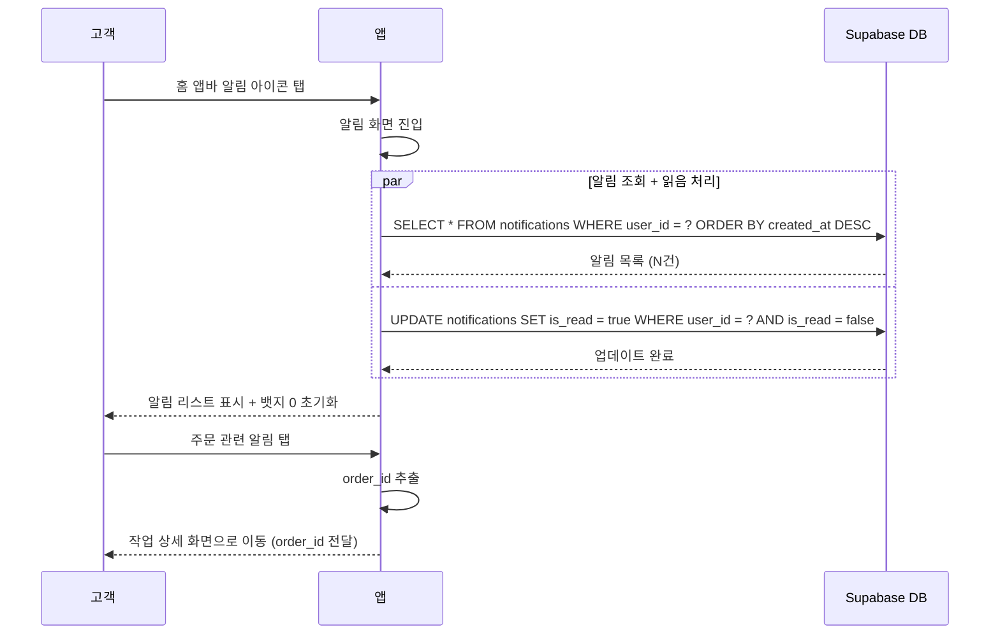

# 유스케이스: UC-10 알림 조회

## 1. 개요

### 1.1 목적
고객이 알림 화면에서 주문 상태 변경, 작업 완료, 공지사항 등의 알림 이력을 시간순으로 확인한다. 화면 진입 시 모든 알림을 자동으로 읽음 처리하여 뱃지 카운트를 초기화하고, 개별 알림을 탭하면 관련 화면으로 이동한다.

### 1.2 범위
- **포함**: 알림 목록 조회(최신순), 화면 진입 시 전체 읽음 처리, 뱃지 카운트 초기화, 알림 탭 시 작업 상세 화면 이동, 빈 상태 표시, Pull-to-refresh
- **제외**: 알림 생성 (Edge Function에서 수행), 알림 삭제, 알림 설정 변경 (마이페이지에서 수행), 푸시 알림 수신 처리

### 1.3 액터
- **주요 액터**: 고객(customer)
- **부 액터**: Supabase DB, Supabase Edge Function(알림 생성 주체)

---

## 2. 선행 조건

- 고객이 로그인 상태이다 (Supabase Auth 인증 완료)
- `users` 테이블에 role이 `customer`인 레코드가 존재한다
- `notifications` 테이블에 알림 데이터가 존재할 수 있다 (0건 이상)

---

## 3. 기본 흐름

### 3.1 알림 목록 조회 및 읽음 처리

1. **고객**: 고객 홈(`customer-home`) 앱바의 알림 아이콘을 탭한다
   - **처리**: 알림 화면(`customer-notifications`)으로 이동

2. **앱**: 알림 목록을 조회한다
   - **처리**: `notifications` 테이블에서 `user_id = auth.uid()` 조건으로 조회, `created_at DESC` 정렬
   - **출력**: 알림 리스트 표시 (유형별 아이콘, 제목, 내용(최대 2줄), 상대시간)

3. **앱**: 읽지 않은 알림을 전체 읽음 처리한다
   - **처리**: `UPDATE notifications SET is_read = true WHERE user_id = auth.uid() AND is_read = false`
   - **출력**: 고객 홈의 알림 뱃지 카운트가 0으로 초기화

4. **고객**: 주문 관련 알림(order_id가 있는 알림)을 탭한다
   - **처리**: 해당 알림의 `order_id`를 파라미터로 작업 상세 화면(`customer-order-detail`)으로 이동
   - **출력**: 작업 상세 화면 표시

### 3.2 시퀀스 다이어그램

---

## 4. 대안 흐름

### 4.1 알림이 없는 경우 (빈 상태)

**분기 조건**: 기본 흐름 2단계에서 조회 결과가 0건인 경우

1. 빈 상태 UI를 표시한다
   - 아이콘: `notifications_none` (64px, `#CBD5E1`)
   - 메시지: "알림이 없습니다" (16sp, `#94A3B8`, 중앙 정렬)
2. 읽음 처리 API는 호출하지 않는다 (읽을 알림이 없으므로)

**결과**: 빈 상태 화면 표시, 뱃지 카운트 변동 없음

### 4.2 order_id가 없는 알림 탭

**분기 조건**: 기본 흐름 4단계에서 탭한 알림의 `order_id`가 null인 경우 (공지사항 알림 등)

1. 알림 탭에 대한 추가 동작 없이 화면에 머무른다

**결과**: 화면 전환 없음

### 4.3 Pull-to-refresh

**분기 조건**: 고객이 알림 리스트를 아래로 당기는 경우

1. RefreshIndicator를 표시한다
2. 알림 목록을 재조회한다 (`SELECT * FROM notifications WHERE user_id = ? ORDER BY created_at DESC`)
3. 리스트를 갱신한다

**결과**: 최신 알림 반영

---

## 5. 예외 흐름

### 5.1 알림 목록 조회 실패

**발생 조건**: 화면 진입 시 네트워크 오류 또는 서버 오류로 알림 조회 실패

**처리**:
1. 로딩 상태를 해제한다
2. 에러 상태 UI를 표시한다: 에러 메시지 + "재시도" 버튼
3. 재시도 버튼 탭 시 알림 목록을 다시 조회한다

**사용자 메시지**: "알림을 불러올 수 없습니다"

### 5.2 전체 읽음 처리 실패

**발생 조건**: 알림 목록 조회는 성공했으나 읽음 처리 UPDATE가 실패한 경우

**처리**:
1. 알림 목록은 정상 표시한다 (조회는 성공했으므로)
2. 읽음 처리 실패는 사용자에게 별도 알리지 않는다 (백그라운드 작업)
3. 다음 화면 진입 시 다시 시도된다
4. 뱃지 카운트는 다음 성공 시점에 초기화된다

**사용자 메시지**: 없음 (무시)

### 5.3 작업 상세 화면 이동 실패

**발생 조건**: 알림의 `order_id`에 해당하는 주문이 삭제된 경우

**처리**:
1. 작업 상세 화면에서 데이터 조회 실패 처리
2. "해당 작업을 찾을 수 없습니다" 메시지 표시
3. 알림 화면으로 복귀

**사용자 메시지**: "해당 작업을 찾을 수 없습니다"

---

## 6. 후행 조건

### 6.1 성공 시
- **DB 변경**: `notifications` 테이블에서 해당 사용자의 모든 `is_read = false` 레코드가 `is_read = true`로 업데이트
- **시스템 상태**: 고객 홈 앱바의 알림 뱃지 카운트가 0으로 초기화
- **부수 효과**: 없음

### 6.2 실패 시
- **롤백**: 읽음 처리 실패 시 `is_read` 상태 변경 없음
- **시스템 상태**: 뱃지 카운트 유지, 다음 진입 시 재시도

---

## 7. 테스트 시나리오

### 7.1 성공 케이스

| ID | 시나리오 | 입력값 | 기대 결과 |
|----|----------|--------|----------|
| TC-10-01 | 알림이 있는 상태에서 화면 진입 | 알림 5건 (읽지 않은 알림 3건) | 알림 5건 최신순 표시, 읽지 않은 3건 읽음 처리, 뱃지 0 |
| TC-10-02 | 주문 상태 변경 알림 탭 | type: status_change, order_id: 존재 | 작업 상세 화면으로 이동 (order_id 전달) |
| TC-10-03 | 작업 완료 알림 탭 | type: completion, order_id: 존재 | 작업 상세 화면으로 이동 (order_id 전달) |
| TC-10-04 | 공지사항 알림 탭 | type: notice, order_id: null | 화면 전환 없음 |
| TC-10-05 | 접수 확인 알림 탭 | type: receipt, order_id: 존재 | 작업 상세 화면으로 이동 (order_id 전달) |
| TC-10-06 | 빈 상태 (알림 0건) | 알림 없음 | 빈 상태 UI 표시 ("알림이 없습니다") |
| TC-10-07 | Pull-to-refresh로 새 알림 갱신 | 새 알림 2건 추가된 상태에서 당기기 | 새 알림 포함 리스트 갱신 |
| TC-10-08 | 모든 알림이 이미 읽은 상태 | 알림 5건, 전부 is_read = true | 알림 리스트 정상 표시, 뱃지 유지(0) |
| TC-10-09 | 알림 유형별 아이콘 표시 확인 | 4가지 유형 알림 각 1건 | status_change: sync/파란색, completion: check_circle/녹색, notice: campaign/노란색, receipt: inventory_2/파란색 |
| TC-10-10 | 상대시간 표시 확인 | 방금/1시간 전/1일 전/1주 전 알림 | 각각 적절한 상대시간 텍스트로 표시 |

### 7.2 실패 케이스

| ID | 시나리오 | 입력값 | 기대 결과 |
|----|----------|--------|----------|
| TC-10-11 | 알림 목록 조회 네트워크 오류 | 네트워크 끊김 | 에러 UI 표시 + "재시도" 버튼 |
| TC-10-12 | 전체 읽음 처리 실패 | 조회 성공 + UPDATE 실패 | 알림 리스트 정상 표시, 뱃지 카운트 유지 |
| TC-10-13 | 삭제된 주문의 알림 탭 | order_id에 해당하는 주문이 삭제됨 | "해당 작업을 찾을 수 없습니다" 메시지 |
| TC-10-14 | 재시도 후 성공 | 첫 조회 실패 → 재시도 탭 | 알림 리스트 정상 표시 |

---

## 8. 관련 유스케이스

- **선행**: 작업 상태 변경 (사장님이 상태를 변경하면 Edge Function이 `notifications` 테이블에 알림 생성)
- **후행**: 작업 상세 조회 (주문 관련 알림 탭 시 작업 상세 화면으로 이동)
- **연관**: 고객 홈 (알림 뱃지 카운트 표시 — `is_read = false` 건수), 푸시 알림 수신 (FCM으로 전송된 알림이 `notifications` 테이블에 기록됨)
