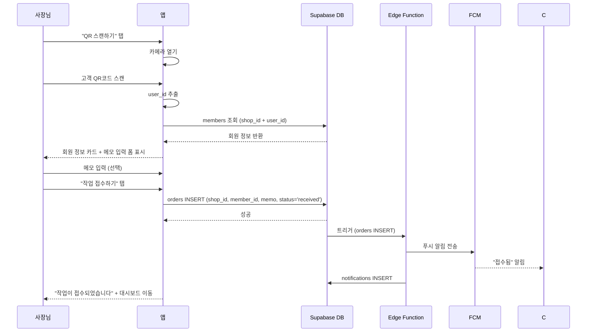
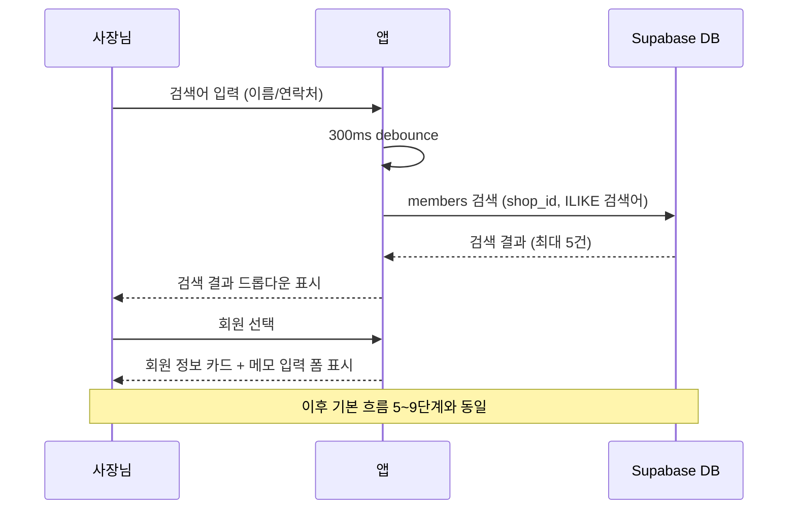
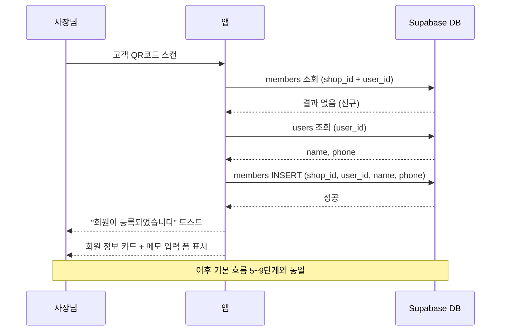

# 유스케이스: UC-4 작업 접수

## 1. 개요

### 1.1 목적
샵 사장님이 고객의 거트 작업을 접수한다. QR 스캔 또는 수동 검색으로 회원을 식별하고, 메모를 입력하여 작업을 등록한다. 접수 시 고객에게 푸시 알림이 전송된다.

### 1.2 범위
- **포함**: QR 스캔/수동 검색을 통한 회원 식별, 작업 접수(orders INSERT), 접수 알림 전송
- **제외**: 작업 상태 변경(received → in_progress → completed), 작업 삭제, 작업 이력 조회

### 1.3 액터
- **주요 액터**: 샵 사장님
- **부 액터**: Supabase (DB), Edge Function (알림 트리거), FCM (푸시 알림)

---

## 2. 선행 조건

- 사장님이 로그인한 상태 (role = 'shop_owner')
- 샵이 등록되어 있는 상태 (`shops` 레코드 존재)
- 작업 대상 회원이 해당 샵에 등록되어 있는 상태 (`members` 레코드 존재)

---

## 3. 기본 흐름 — QR 스캔으로 회원 식별 후 접수

### 3.1 단계별 흐름

1. **사장님**: 작업 접수 화면에서 "QR 스캔하기" 버튼을 탭한다
   - **처리**: 카메라 권한 확인 후 QR 스캔 화면을 연다

2. **사장님**: 고객의 앱에 표시된 QR코드를 스캔한다
   - **입력**: 고객 QR코드 (user_id 인코딩)
   - **처리**: QR코드에서 `user_id`를 추출한다

3. **앱**: 해당 사용자가 현재 샵의 회원인지 확인한다
   - **입력**: `shop_id`, `user_id`
   - **처리**: `members` 테이블에서 `shop_id + user_id` 조합으로 조회
   - **출력**: 기존 회원 정보 (member_id, name, phone, visit_count)

4. **앱**: 회원 정보 카드를 표시하고 작업 정보 입력 폼을 연다
   - **출력**: 회원 이름, 연락처, 방문 횟수 표시 + 메모 입력 필드

5. **사장님**: 메모를 입력한다 (선택)
   - **입력**: `memo` (0~500자, 선택 입력)

6. **사장님**: "작업 접수하기" 버튼을 탭한다
   - **처리**: 입력값 검증 (member_id 필수)

7. **앱**: `orders` 테이블에 신규 작업을 등록한다
   - **입력**: `shop_id`, `member_id`, `memo`, `status = 'received'`
   - **처리**: `orders` 테이블에 INSERT
   - **출력**: 신규 `order` 레코드 생성

8. **시스템**: 고객에게 "접수됨" 푸시 알림을 전송한다
   - **처리**: DB 트리거 → Edge Function → FCM
   - **출력**: 고객 앱에 "접수됨" 알림 수신, `notifications` 레코드 생성

9. **앱**: 접수 완료 후 대시보드로 이동한다
   - **출력**: "작업이 접수되었습니다" 토스트 + 대시보드 화면

### 3.2 시퀀스 다이어그램

---

## 4. 대안 흐름

### 4.1 수동 검색으로 회원 식별

**분기 조건**: 기본 흐름 1단계에서 QR 스캔 대신 수동 검색을 선택하는 경우

1. **사장님**: 검색 필드에 이름 또는 연락처를 입력한다 (2글자 이상)
   - **입력**: 검색어 (이름 또는 연락처)
   - **처리**: 300ms debounce 후 검색 API 호출

2. **앱**: `members` 테이블에서 매칭되는 회원을 검색한다
   - **입력**: `shop_id`, 검색어
   - **처리**: `name ILIKE '%검색어%'` OR `phone ILIKE '%검색어%'` (최대 5건)
   - **출력**: 검색 결과 드롭다운 표시

3. **사장님**: 검색 결과에서 대상 회원을 선택한다
   - **출력**: 회원 정보 카드 표시

4. 이후 기본 흐름 5단계부터 동일하게 진행한다

**결과**: 수동 검색으로 회원을 식별한 후 작업 접수 완료

### 4.2 QR 스캔 → 미등록 고객 → 자동 회원 등록 후 접수

**분기 조건**: 기본 흐름 3단계에서 `members` 테이블에 회원이 없는 경우 (신규 고객)

1. **앱**: 해당 사용자가 현재 샵의 회원이 아님을 확인한다
   - **처리**: `members` 조회 결과 없음 (NULL)

2. **앱**: `users` 테이블에서 사용자 정보를 가져온다
   - **입력**: `user_id`
   - **처리**: `users` 테이블에서 `name`, `phone` 조회

3. **앱**: `members` 테이블에 신규 회원을 자동 등록한다
   - **입력**: `shop_id`, `user_id`, `name`, `phone`
   - **처리**: `members` INSERT
   - **출력**: "회원이 등록되었습니다" 토스트

4. 이후 기본 흐름 4단계부터 동일하게 진행한다 (회원 정보 카드 표시 → 메모 → 접수)

**결과**: 신규 회원 자동 등록 + 작업 접수 완료 (UC-3 QR 등록과 UC-4 접수가 연속 수행)

### 4.3 연속 접수

**분기 조건**: 기본 흐름 9단계에서 사장님이 연속 접수를 원하는 경우

1. **앱**: 접수 완료 토스트에 "연속 접수" 버튼을 3초간 표시한다
2. **사장님**: "연속 접수" 버튼을 탭한다
3. **앱**: 빈 작업 접수 화면으로 재진입한다 (초기 상태)

**결과**: 대시보드로 이동하지 않고 새로운 작업 접수 화면으로 진입

---

## 5. 예외 흐름

### 5.1 회원을 찾을 수 없음 (수동 검색)

**발생 조건**: 수동 검색 시 매칭되는 회원이 없는 경우

**처리**:
1. 검색 결과 드롭다운에 "검색 결과가 없습니다" 표시
2. 사장님이 회원 등록 화면으로 이동하여 수동 등록 후 다시 접수 가능

**사용자 메시지**: "검색 결과가 없습니다"

### 5.2 카메라 권한 거부

**발생 조건**: QR 스캔 시 카메라 권한이 없는 경우

**처리**:
1. 카메라 권한 요청 다이얼로그 표시
2. 거부 시 안내 메시지 + 설정 이동 링크 제공

**사용자 메시지**: "카메라 권한이 필요합니다. 설정에서 권한을 허용해주세요."

### 5.3 유효하지 않은 QR코드

**발생 조건**: QR코드가 거트알림 형식이 아니거나 존재하지 않는 `user_id`를 포함하는 경우

**처리**:
1. QR 데이터 형식을 검증한다
2. 유효하지 않으면 에러 토스트를 표시한다

**에러 코드**: `INVALID_QR` (400)
**사용자 메시지**: "유효하지 않은 QR코드입니다"

### 5.4 네트워크 오류

**발생 조건**: 작업 접수 중 네트워크 연결이 끊어진 경우

**처리**:
1. 접수 요청이 실패한다
2. 에러 스낵바를 표시하고 접수 버튼을 재활성화한다

**사용자 메시지**: "네트워크 연결을 확인해주세요"

### 5.5 작업 접수 실패

**발생 조건**: `orders` INSERT가 서버 측 오류로 실패하는 경우

**처리**:
1. 에러 스낵바를 표시한다
2. 접수 버튼을 재활성화하여 재시도 가능하게 한다
3. 입력 데이터는 유지한다

**에러 코드**: `INSERT_FAILED` (500)
**사용자 메시지**: "작업 접수에 실패했습니다. 다시 시도해주세요."

---

## 6. 후행 조건

### 6.1 성공 시
- **DB 변경**: `orders` 테이블에 신규 레코드 INSERT (status = 'received'), `notifications` 테이블에 알림 레코드 INSERT
- **시스템 상태**: 작업이 "접수됨" 상태로 등록됨
- **부수 효과**: 고객에게 "접수됨" 푸시 알림 전송 (FCM), 고객 앱에서 실시간 구독을 통해 작업 상태 표시

### 6.2 실패 시
- **롤백**: `orders` INSERT가 롤백됨 (트랜잭션)
- **시스템 상태**: 변경 없음, 입력 데이터 유지

---

## 7. 테스트 시나리오

### 7.1 성공 케이스

| ID | 시나리오 | 입력값 | 기대 결과 |
|----|----------|--------|-----------|
| TC-4-01 | QR 스캔 → 기존 회원 → 메모 입력 → 접수 | 등록된 회원 QR, memo="요청사항" | `orders` INSERT 성공, status='received', 알림 전송 |
| TC-4-02 | QR 스캔 → 기존 회원 → 메모 없이 접수 | 등록된 회원 QR, memo="" | `orders` INSERT 성공, memo=NULL |
| TC-4-03 | 수동 검색 (이름) → 접수 | 검색어="홍길동" | 회원 목록 표시 → 선택 → 접수 성공 |
| TC-4-04 | 수동 검색 (연락처) → 접수 | 검색어="010-1234" | 회원 목록 표시 → 선택 → 접수 성공 |
| TC-4-05 | QR 스캔 → 신규 고객 → 자동 등록 → 접수 | 미등록 user_id의 QR | `members` INSERT 후 `orders` INSERT 성공 |
| TC-4-06 | 연속 접수 | 접수 완료 후 "연속 접수" 탭 | 빈 작업 접수 화면 재진입 |
| TC-4-07 | 접수 후 푸시 알림 전송 | user_id가 연결된 회원 | `notifications` INSERT + FCM 발송 |
| TC-4-08 | 접수 후 푸시 알림 미전송 | user_id=NULL 회원 (수동 등록) | `orders` INSERT 성공, 알림 미전송 |

### 7.2 실패 케이스

| ID | 시나리오 | 입력값 | 기대 결과 |
|----|----------|--------|-----------|
| TC-4-09 | 회원 미선택 상태에서 접수 시도 | member_id=NULL | 접수 버튼 비활성, 제출 불가 |
| TC-4-10 | 유효하지 않은 QR코드 | 잘못된 QR 데이터 | "유효하지 않은 QR코드입니다" 토스트 |
| TC-4-11 | 카메라 권한 거부 | 권한 없음 | 권한 요청 → 설정 이동 안내 |
| TC-4-12 | 수동 검색 결과 없음 | 검색어="존재하지않는이름" | "검색 결과가 없습니다" 표시 |
| TC-4-13 | 네트워크 오류 | 네트워크 끊김 | "네트워크 연결을 확인해주세요" 스낵바 |
| TC-4-14 | 서버 오류로 접수 실패 | 서버 500 에러 | "작업 접수에 실패했습니다" 스낵바, 재시도 가능 |
| TC-4-15 | 메모 500자 초과 | 501자 입력 | 입력 제한 또는 유효성 에러 |
| TC-4-16 | 뒤로가기 시 입력 내용 존재 | 회원 선택 + 메모 입력 상태 | "작성 중인 내용이 있습니다. 나가시겠습니까?" 다이얼로그 |

---

## 8. 관련 유스케이스

- **선행**: UC-3 회원 등록 (회원이 등록되어 있어야 작업 접수 가능)
- **후행**: UC-5 작업 상태 변경 (접수 후 received → in_progress → completed)
- **연관**: UC-3 회원 등록 (QR 스캔 시 미등록 고객 자동 등록 흐름 포함)
