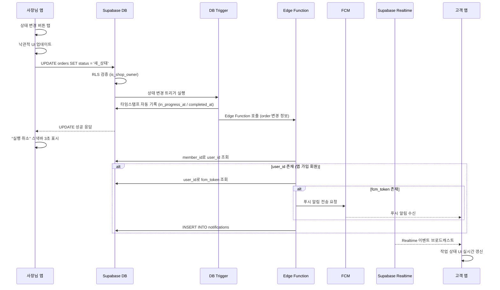

# 유스케이스: UC-5 작업 상태 변경 + 푸시 알림

## 1. 개요

### 1.1 목적
샵 사장님이 거트 작업의 상태를 변경(접수됨 → 작업중 → 완료)하면, 고객에게 푸시 알림이 자동 전송되어 작업 진행 상황을 실시간으로 알 수 있도록 한다.

### 1.2 범위
- **포함**: 작업 상태 변경(received → in_progress → completed), 상태 변경 시 타임스탬프 자동 기록, DB 트리거를 통한 Edge Function 호출, FCM 푸시 알림 전송, notifications 테이블 기록, Supabase Realtime을 통한 고객 앱 실시간 반영, 접수됨 상태 작업 삭제, 실행 취소(Undo) 처리
- **제외**: 작업 접수(INSERT), 작업 상세 조회, 알림 읽음 처리, 고객 앱의 알림 목록 화면

### 1.3 액터
- **주요 액터**: 샵 사장님 (shop_owner)
- **부 액터**: Supabase DB (트리거, RLS), Supabase Edge Function, Firebase Cloud Messaging (FCM), Supabase Realtime, 고객 앱 (customer)

---

## 2. 선행 조건

- 사장님이 로그인되어 있고 role이 `shop_owner`이다
- 사장님의 샵이 등록되어 있다 (shops 테이블에 레코드 존재)
- 상태를 변경할 작업(order)이 존재하며, 해당 샵에 속한다
- 작업에 연결된 회원(member)이 존재한다

---

## 3. 기본 흐름

### 3.1 단계별 흐름

1. **사장님**: 대시보드 또는 작업 관리 화면에서 작업 카드의 상태 변경 버튼을 탭한다
   - **입력**: 현재 상태가 `received`이면 "작업 시작" 버튼, `in_progress`이면 "작업 완료" 버튼
   - **처리**: 확인 다이얼로그 없이 즉시 상태 변경 요청 (빠른 운영을 위한 설계)
   - **출력**: 버튼 탭 즉시 UI에 낙관적 업데이트(Optimistic Update) 반영

2. **앱 (Flutter)**: Supabase에 orders 테이블 UPDATE 요청을 보낸다
   - **입력**: `order_id`, 새로운 `status` 값
   - **처리**: `supabase.from('orders').update({status: 새_상태}).eq('id', order_id)` 호출
   - **출력**: 3초간 "실행 취소" 스낵바 표시

3. **Supabase DB**: orders 테이블 UPDATE 실행 및 트리거 동작
   - **입력**: UPDATE 요청
   - **처리**:
     - RLS 정책 확인: `is_shop_owner(shop_id)` — 사장님 본인 샵의 작업인지 검증
     - `trigger_order_status_timestamps` 트리거: `in_progress` 전환 시 `in_progress_at = now()`, `completed` 전환 시 `completed_at = now()` 자동 기록
     - `trigger_orders_updated_at` 트리거: `updated_at = now()` 자동 갱신
     - 상태 변경 감지 트리거: Edge Function 호출
   - **출력**: orders 레코드 업데이트 완료

4. **Supabase Edge Function**: 푸시 알림 전송 및 알림 기록 저장
   - **입력**: 변경된 order 정보 (order_id, shop_id, member_id, 새로운 status)
   - **처리**:
     - members 테이블에서 `member_id`로 `user_id` 조회
     - `user_id`가 NULL이면 (미가입 회원) 푸시 알림 전송 생략, 종료
     - users 테이블에서 `user_id`로 `fcm_token` 조회
     - `fcm_token`이 NULL이면 (앱 삭제 등) 푸시 알림 전송 생략
     - `fcm_token`이 존재하면 FCM API로 푸시 알림 전송
     - notifications 테이블에 알림 기록 INSERT (user_id가 존재하는 경우에만)
   - **출력**: 푸시 알림 전송 결과

5. **FCM**: 고객 디바이스에 푸시 알림 전달
   - **입력**: FCM 토큰, 알림 제목/본문
   - **처리**: 고객 디바이스로 푸시 알림 전송
   - **출력**: 알림 표시 (접수됨→작업중: "작업이 시작되었습니다", 작업중→완료: "작업이 완료되었습니다! 샵에 방문하여 라켓을 수령하세요")

6. **Supabase Realtime**: 고객 앱에 실시간 상태 변경 전파
   - **입력**: orders 테이블 UPDATE 이벤트
   - **처리**: `shop_id` 조건으로 구독 중인 채널에 변경 이벤트 브로드캐스트
   - **출력**: 고객 앱에서 실시간으로 작업 상태 갱신 (고객 홈 화면의 작업 목록 즉시 반영)

### 3.2 시퀀스 다이어그램

---

## 4. 대안 흐름

### 4.1 작업 삭제 (접수됨 상태만)

**분기 조건**: 사장님이 `received` 상태의 작업 카드를 좌측으로 스와이프한다

1. **사장님**: 작업 카드를 좌측으로 스와이프한다
2. **앱**: "이 작업을 삭제하시겠습니까?" 확인 다이얼로그를 표시한다
3. **사장님**: "삭제" 버튼을 탭한다
4. **앱**: `supabase.from('orders').delete().eq('id', order_id)` 호출
5. **Supabase DB**: RLS 정책 확인 (`is_shop_owner(shop_id)` AND `status = 'received'`) 후 DELETE 실행
6. **앱**: 작업 목록에서 해당 카드 제거, 필터 탭 건수 재계산

**결과**: 작업이 삭제되고 목록에서 제거된다. 삭제된 작업에 대해서는 고객에게 별도 알림을 보내지 않는다.

### 4.2 실행 취소 (Undo)

**분기 조건**: 사장님이 상태 변경 후 3초 이내에 "실행 취소" 스낵바를 탭한다

1. **사장님**: "실행 취소" 스낵바를 탭한다
2. **앱**: 이전 상태로 되돌리는 UPDATE 요청을 보낸다 (예: `in_progress` → `received`)
3. **Supabase DB**: orders 테이블 UPDATE 실행 (이전 상태로 복원)
4. **앱**: UI를 이전 상태로 복원한다

**결과**: 작업 상태가 이전 상태로 되돌려진다. 이미 전송된 푸시 알림은 취소할 수 없으나, 상태가 되돌려지므로 고객 앱에서는 Realtime을 통해 원래 상태로 갱신된다.

### 4.3 대시보드에서 상태 변경

**분기 조건**: 사장님이 대시보드(owner-dashboard)의 최근 작업 카드에서 상태 변경 버튼을 탭한다

1. 기본 흐름과 동일하게 진행된다
2. 추가로 대시보드의 카운트 카드 숫자가 실시간으로 재계산된다 (예: 접수됨 3→2, 작업중 2→3)

**결과**: 기본 흐름과 동일하며, 대시보드 UI가 즉시 갱신된다.

---

## 5. 예외 흐름

### 5.1 고객이 FCM 토큰이 없는 경우 (앱 삭제)

**발생 조건**: 고객이 앱을 삭제하여 `users.fcm_token`이 NULL인 경우

**처리**:
1. Edge Function이 `fcm_token` NULL을 감지한다
2. FCM 전송 단계를 건너뛴다
3. notifications 테이블에는 정상적으로 INSERT한다 (나중에 앱 재설치 시 확인 가능)
4. 상태 변경 자체는 정상 완료된다

**사용자 메시지**: 없음 (사장님에게 별도 안내하지 않음, 상태 변경은 정상 처리)

### 5.2 미가입 회원 (user_id가 NULL)

**발생 조건**: 사장님이 수동 등록한 회원(user_id = NULL)의 작업 상태를 변경한 경우

**처리**:
1. Edge Function이 `members.user_id` NULL을 감지한다
2. 푸시 알림 전송과 notifications INSERT를 모두 건너뛴다
3. 상태 변경 자체는 정상 완료된다

**사용자 메시지**: 없음 (미가입 회원은 알림 수신 대상이 아님)

### 5.3 네트워크 오류 (상태 변경 요청 실패)

**발생 조건**: 사장님의 디바이스가 네트워크에 연결되지 않았거나, Supabase 서버 오류가 발생한 경우

**처리**:
1. 낙관적 업데이트로 변경된 UI를 이전 상태로 롤백한다
2. "상태 변경에 실패했습니다. 다시 시도해 주세요" 스낵바를 표시한다
3. 사장님은 다시 버튼을 탭하여 재시도할 수 있다

**에러 코드**: 네트워크 에러 또는 HTTP 5xx
**사용자 메시지**: "상태 변경에 실패했습니다. 다시 시도해 주세요"

### 5.4 FCM 전송 실패

**발생 조건**: FCM 서버 오류 또는 유효하지 않은 토큰으로 푸시 전송이 실패한 경우

**처리**:
1. Edge Function이 FCM 전송 실패를 감지한다
2. 유효하지 않은 토큰인 경우: users 테이블에서 `fcm_token`을 NULL로 업데이트한다
3. 서버 오류인 경우: 에러를 로깅하되, 상태 변경 자체는 롤백하지 않는다
4. notifications 테이블에는 정상적으로 INSERT한다

**사용자 메시지**: 없음 (푸시 실패는 상태 변경에 영향을 주지 않음)

### 5.5 잘못된 상태 전이 시도

**발생 조건**: 네트워크 지연 등으로 이미 다른 상태로 변경된 작업에 대해 중복 요청이 온 경우

**처리**:
1. DB 트리거에서 유효한 상태 전이인지 확인한다 (received→in_progress, in_progress→completed만 허용)
2. 유효하지 않은 전이는 무시한다
3. 앱은 Realtime을 통해 최신 상태를 수신하여 UI를 보정한다

**사용자 메시지**: UI가 자동으로 최신 상태로 갱신된다

---

## 6. 후행 조건

### 6.1 성공 시
- **DB 변경**:
  - `orders` 테이블: `status` 갱신, `in_progress_at` 또는 `completed_at` 타임스탬프 기록, `updated_at` 갱신
  - `notifications` 테이블: 알림 레코드 INSERT (user_id가 존재하는 회원만)
- **시스템 상태**: 작업 상태가 다음 단계로 전이됨
- **부수 효과**:
  - FCM 푸시 알림이 고객 디바이스에 전송됨 (fcm_token이 존재하는 경우)
  - Supabase Realtime을 통해 고객 앱의 UI가 실시간 갱신됨
  - 사장님 앱의 대시보드 카운트 및 작업 목록이 갱신됨

### 6.2 실패 시
- **롤백**: 낙관적 업데이트로 변경된 UI가 이전 상태로 복원됨. DB 변경은 발생하지 않음
- **시스템 상태**: 작업 상태가 변경 전 그대로 유지됨

---

## 7. 테스트 시나리오

### 7.1 성공 케이스

| ID | 시나리오 | 입력값 | 기대 결과 |
|----|----------|--------|----------|
| TC-5-01 | 접수됨 → 작업중 상태 변경 | status: received → in_progress | orders.status = 'in_progress', in_progress_at에 현재 시각 기록, 고객에게 "작업이 시작되었습니다" 푸시 알림 전송 |
| TC-5-02 | 작업중 → 완료 상태 변경 | status: in_progress → completed | orders.status = 'completed', completed_at에 현재 시각 기록, 고객에게 "작업이 완료되었습니다" 푸시 알림 전송 |
| TC-5-03 | 상태 변경 후 notifications 기록 | 상태 변경 완료 | notifications 테이블에 type='status_change' 또는 'completion', order_id 연결된 레코드 INSERT |
| TC-5-04 | Realtime으로 고객 앱 갱신 | 상태 변경 완료 | 고객 앱에서 Realtime 이벤트를 수신하여 작업 상태가 즉시 갱신됨 |
| TC-5-05 | 실행 취소 동작 | 상태 변경 후 3초 이내 "실행 취소" 탭 | 이전 상태로 롤백, UI 복원 |
| TC-5-06 | 접수됨 상태 작업 삭제 | status: received, 스와이프 삭제 확인 | orders 레코드 DELETE, 목록에서 제거 |
| TC-5-07 | 대시보드에서 상태 변경 | 대시보드 작업 카드의 상태 변경 버튼 탭 | 상태 변경 + 카운트 카드 숫자 갱신 |

### 7.2 실패 케이스

| ID | 시나리오 | 입력값 | 기대 결과 |
|----|----------|--------|----------|
| TC-5-08 | 미가입 회원 작업 상태 변경 | member.user_id = NULL | 상태 변경 성공, 푸시 알림 미전송, notifications 미생성 |
| TC-5-09 | FCM 토큰 없는 고객 | users.fcm_token = NULL | 상태 변경 성공, 푸시 알림 미전송, notifications 정상 INSERT |
| TC-5-10 | 네트워크 오류 시 롤백 | 네트워크 연결 없음 | 낙관적 업데이트 롤백, 에러 스낵바 표시 |
| TC-5-11 | 작업중/완료 상태 삭제 시도 | status: in_progress 또는 completed | 스와이프 비활성, 삭제 불가 |
| TC-5-12 | 다른 샵의 작업 상태 변경 시도 | 본인 샵이 아닌 order_id | RLS 정책에 의해 거부 |
| TC-5-13 | FCM 전송 실패 (유효하지 않은 토큰) | 만료된 fcm_token | 상태 변경 성공, fcm_token NULL로 갱신, notifications 정상 INSERT |
| TC-5-14 | 잘못된 상태 전이 (received → completed) | 단계 건너뛰기 시도 | 상태 전이 거부, 현재 상태 유지 |

---

## 8. 관련 유스케이스

- **선행**: UC-3 작업 접수 (작업이 접수되어야 상태 변경이 가능)
- **후행**: UC-7 알림 조회 및 읽음 처리 (고객이 수신한 알림을 확인)
- **연관**: UC-4 작업 현황 실시간 확인 (고객이 Realtime으로 상태 변경을 확인)
