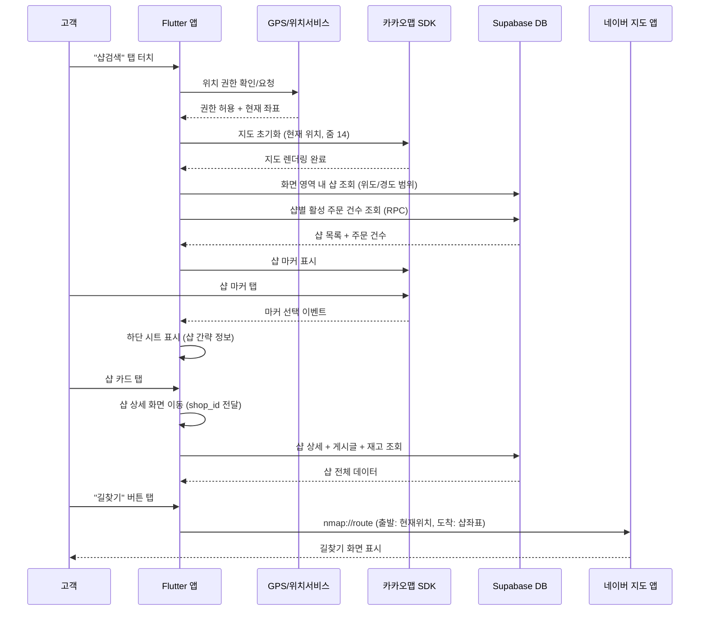

# 유스케이스: UC-6 주변 샵 검색

## 1. 개요

### 1.1 목적
고객이 현재 위치를 기반으로 주변 거트 샵을 지도 또는 리스트에서 검색하고, 각 샵의 작업 현황(접수/작업중 건수)을 확인한 뒤, 원하는 샵의 상세 정보와 길찾기를 통해 샵을 방문할 수 있도록 한다.

### 1.2 범위
- **포함**: 위치 권한 요청 및 처리, 카카오맵 기반 주변 샵 표시, 지도 뷰/리스트 뷰 전환, 샵 마커 탭 시 하단 시트 표시, 샵별 활성 작업 건수(접수 + 작업중) 표시, 샵 카드 탭 시 샵 상세 화면 이동, 길찾기 연동
- **제외**: 샵 등록, 샵 정보 수정, 작업 접수, QR 스캔 회원 등록

### 1.3 액터
- **주요 액터**: 고객 (customer)
- **부 액터**: Supabase DB, 카카오맵 SDK, 네이버 지도 앱 (길찾기), GPS (위치 서비스)

---

## 2. 선행 조건

- 고객이 로그인되어 있고 role이 `customer`이다
- 디바이스에 GPS(위치 서비스)가 활성화되어 있다
- 카카오맵 SDK가 정상적으로 초기화되어 있다

---

## 3. 기본 흐름

### 3.1 단계별 흐름

1. **고객**: 하단 네비게이션에서 "샵검색" 탭을 탭한다
   - **입력**: 없음
   - **처리**: 주변 샵 검색 화면(customer-shop-search)으로 이동
   - **출력**: 화면 전환

2. **앱 (Flutter)**: 위치 권한을 확인하고, 필요 시 권한을 요청한다
   - **입력**: 없음
   - **처리**: `Permission.location` 권한 상태 확인. 미요청 상태이면 시스템 권한 팝업을 표시한다
   - **출력**: 권한 허용 시 다음 단계로 진행. 거부 시 예외 흐름 5.1로 분기

3. **앱 (Flutter)**: 현재 GPS 위치를 획득하고, 카카오맵을 초기화한다
   - **입력**: GPS 좌표 (위도, 경도)
   - **처리**: 현재 위치를 중심 좌표로 설정하고, 줌 레벨 14로 카카오맵을 표시한다. 현재 위치에 파란색 점 마커를 표시한다
   - **출력**: 지도 화면에 현재 위치가 중심으로 표시됨

4. **앱 (Flutter)**: 지도 화면 영역(bounds) 내의 샵 목록을 Supabase에서 조회한다
   - **입력**: 지도의 남서쪽/북동쪽 좌표 (위도/경도 범위)
   - **처리**: `shops` 테이블에서 `latitude`, `longitude`가 화면 범위 내인 레코드를 조회한다. 동시에 각 샵의 활성 주문 건수(received + in_progress)를 집계한다
   - **출력**: 샵 목록 + 샵별 접수/작업중 건수

5. **앱 (Flutter)**: 조회된 샵을 지도에 마커로 표시한다
   - **입력**: 샵 목록 (이름, 위도, 경도)
   - **처리**: 각 샵 위치에 커스텀 마커(storefront 아이콘, 녹색 원형 배경, 28x28px)를 추가한다
   - **출력**: 지도 위에 주변 샵 마커가 표시됨

6. **고객**: 관심 있는 샵 마커를 탭한다
   - **입력**: 마커 탭 이벤트
   - **처리**: 선택된 마커를 강조(크기 32x32px, 진한 녹색)하고, 지도 카메라를 마커 위치로 이동한다. 하단 시트에 샵 간략 정보 카드를 슬라이드 업으로 표시한다
   - **출력**: 하단 시트에 샵 이름, 주소(간략), 현재 위치로부터 거리, 접수 N건, 작업중 N건이 표시됨

7. **고객**: 하단 시트의 샵 카드를 탭한다
   - **입력**: 샵 카드 탭 이벤트
   - **처리**: `shop_id`를 전달하며 샵 상세 화면(customer-shop-detail)으로 이동한다
   - **출력**: 샵 상세 화면 표시 (샵 소개, 작업 현황, 위치/연락처, 공지사항/이벤트/재고, 길찾기 버튼)

8. **고객**: 샵 상세 화면에서 "길찾기" 버튼을 탭한다
   - **입력**: 샵의 위도/경도
   - **처리**: 네이버 지도 앱 URL Scheme(`nmap://route/...`)으로 길찾기를 호출한다. 출발지는 현재 GPS 위치, 목적지는 샵 좌표로 설정한다
   - **출력**: 네이버 지도 앱에서 길찾기 화면이 열린다

### 3.2 시퀀스 다이어그램

---

## 4. 대안 흐름

### 4.1 리스트 뷰로 전환

**분기 조건**: 고객이 앱바의 "리스트" 토글을 탭한다

1. **고객**: 뷰 전환 토글에서 "리스트"를 선택한다
2. **앱**: 지도 뷰에서 리스트 뷰로 전환한다 (200ms 애니메이션)
3. **앱**: 현재 위치 기준 반경 5km 이내의 샵을 거리순으로 정렬하여 카드 리스트로 표시한다
4. **고객**: 리스트에서 원하는 샵 카드를 탭한다
5. **앱**: 샵 상세 화면(customer-shop-detail)으로 이동한다

**결과**: 지도 대신 리스트 형태로 주변 샵을 탐색할 수 있다. 각 카드에는 샵 이름, 주소(간략), 거리, 접수/작업중 건수가 표시된다.

### 4.2 지도 이동 시 재검색

**분기 조건**: 고객이 지도를 드래그하거나 핀치 줌으로 화면 영역을 변경한다

1. **고객**: 지도를 드래그하여 다른 지역을 탐색한다
2. **앱**: 지도 이동 완료 후 500ms debounce를 적용한다
3. **앱**: 변경된 화면 영역(bounds)으로 샵 목록을 재조회한다
4. **앱**: 기존 마커를 제거하고 새로운 영역의 샵 마커를 표시한다

**결과**: 지도 이동에 따라 해당 영역의 샵이 자동으로 검색되어 표시된다.

### 4.3 현재 위치 버튼 탭

**분기 조건**: 고객이 지도 우하단의 현재 위치 FAB를 탭한다

1. **고객**: 현재 위치 FAB를 탭한다
2. **앱**: GPS에서 최신 현재 위치를 획득한다
3. **앱**: 지도 카메라를 현재 위치로 이동한다 (줌 레벨 14)
4. **앱**: 이동된 화면 영역으로 주변 샵을 재검색한다

**결과**: 지도가 현재 위치로 돌아가고 주변 샵이 갱신된다.

### 4.4 주변에 샵이 없는 경우

**분기 조건**: 화면 영역 내에 등록된 샵이 0건인 경우

1. **앱**: 빈 상태 UI를 표시한다
   - 지도 뷰: 마커 없이 지도만 표시된다
   - 리스트 뷰: 일러스트(120x120px) + "주변에 등록된 샵이 없습니다" + "다른 지역을 탐색해 보세요" 안내 문구를 화면 중앙에 표시한다

**결과**: 고객이 지도를 이동하여 다른 지역을 탐색하도록 유도한다.

---

## 5. 예외 흐름

### 5.1 위치 권한 거부

**발생 조건**: 고객이 위치 권한 요청을 거부한 경우

**처리**:
1. 위치 권한 미허용 상태 화면을 표시한다
2. `location_off` 아이콘(48px) + "위치 권한이 필요합니다" + "주변 샵을 찾으려면 위치 권한을 허용해 주세요" 안내 문구를 표시한다
3. "설정으로 이동" 버튼을 표시한다
4. 고객이 버튼을 탭하면 시스템 앱 설정 화면으로 이동한다
5. 설정에서 권한 변경 후 앱으로 복귀하면 자동으로 위치를 재확인한다

**사용자 메시지**: "위치 권한이 필요합니다 / 주변 샵을 찾으려면 위치 권한을 허용해 주세요"

### 5.2 GPS 위치 획득 실패

**발생 조건**: GPS 신호가 약하거나 위치 서비스가 비활성화된 경우

**처리**:
1. "현재 위치를 확인할 수 없습니다" 스낵바를 표시한다
2. 마지막으로 알려진 위치가 있으면 해당 위치를 중심으로 지도를 표시한다
3. 마지막 위치도 없으면 서울 시청 좌표(37.5666, 126.9784) 등 기본 좌표를 중심으로 표시한다

**사용자 메시지**: "현재 위치를 확인할 수 없습니다"

### 5.3 지도 로딩 실패

**발생 조건**: 카카오맵 SDK 초기화 실패 또는 네트워크 오류로 지도 타일 로드가 실패한 경우

**처리**:
1. 지도 영역에 "지도를 불러올 수 없습니다" 메시지와 재시도 버튼을 표시한다
2. 고객이 재시도 버튼을 탭하면 지도 초기화를 다시 시도한다
3. 리스트 뷰로 전환하면 지도 없이 샵 목록을 확인할 수 있다

**사용자 메시지**: "지도를 불러올 수 없습니다"

### 5.4 샵 목록 조회 실패

**발생 조건**: Supabase 서버 오류 또는 네트워크 오류로 샵 데이터 조회가 실패한 경우

**처리**:
1. "데이터를 불러올 수 없습니다" 스낵바를 표시한다
2. 기존에 표시된 마커/리스트가 있으면 유지한다 (캐시된 데이터 활용)
3. 기존 데이터가 없으면 빈 상태를 표시한다

**에러 코드**: HTTP 5xx 또는 네트워크 타임아웃
**사용자 메시지**: "데이터를 불러올 수 없습니다"

### 5.5 네이버 지도 앱 미설치 (길찾기)

**발생 조건**: 샵 상세 화면에서 "길찾기" 버튼을 탭했으나 네이버 지도 앱이 설치되어 있지 않은 경우

**처리**:
1. `nmap://` URL Scheme 호출이 실패한다
2. 웹 브라우저로 네이버 지도 웹 버전 길찾기 URL을 폴백 호출한다
3. 웹 브라우저 호출도 실패하면 "지도 앱을 열 수 없습니다" 스낵바를 표시한다

**사용자 메시지**: "지도 앱을 열 수 없습니다" (최종 폴백 실패 시)

---

## 6. 후행 조건

### 6.1 성공 시
- **DB 변경**: 없음 (조회 전용 유스케이스)
- **시스템 상태**: 고객이 주변 샵 정보를 확인하고, 원하는 샵의 상세 정보를 열람하거나 길찾기를 실행한 상태
- **부수 효과**: 없음

### 6.2 실패 시
- **롤백**: 데이터 변경이 없으므로 롤백 대상 없음
- **시스템 상태**: 에러 메시지가 표시된 상태. 고객은 재시도하거나 다른 방법으로 샵을 탐색할 수 있음

---

## 7. 테스트 시나리오

### 7.1 성공 케이스

| ID | 시나리오 | 입력값 | 기대 결과 |
|----|----------|--------|----------|
| TC-6-01 | 지도 뷰에서 주변 샵 마커 표시 | 현재 위치 GPS 좌표, 화면 영역 내 샵 3개 존재 | 지도에 3개 마커 표시, 각 마커 탭 가능 |
| TC-6-02 | 마커 탭 시 하단 시트 표시 | 샵 마커 탭 | 하단 시트에 샵 이름, 주소, 거리, 접수 N건, 작업중 N건 표시 |
| TC-6-03 | 샵 카드 탭으로 상세 이동 | 하단 시트 샵 카드 탭 | customer-shop-detail 화면으로 이동, shop_id 정상 전달 |
| TC-6-04 | 리스트 뷰 전환 | "리스트" 토글 탭 | 거리순 정렬된 샵 카드 리스트 표시 |
| TC-6-05 | 지도 이동 시 재검색 | 지도 드래그 후 500ms 경과 | 새로운 화면 영역 내 샵 마커 갱신 |
| TC-6-06 | 현재 위치 버튼 탭 | FAB 탭 | 지도 카메라가 현재 위치로 이동, 주변 샵 재검색 |
| TC-6-07 | 샵 상세에서 길찾기 | "길찾기" 버튼 탭 | 네이버 지도 앱 길찾기 실행 (출발: 현재위치, 도착: 샵좌표) |
| TC-6-08 | 거리 표시 규칙 (1km 미만) | 샵 거리 350m | "350m"으로 표시 |
| TC-6-09 | 거리 표시 규칙 (1km 이상 10km 미만) | 샵 거리 1.2km | "1.2km"으로 표시 |
| TC-6-10 | 거리 표시 규칙 (10km 이상) | 샵 거리 15km | "15km"으로 표시 |
| TC-6-11 | 샵별 작업 현황 표시 | 샵의 접수 2건, 작업중 1건 | 카드에 "접수 2건 . 작업중 1건" 표시 |

### 7.2 실패 케이스

| ID | 시나리오 | 입력값 | 기대 결과 |
|----|----------|--------|----------|
| TC-6-12 | 위치 권한 거부 | 권한 팝업에서 "거부" 선택 | 위치 권한 안내 화면 표시, "설정으로 이동" 버튼 제공 |
| TC-6-13 | 주변 샵 0건 | 화면 영역 내 등록된 샵 없음 | 빈 상태 UI 표시: "주변에 등록된 샵이 없습니다" |
| TC-6-14 | GPS 위치 획득 실패 | GPS 신호 없음 | "현재 위치를 확인할 수 없습니다" 스낵바, 마지막 위치 또는 기본 좌표 사용 |
| TC-6-15 | 지도 로딩 실패 | 네트워크 오류 | "지도를 불러올 수 없습니다" + 재시도 버튼 |
| TC-6-16 | 샵 목록 조회 실패 | Supabase 서버 오류 | "데이터를 불러올 수 없습니다" 스낵바, 기존 데이터 유지 |
| TC-6-17 | 네이버 지도 앱 미설치 시 길찾기 | 네이버 지도 미설치 | 웹 브라우저로 폴백 길찾기 실행 |
| TC-6-18 | 설정에서 권한 허용 후 복귀 | 시스템 설정에서 위치 권한 허용 | 앱 복귀 시 자동으로 현재 위치 확인 및 지도 표시 |

---

## 8. 관련 유스케이스

- **선행**: UC-1 회원가입/로그인 (고객이 로그인되어야 샵 검색 가능)
- **후행**: UC-8 QR 스캔 회원 등록 (샵 방문 후 QR 스캔으로 회원 등록)
- **연관**: UC-5 작업 상태 변경 (샵의 작업 현황 건수에 영향)
