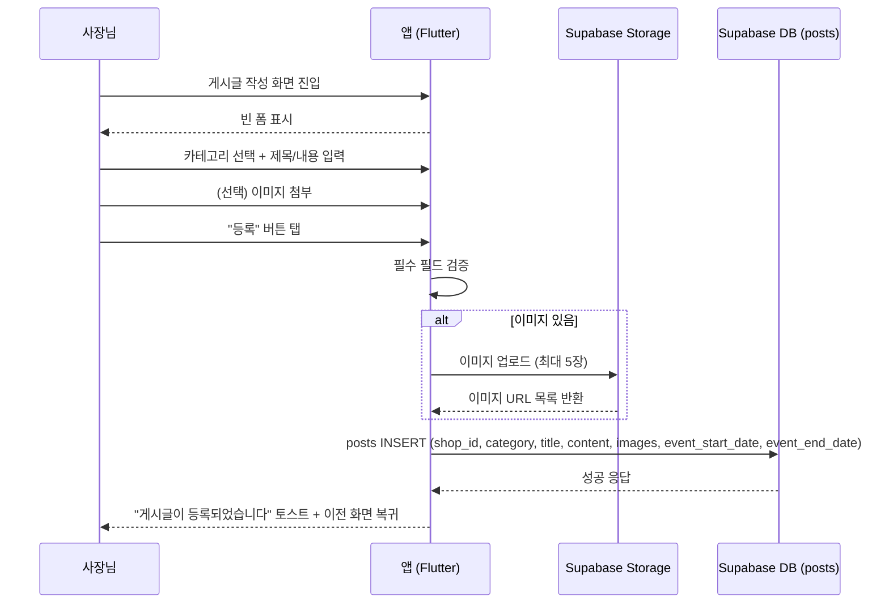
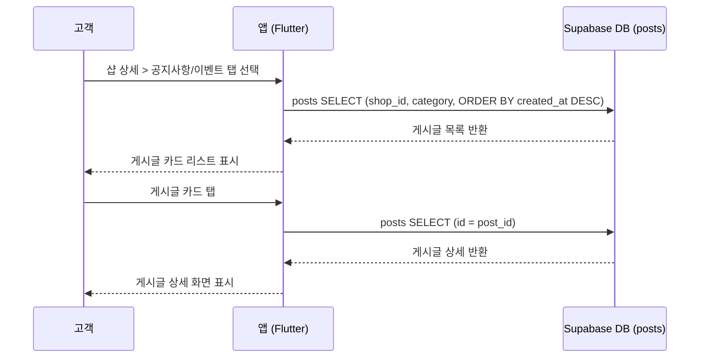

# 유스케이스: UC-7 게시글 관리

## 1. 개요

### 1.1 목적
샵 사장님이 공지사항 및 이벤트 게시글을 작성/관리하고, 고객이 샵 상세 화면에서 게시글을 열람할 수 있도록 한다.

### 1.2 범위
- **포함**: 게시글 작성(공지사항/이벤트), 이미지 첨부(최대 5장), 이벤트 기간 설정, 게시글 목록 조회, 게시글 상세 조회
- **제외**: 게시글 수정/삭제(향후 구현), 댓글/좋아요, 게시글 알림 발송

### 1.3 액터
- **주요 액터**: 샵 사장님(shop_owner) — 게시글을 작성한다
- **부 액터**: 고객(customer) — 게시글을 열람한다, Supabase Storage — 이미지를 저장한다

---

## 2. 선행 조건

- 사장님은 로그인된 상태이며 `role = 'shop_owner'`이다
- 사장님은 샵 등록이 완료된 상태이다 (`shops` 테이블에 해당 `owner_id` 레코드 존재)
- 고객은 로그인된 상태이며 `role = 'customer'`이다 (열람 시)

---

## 3. 기본 흐름

### 3.1 게시글 작성 (Create)

1. **사장님**: 게시글 작성 화면(`owner-post-create`)에 진입한다
   - **입력**: 없음
   - **처리**: 빈 폼 화면을 표시한다 (카테고리 미선택, 등록 버튼 비활성)
   - **출력**: 초기 상태의 게시글 작성 폼

2. **사장님**: 카테고리를 선택한다 (공지사항 또는 이벤트)
   - **입력**: `category` — `'notice'` 또는 `'event'`
   - **처리**: 선택된 칩을 강조 표시한다. 이벤트 선택 시 기간 입력 영역을 추가로 표시한다
   - **출력**: 카테고리 선택 상태 반영

3. **사장님**: 제목과 내용을 입력한다
   - **입력**: `title` (1~100자), `content` (1~2000자)
   - **처리**: 실시간으로 입력값을 검증한다. 글자 수 카운터를 갱신한다
   - **출력**: 입력값 반영, 검증 에러 시 필드 하단에 에러 메시지 표시

4. **사장님**: (선택) 이미지를 첨부한다
   - **입력**: 이미지 파일 (최대 5장, 각 10MB 이하)
   - **처리**: 카메라/갤러리 선택 바텀시트를 표시한다. 선택한 이미지를 썸네일 리스트에 추가한다
   - **출력**: 가로 스크롤 이미지 리스트에 썸네일 표시. 5장 도달 시 추가 버튼 숨김

5. **사장님**: 등록 버튼을 탭한다
   - **입력**: 전체 폼 데이터 (`category`, `title`, `content`, `images`, `event_start_date`, `event_end_date`)
   - **처리**:
     1. 필수 필드 검증 수행 (카테고리 선택, 제목/내용 입력, 이벤트 시 기간 입력)
     2. 이미지가 있으면 Supabase Storage(`post-images` 버킷)에 업로드하여 URL 목록을 획득한다
     3. `posts` 테이블에 INSERT한다 (`shop_id`, `category`, `title`, `content`, `images`, `event_start_date`, `event_end_date`)
   - **출력**: "게시글이 등록되었습니다" 토스트 메시지 표시 후 이전 화면으로 복귀

### 3.2 게시글 목록 조회 (Read — List)

1. **고객**: 샵 상세 화면(`customer-shop-detail`)에서 공지사항/이벤트 탭을 선택하거나, 게시글 목록 화면(`customer-post-list`)에 진입한다
   - **입력**: `shop_id`, `category` (선택적)
   - **처리**: `posts` 테이블에서 `shop_id`와 `category`로 필터링하여 `created_at DESC` 순으로 조회한다
   - **출력**: 게시글 카드 리스트 (카테고리 뱃지, 제목, 날짜, 본문 미리보기 2줄)

2. **고객**: 카테고리 탭을 전환한다 (공지사항/이벤트)
   - **입력**: 탭 인덱스
   - **처리**: 해당 카테고리의 게시글 목록을 표시한다
   - **출력**: 탭 인디케이터 이동, 해당 카테고리 게시글 리스트

### 3.3 게시글 상세 조회 (Read — Detail)

1. **고객**: 게시글 카드를 탭한다
   - **입력**: `post_id`
   - **처리**: `posts` 테이블에서 `id = post_id`로 단건 조회한다
   - **출력**: 게시글 상세 화면 — 카테고리 뱃지, 제목, 작성자("관리자" 고정), 날짜, 본문 전문, 첨부 이미지

### 3.4 시퀀스 다이어그램 — 게시글 작성

### 3.5 시퀀스 다이어그램 — 게시글 조회

---

## 4. 대안 흐름

### 4.1 이벤트 게시글 작성 (기간 포함)

**분기 조건**: 기본 흐름 3.1 2단계에서 카테고리로 `'event'`를 선택한 경우

1. 이벤트 기간 입력 영역이 추가로 표시된다
2. 사장님이 시작일과 종료일을 날짜 선택기(DatePicker)로 입력한다
3. 시작일은 오늘 이후, 종료일은 시작일 이후여야 한다
4. 등록 시 `event_start_date`와 `event_end_date`가 함께 저장된다

**결과**: 이벤트 게시글이 기간 정보와 함께 등록되며, 고객은 이벤트 탭에서 기간과 진행 상태(진행중/종료) 뱃지를 확인할 수 있다

### 4.2 이미지 없이 게시글 작성

**분기 조건**: 기본 흐름 3.1 4단계에서 이미지를 첨부하지 않는 경우

1. 이미지 업로드 단계를 건너뛴다
2. `posts.images` 필드에 빈 배열 `[]`이 저장된다
3. 게시글 상세에서 이미지 영역이 표시되지 않는다

**결과**: 텍스트만으로 구성된 게시글이 등록된다

### 4.3 작성 중 뒤로가기

**분기 조건**: 제목/내용/이미지 등 입력 내용이 있는 상태에서 뒤로가기를 시도하는 경우

1. "작성 중인 내용이 있습니다. 나가시겠습니까?" 확인 다이얼로그를 표시한다
2. "나가기" 선택 시 입력 내용을 폐기하고 이전 화면으로 복귀한다
3. "계속 작성" 선택 시 작성 화면에 머문다

**결과**: 사용자의 의도를 확인한 후 화면 이탈 처리한다

### 4.4 빈 게시글 목록

**분기 조건**: 해당 카테고리에 등록된 게시글이 0건인 경우

1. "등록된 게시글이 없습니다" 빈 상태 텍스트를 화면 중앙에 표시한다

**결과**: 빈 상태 UI가 표시되며, 사장님의 게시글 작성을 유도한다

---

## 5. 예외 흐름

### 5.1 이미지 업로드 실패

**발생 조건**: Supabase Storage에 이미지 업로드 중 네트워크 오류 또는 서버 오류가 발생한 경우

**처리**:
1. 이미지 업로드를 중단한다
2. 이미 업로드된 이미지가 있으면 해당 이미지는 Storage에 남는다 (고아 파일)
3. 게시글 INSERT를 수행하지 않는다
4. 에러 스낵바를 표시한다
5. 등록 버튼을 재활성화하여 재시도를 허용한다

**에러 코드**: `STORAGE_UPLOAD_FAILED` (HTTP 500 또는 네트워크 타임아웃)
**사용자 메시지**: "이미지 업로드에 실패했습니다. 다시 시도해 주세요."

### 5.2 내용 길이 초과

**발생 조건**: 제목이 100자를 초과하거나 내용이 2000자를 초과하는 경우

**처리**:
1. 입력 필드에서 최대 글자 수 이상 입력을 차단한다 (maxLength)
2. 최대 글자 수에 도달하면 글자 수 카운터가 빨간색으로 표시된다

**에러 코드**: 클라이언트 검증 (서버 호출 없음)
**사용자 메시지**: 필드 하단 에러 메시지로 "최대 {N}자까지 입력 가능합니다" 표시

### 5.3 이벤트 날짜 검증 실패

**발생 조건**: 이벤트 종료일이 시작일 이전이거나, 시작일이 오늘 이전인 경우

**처리**:
1. 등록 버튼 탭 시 날짜 검증을 수행한다
2. 검증 실패 시 날짜 필드 하단에 에러 메시지를 표시한다

**에러 코드**: 클라이언트 검증 (서버 호출 없음)
**사용자 메시지**: "종료일은 시작일 이후여야 합니다" 또는 "시작일은 오늘 이후여야 합니다"

### 5.4 게시글 INSERT 실패

**발생 조건**: Supabase DB에 게시글 INSERT 중 네트워크 오류 또는 RLS 정책 위반이 발생한 경우

**처리**:
1. 에러 스낵바를 표시한다
2. 등록 버튼을 재활성화하여 재시도를 허용한다
3. 이미 업로드된 이미지는 Storage에 남는다 (재시도 시 재업로드 방지는 미구현)

**에러 코드**: `POST_INSERT_FAILED` (HTTP 403 RLS 위반 또는 HTTP 500)
**사용자 메시지**: "게시글 등록에 실패했습니다. 다시 시도해 주세요."

### 5.5 게시글 조회 실패

**발생 조건**: 네트워크 오류로 게시글 목록 또는 상세 조회가 실패한 경우

**처리**:
1. 에러 메시지와 재시도 버튼을 표시한다
2. 재시도 버튼 탭 시 API를 다시 호출한다

**에러 코드**: `POST_FETCH_FAILED` (HTTP 500 또는 네트워크 타임아웃)
**사용자 메시지**: "데이터를 불러올 수 없습니다"

---

## 6. 후행 조건

### 6.1 성공 시 (게시글 작성)
- **DB 변경**: `posts` 테이블에 새 레코드 INSERT (`id`, `shop_id`, `category`, `title`, `content`, `images`, `event_start_date`, `event_end_date`, `created_at`)
- **Storage 변경**: 이미지가 있으면 `post-images` 버킷에 이미지 파일 저장
- **시스템 상태**: 게시글 작성 화면이 닫히고 이전 화면으로 복귀한다
- **부수 효과**: 없음 (게시글 작성 시 푸시 알림은 발송하지 않음)

### 6.2 성공 시 (게시글 조회)
- **DB 변경**: 없음 (읽기 전용)
- **시스템 상태**: 게시글 목록 또는 상세 화면이 정상적으로 표시된다

### 6.3 실패 시
- **롤백**: 게시글 INSERT 실패 시 DB에 레코드가 생성되지 않는다. 이미 업로드된 이미지는 Storage에 잔류할 수 있다 (고아 파일)
- **시스템 상태**: 에러 메시지가 표시되며, 사용자는 재시도할 수 있다

---

## 7. 테스트 시나리오

### 7.1 성공 케이스

| ID | 시나리오 | 입력값 | 기대 결과 |
|----|----------|--------|----------|
| TC-7-01 | 공지사항 게시글 작성 (이미지 없음) | category=notice, title="휴무 안내", content="7월 15일 휴무" | posts 테이블에 레코드 생성, images=[], 토스트 표시 후 화면 복귀 |
| TC-7-02 | 공지사항 게시글 작성 (이미지 포함) | category=notice, title="오픈 안내", content="본문", images=[img1, img2] | Storage에 이미지 2장 업로드, posts.images에 URL 2개 저장 |
| TC-7-03 | 이벤트 게시글 작성 (기간 포함) | category=event, title="할인 이벤트", content="본문", start=2026-03-01, end=2026-03-31 | posts에 event_start_date, event_end_date 포함 레코드 생성 |
| TC-7-04 | 이미지 5장 최대 첨부 | images 5장 첨부 | 5장 모두 업로드 성공, 추가 버튼 숨김 |
| TC-7-05 | 고객 공지사항 목록 조회 | shop_id=valid, tab=공지사항 | 해당 샵의 공지사항 게시글이 최신순으로 표시 |
| TC-7-06 | 고객 이벤트 목록 조회 | shop_id=valid, tab=이벤트 | 해당 샵의 이벤트 게시글이 기간/상태 뱃지와 함께 표시 |
| TC-7-07 | 고객 게시글 상세 조회 | post_id=valid | 제목, 본문, 이미지, 날짜가 모두 표시 |
| TC-7-08 | 탭 전환 | 공지사항 → 이벤트 → 공지사항 | 각 탭별 게시글이 정상 표시, 스와이프 제스처 지원 |

### 7.2 실패 케이스

| ID | 시나리오 | 입력값 | 기대 결과 |
|----|----------|--------|----------|
| TC-7-09 | 필수 필드 누락 (카테고리 미선택) | category=null | 등록 버튼 비활성, 등록 불가 |
| TC-7-10 | 필수 필드 누락 (제목 비어있음) | title="" | 등록 버튼 비활성, 제목 필드 에러 메시지 표시 |
| TC-7-11 | 제목 길이 초과 | title=101자 | 100자에서 입력 차단 |
| TC-7-12 | 내용 길이 초과 | content=2001자 | 2000자에서 입력 차단 |
| TC-7-13 | 이벤트 종료일 < 시작일 | start=2026-03-31, end=2026-03-01 | 날짜 에러 메시지 "종료일은 시작일 이후여야 합니다" |
| TC-7-14 | 이벤트 시작일이 과거 | start=2026-01-01 | 날짜 에러 메시지 "시작일은 오늘 이후여야 합니다" |
| TC-7-15 | 이미지 업로드 실패 | 네트워크 오류 중 이미지 업로드 | 에러 스낵바 표시, 등록 버튼 재활성화 |
| TC-7-16 | 게시글 INSERT 실패 | DB 네트워크 오류 | 에러 스낵바 표시, 등록 버튼 재활성화 |
| TC-7-17 | 이미지 10MB 초과 | 15MB 이미지 첨부 시도 | 에러 메시지 표시, 해당 이미지 첨부 거부 |
| TC-7-18 | 게시글 조회 실패 | 네트워크 오류 중 목록 조회 | 에러 메시지 + 재시도 버튼 표시 |
| TC-7-19 | 빈 게시글 목록 | 게시글 0건인 샵 | "등록된 게시글이 없습니다" 빈 상태 표시 |

---

## 8. 비즈니스 규칙

| ID | 규칙 | 비고 |
|----|------|------|
| BR-7-01 | 게시글 카테고리는 `'notice'`(공지사항) 또는 `'event'`(이벤트) 중 하나이다 | DB CHECK 제약 |
| BR-7-02 | 이미지는 최대 5장까지 첨부 가능하며, 각 이미지는 10MB 이하이다 | 클라이언트 검증 |
| BR-7-03 | 이벤트 게시글의 시작일은 오늘 이후, 종료일은 시작일 이후여야 한다 | 클라이언트 검증 |
| BR-7-04 | 게시글 작성은 해당 샵의 사장님만 가능하다 | RLS: `is_shop_owner(shop_id)` |
| BR-7-05 | 게시글 조회는 모든 인증된 사용자가 가능하다 | RLS: `posts_select_all` |
| BR-7-06 | 게시글 상세에서 작성자는 "관리자"로 고정 표시한다 | UI 고정값 |
| BR-7-07 | 제목은 1~100자, 내용은 1~2000자이다 | 클라이언트 검증 |

---

## 9. 관련 화면

| 화면 ID | 화면명 | 역할 |
|---------|--------|------|
| `owner-post-create` | 게시글 작성 | 사장님이 게시글을 작성한다 |
| `customer-post-list` | 게시글 목록 | 고객이 카테고리별 게시글 목록을 조회한다 |
| `customer-post-detail` | 게시글 상세 | 고객이 게시글 전문을 확인한다 |
| `customer-shop-detail` | 샵 상세 | 고객이 샵 상세에서 공지사항/이벤트 탭으로 게시글을 열람한다 |

---

## 10. 관련 유스케이스

- **선행**: UC-2 샵 등록 (사장님이 샵을 등록해야 게시글 작성 가능)
- **후행**: 없음
- **연관**: UC-8 재고 관리 (샵 상세 화면의 다른 탭)
