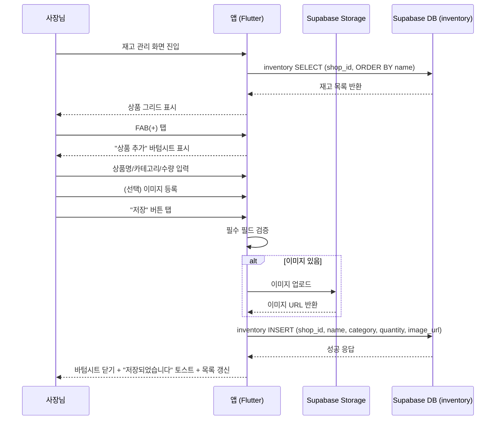
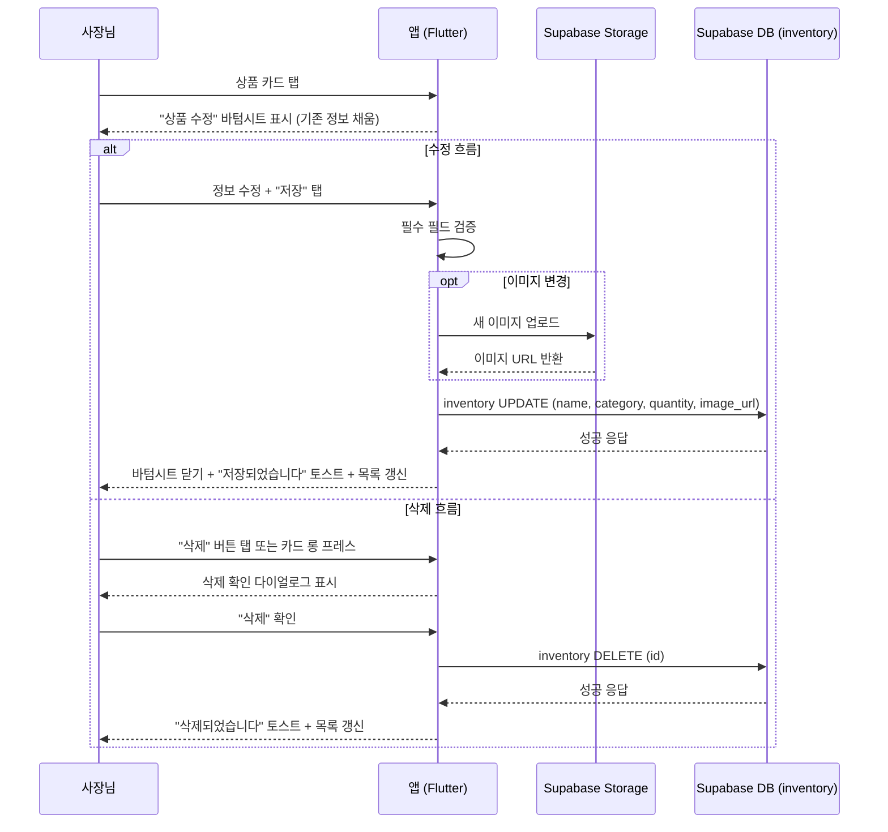
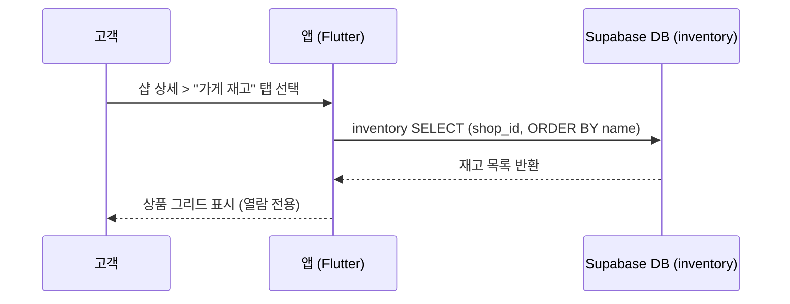

# 유스케이스: UC-8 재고 관리

## 1. 개요

### 1.1 목적
샵 사장님이 상품 재고(라켓, 셔틀콕, 그립 등)를 등록/수정/삭제하여 관리하고, 고객이 샵 상세 화면에서 재고를 열람할 수 있도록 한다.

### 1.2 범위
- **포함**: 상품 등록(이름, 카테고리, 수량, 이미지), 상품 수정, 상품 삭제, 고객의 재고 열람
- **제외**: 상품 구매/결제, 재고 자동 차감, 재고 부족 알림

### 1.3 액터
- **주요 액터**: 샵 사장님(shop_owner) — 재고를 등록/수정/삭제한다
- **부 액터**: 고객(customer) — 재고를 열람한다, Supabase Storage — 상품 이미지를 저장한다

---

## 2. 선행 조건

- 사장님은 로그인된 상태이며 `role = 'shop_owner'`이다
- 사장님은 샵 등록이 완료된 상태이다 (`shops` 테이블에 해당 `owner_id` 레코드 존재)
- 고객은 로그인된 상태이며 `role = 'customer'`이다 (열람 시)

---

## 3. 기본 흐름

### 3.1 상품 등록 (Create)

1. **사장님**: 재고 관리 화면(`owner-inventory-manage`)에 진입한다
   - **입력**: 없음
   - **처리**: `inventory` 테이블에서 `shop_id`로 필터링하여 `name ASC` 순으로 조회한다
   - **출력**: 상품 그리드(2열) 표시. 상품이 없으면 빈 상태 UI 표시

2. **사장님**: FAB(+) 버튼을 탭한다
   - **입력**: 없음
   - **처리**: "상품 추가" 바텀시트를 표시한다 (빈 폼)
   - **출력**: 상품명, 카테고리, 재고 수량 입력 필드와 이미지 영역이 있는 바텀시트

3. **사장님**: 상품 정보를 입력한다
   - **입력**: `name` (1~50자, 필수), `category` (드롭다운 선택, 필수), `quantity` (0~9999 정수, 필수), `image` (선택, 10MB 이하)
   - **처리**: 필수 필드 입력 시 저장 버튼을 활성화한다. 카테고리는 고정 목록(라켓, 상의, 하의, 가방, 신발, 악세서리)에서 선택한다
   - **출력**: 입력값 반영, 저장 버튼 활성화 상태 변경

4. **사장님**: (선택) 상품 이미지를 등록한다
   - **입력**: 이미지 파일 (1장, 10MB 이하)
   - **처리**: 카메라/갤러리 선택 바텀시트를 표시한다. 선택한 이미지를 썸네일로 표시한다
   - **출력**: 80x80px 썸네일 표시, 삭제(X) 버튼 포함

5. **사장님**: "저장" 버튼을 탭한다
   - **입력**: 전체 폼 데이터 (`name`, `category`, `quantity`, `image`)
   - **처리**:
     1. 필수 필드 검증 수행 (상품명, 카테고리, 수량)
     2. 이미지가 있으면 Supabase Storage(`inventory-images` 버킷)에 업로드하여 URL을 획득한다
     3. `inventory` 테이블에 INSERT한다 (`shop_id`, `name`, `category`, `quantity`, `image_url`)
   - **출력**: 바텀시트 닫기, "저장되었습니다" 토스트 표시, 그리드 목록 갱신

### 3.2 상품 수정 (Update)

1. **사장님**: 상품 카드를 탭한다
   - **입력**: 선택한 상품의 `inventory.id`
   - **처리**: "상품 수정" 바텀시트를 표시한다 (기존 상품 정보가 채워진 폼)
   - **출력**: 상품명, 카테고리, 수량, 이미지가 채워진 바텀시트. 하단에 "삭제" 버튼 추가 표시

2. **사장님**: 정보를 수정한다
   - **입력**: 변경된 `name`, `category`, `quantity`, `image`
   - **처리**: 필수 필드 검증을 수행한다
   - **출력**: 변경값 반영

3. **사장님**: "저장" 버튼을 탭한다
   - **입력**: 수정된 폼 데이터
   - **처리**:
     1. 이미지가 변경되었으면 새 이미지를 Storage에 업로드한다
     2. `inventory` 테이블에 UPDATE한다 (`name`, `category`, `quantity`, `image_url`)
   - **출력**: 바텀시트 닫기, "저장되었습니다" 토스트 표시, 그리드 목록 갱신

### 3.3 상품 삭제 (Delete)

1. **사장님**: 상품 카드를 롱 프레스하거나, 수정 바텀시트에서 "삭제" 버튼을 탭한다
   - **입력**: 삭제 대상 상품의 `inventory.id`
   - **처리**: "'상품명'을 삭제하시겠습니까?" 확인 다이얼로그를 표시한다
   - **출력**: 삭제 확인 다이얼로그

2. **사장님**: "삭제" 버튼을 탭한다
   - **입력**: 확인 동작
   - **처리**: `inventory` 테이블에서 해당 레코드를 DELETE한다
   - **출력**: "삭제되었습니다" 토스트 표시, 그리드 목록에서 해당 상품 제거

### 3.4 재고 열람 (Read — 고객)

1. **고객**: 샵 상세 화면(`customer-shop-detail`)에서 "가게 재고" 탭을 선택한다
   - **입력**: `shop_id`
   - **처리**: `inventory` 테이블에서 `shop_id`로 필터링하여 `name ASC` 순으로 조회한다
   - **출력**: 상품 그리드(3열) — 상품 이미지(또는 기본 아이콘), 상품명, 재고 수량. 상단에 "재고 정보는 열람만 가능합니다" 안내 표시

### 3.5 시퀀스 다이어그램 — 상품 등록

### 3.6 시퀀스 다이어그램 — 상품 수정/삭제

### 3.7 시퀀스 다이어그램 — 고객 재고 열람

---

## 4. 대안 흐름

### 4.1 이미지 없이 상품 등록

**분기 조건**: 기본 흐름 3.1 4단계에서 이미지를 등록하지 않는 경우

1. 이미지 업로드 단계를 건너뛴다
2. `inventory.image_url`에 `null`이 저장된다
3. 상품 그리드에서 기본 이미지(아이콘 `inventory_2`, 배경 `#F1F5F9`)가 표시된다

**결과**: 기본 이미지가 적용된 상품이 등록된다

### 4.2 수량만 변경

**분기 조건**: 기본 흐름 3.2에서 수량만 수정하는 경우

1. 수량 필드만 변경하고 "저장" 버튼을 탭한다
2. `inventory.quantity` 필드만 UPDATE된다

**결과**: 수량이 즉시 반영되어 고객에게도 변경된 수량이 표시된다

### 4.3 빈 재고 목록

**분기 조건**: 등록된 상품이 0건인 경우

1. 사장님 화면: 빈 상태 아이콘(`inventory_2`) + "등록된 상품이 없습니다" + "'+' 버튼으로 상품을 등록하세요" 안내 표시
2. 고객 화면: "등록된 재고 정보가 없습니다" 빈 상태 텍스트 표시

**결과**: 빈 상태 UI가 역할에 맞게 표시된다

### 4.4 바텀시트에서 삭제

**분기 조건**: 기본 흐름 3.2에서 수정 바텀시트 하단의 "삭제" 버튼을 탭한 경우

1. 삭제 확인 다이얼로그를 표시한다
2. 확인 시 상품을 삭제하고 바텀시트를 닫는다

**결과**: 롱 프레스와 동일하게 삭제가 수행된다

---

## 5. 예외 흐름

### 5.1 이미지 업로드 실패

**발생 조건**: Supabase Storage에 이미지 업로드 중 네트워크 오류 또는 서버 오류가 발생한 경우

**처리**:
1. 이미지 업로드를 중단한다
2. `inventory` INSERT/UPDATE를 수행하지 않는다
3. 에러 스낵바를 표시한다
4. 저장 버튼을 재활성화하여 재시도를 허용한다

**에러 코드**: `STORAGE_UPLOAD_FAILED` (HTTP 500 또는 네트워크 타임아웃)
**사용자 메시지**: "이미지 업로드에 실패했습니다. 다시 시도해 주세요."

### 5.2 음수 수량 입력 방지

**발생 조건**: 수량에 음수를 입력하려는 경우

**처리**:
1. 클라이언트에서 숫자 키패드(`TextInputType.number`)를 제공하여 음수 입력을 방지한다
2. 0~9999 범위 검증을 수행한다
3. DB에도 `CHECK (quantity >= 0)` 제약이 설정되어 있어 이중 방어된다

**에러 코드**: 클라이언트 검증 (서버 호출 없음). DB CHECK 위반 시 HTTP 400
**사용자 메시지**: "재고 수량은 0 이상이어야 합니다"

### 5.3 상품 INSERT/UPDATE 실패

**발생 조건**: Supabase DB에 INSERT 또는 UPDATE 중 네트워크 오류 또는 RLS 정책 위반이 발생한 경우

**처리**:
1. 에러 스낵바를 표시한다
2. 저장 버튼을 재활성화하여 재시도를 허용한다

**에러 코드**: `INVENTORY_SAVE_FAILED` (HTTP 403 RLS 위반 또는 HTTP 500)
**사용자 메시지**: "저장에 실패했습니다. 다시 시도해 주세요."

### 5.4 상품 삭제 실패

**발생 조건**: 삭제 요청 중 네트워크 오류 또는 RLS 정책 위반이 발생한 경우

**처리**:
1. 에러 스낵바를 표시한다
2. 상품은 그리드에 유지된다

**에러 코드**: `INVENTORY_DELETE_FAILED` (HTTP 403 RLS 위반 또는 HTTP 500)
**사용자 메시지**: "삭제에 실패했습니다. 다시 시도해 주세요."

### 5.5 재고 조회 실패

**발생 조건**: 네트워크 오류로 재고 목록 조회가 실패한 경우

**처리**:
1. "데이터를 불러올 수 없습니다" 에러 메시지와 재시도 버튼을 표시한다
2. 재시도 버튼 탭 시 API를 다시 호출한다

**에러 코드**: `INVENTORY_FETCH_FAILED` (HTTP 500 또는 네트워크 타임아웃)
**사용자 메시지**: "데이터를 불러올 수 없습니다"

---

## 6. 후행 조건

### 6.1 성공 시 (상품 등록)
- **DB 변경**: `inventory` 테이블에 새 레코드 INSERT (`id`, `shop_id`, `name`, `category`, `quantity`, `image_url`, `created_at`)
- **Storage 변경**: 이미지가 있으면 `inventory-images` 버킷에 이미지 파일 저장
- **시스템 상태**: 바텀시트가 닫히고 상품 그리드에 새 상품이 추가된다

### 6.2 성공 시 (상품 수정)
- **DB 변경**: `inventory` 테이블의 해당 레코드 UPDATE (`name`, `category`, `quantity`, `image_url`)
- **Storage 변경**: 이미지가 변경되었으면 새 이미지가 업로드된다 (기존 이미지는 잔류)
- **시스템 상태**: 바텀시트가 닫히고 상품 그리드에 변경된 정보가 반영된다

### 6.3 성공 시 (상품 삭제)
- **DB 변경**: `inventory` 테이블에서 해당 레코드 DELETE
- **시스템 상태**: 그리드에서 해당 상품이 제거된다. Storage의 이미지는 잔류할 수 있다

### 6.4 성공 시 (재고 열람)
- **DB 변경**: 없음 (읽기 전용)
- **시스템 상태**: 고객에게 재고 그리드가 표시된다

### 6.5 실패 시
- **롤백**: INSERT/UPDATE 실패 시 DB에 변경이 적용되지 않는다. 이미 업로드된 이미지는 Storage에 잔류할 수 있다 (고아 파일)
- **시스템 상태**: 에러 메시지가 표시되며, 사용자는 재시도할 수 있다

---

## 7. 테스트 시나리오

### 7.1 성공 케이스

| ID | 시나리오 | 입력값 | 기대 결과 |
|----|----------|--------|----------|
| TC-8-01 | 상품 등록 (이미지 포함) | name="BG65", category="라켓", quantity=12, image=valid | inventory 레코드 생성, Storage에 이미지 저장, 그리드에 상품 표시 |
| TC-8-02 | 상품 등록 (이미지 없음) | name="셔틀콕", category="악세서리", quantity=50, image=null | inventory 레코드 생성, image_url=null, 기본 아이콘 표시 |
| TC-8-03 | 상품 수량 수정 | 기존 quantity=12 → quantity=8 | inventory UPDATE, 그리드에 "8개" 표시 |
| TC-8-04 | 상품명/카테고리 수정 | name="BG65Ti", category="라켓" | inventory UPDATE, 변경된 정보 반영 |
| TC-8-05 | 상품 이미지 변경 | 기존 이미지 → 새 이미지 | 새 이미지 Storage 업로드, image_url 갱신 |
| TC-8-06 | 상품 삭제 (롱 프레스) | 상품 카드 롱 프레스 → 삭제 확인 | inventory DELETE, 그리드에서 제거 |
| TC-8-07 | 상품 삭제 (바텀시트) | 수정 바텀시트 > 삭제 버튼 → 확인 | inventory DELETE, 그리드에서 제거 |
| TC-8-08 | 고객 재고 열람 | shop_id=valid | 해당 샵의 재고가 3열 그리드로 표시, 열람만 가능 |
| TC-8-09 | 수량 0 등록 | name="품절 상품", quantity=0 | inventory 레코드 생성, 수량 "0개" 표시 |
| TC-8-10 | 삭제 확인 다이얼로그에서 취소 | 삭제 확인 > "취소" 탭 | 삭제 취소, 상품 유지 |

### 7.2 실패 케이스

| ID | 시나리오 | 입력값 | 기대 결과 |
|----|----------|--------|----------|
| TC-8-11 | 필수 필드 누락 (상품명 비어있음) | name="" | 저장 버튼 비활성, 상품명 에러 메시지 |
| TC-8-12 | 필수 필드 누락 (카테고리 미선택) | category="" | 저장 버튼 비활성, 카테고리 에러 메시지 |
| TC-8-13 | 상품명 길이 초과 | name=51자 | 50자에서 입력 차단 |
| TC-8-14 | 수량 범위 초과 | quantity=10000 | 에러 메시지 "수량은 0~9999 사이여야 합니다" |
| TC-8-15 | 음수 수량 입력 | quantity=-1 | 숫자 키패드에서 입력 차단, DB CHECK 제약 이중 방어 |
| TC-8-16 | 이미지 업로드 실패 | 네트워크 오류 중 이미지 업로드 | 에러 스낵바, 저장 버튼 재활성화 |
| TC-8-17 | 상품 INSERT 실패 | DB 네트워크 오류 | 에러 스낵바, 저장 버튼 재활성화 |
| TC-8-18 | 상품 삭제 실패 | DB 네트워크 오류 | 에러 스낵바, 상품 유지 |
| TC-8-19 | 이미지 10MB 초과 | 15MB 이미지 등록 시도 | 에러 메시지, 이미지 등록 거부 |
| TC-8-20 | 빈 재고 목록 | 상품 0건인 샵 | 사장님: 빈 상태 아이콘 + 안내, 고객: "등록된 재고 정보가 없습니다" |
| TC-8-21 | 재고 조회 실패 | 네트워크 오류 | 에러 메시지 + 재시도 버튼 |

---

## 8. 비즈니스 규칙

| ID | 규칙 | 비고 |
|----|------|------|
| BR-8-01 | 재고 수량은 0 이상이어야 한다 | DB CHECK: `quantity >= 0` |
| BR-8-02 | 상품 이미지가 없으면 기본 아이콘(`inventory_2`)을 표시한다 | UI 기본값 |
| BR-8-03 | 고객은 재고를 열람만 할 수 있으며 구매 기능은 제공하지 않는다 | 핵심 정책 |
| BR-8-04 | 재고 관리(등록/수정/삭제)는 해당 샵의 사장님만 가능하다 | RLS: `is_shop_owner(shop_id)` |
| BR-8-05 | 재고 열람은 모든 인증된 사용자가 가능하다 | RLS: `inventory_select_all` |
| BR-8-06 | 카테고리는 고정 목록(라켓, 상의, 하의, 가방, 신발, 악세서리)에서 선택한다 | UI 드롭다운 |
| BR-8-07 | 상품명은 1~50자, 수량은 0~9999이다 | 클라이언트 검증 |
| BR-8-08 | 상품 삭제 시 반드시 확인 다이얼로그를 표시한다 | 오조작 방지 |

---

## 9. 관련 화면

| 화면 ID | 화면명 | 역할 |
|---------|--------|------|
| `owner-inventory-manage` | 재고 관리 | 사장님이 상품을 등록/수정/삭제한다 |
| `customer-shop-detail` | 샵 상세 | 고객이 "가게 재고" 탭에서 재고를 열람한다 |

---

## 10. 관련 유스케이스

- **선행**: UC-2 샵 등록 (사장님이 샵을 등록해야 재고 관리 가능)
- **후행**: 없음
- **연관**: UC-7 게시글 관리 (샵 상세 화면의 다른 탭)
