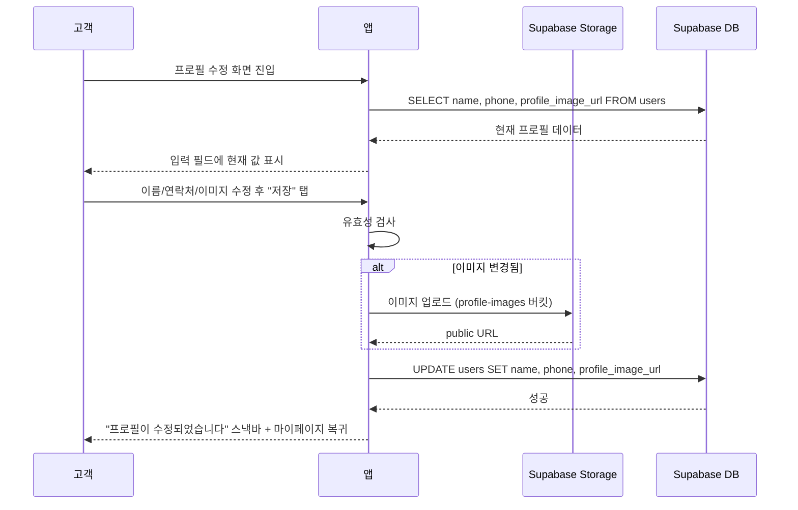
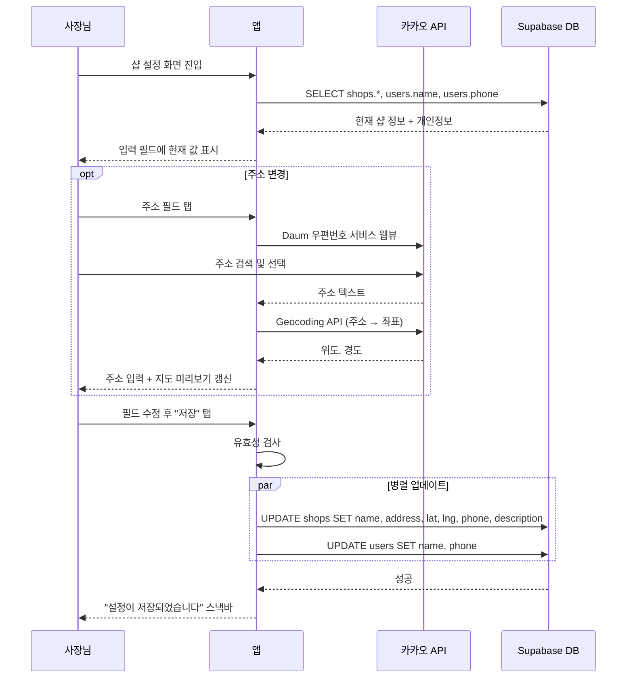

# 유스케이스: UC-9 프로필 수정

## 1. 개요

### 1.1 목적
사용자가 자신의 프로필 정보를 수정한다. 고객은 프로필 이미지, 이름, 연락처를 수정하고, 샵 사장님은 개인정보(이름, 연락처)와 샵 정보(이름, 주소, 연락처, 소개글)를 수정한다.

### 1.2 범위
- **포함**: 고객 프로필 수정(이미지, 이름, 연락처), 사장님 개인정보 수정(이름, 연락처), 샵 정보 수정(이름, 주소, 연락처, 소개글), 프로필 이미지 업로드(Supabase Storage), 주소 변경 시 좌표 변환(Geocoding)
- **제외**: 이메일 변경(소셜 로그인 제공값으로 읽기 전용), 역할 변경, 비밀번호 변경, 회원 탈퇴

### 1.3 액터
- **주요 액터**: 고객(customer), 샵 사장님(shop_owner)
- **부 액터**: Supabase(DB, Storage, Auth), 카카오 주소 API(Daum 우편번호 서비스), 카카오맵 Geocoding API

---

## 2. 선행 조건

- 사용자가 로그인 상태이다 (Supabase Auth 인증 완료)
- `users` 테이블에 사용자 레코드가 존재한다
- 사장님의 경우 `shops` 테이블에 샵 레코드가 존재한다 (가입 2단계에서 등록 완료)

---

## 3. 기본 흐름

### 3.1 고객 프로필 수정

1. **고객**: 마이페이지(`customer-mypage`)에서 "프로필 수정" 버튼을 탭한다
   - **처리**: 프로필 수정 화면(`customer-profile-edit`)으로 이동

2. **앱**: 현재 프로필 데이터를 로드한다
   - **처리**: `users` 테이블에서 `id = auth.uid()`로 name, phone, profile_image_url 조회. `auth.currentUser`에서 email 조회
   - **출력**: 각 입력 필드에 현재 값 표시. 이메일은 읽기 전용(회색 배경)

3. **고객**: 프로필 이미지, 이름, 연락처 중 원하는 항목을 수정한다
   - **입력**: 이름(필수, 최대 20자), 연락처(필수, 전화번호 형식), 프로필 이미지(선택)
   - **처리**: 변경 감지 시 저장 버튼 활성화

4. **고객**: "저장" 버튼을 탭한다

5. **앱**: 유효성 검사를 수행한다
   - **처리**: 이름 빈 값 확인, 연락처 형식 확인
   - **출력**: 유효성 통과 시 다음 단계 진행

6. **앱**: 프로필 이미지가 변경된 경우 Supabase Storage에 업로드한다
   - **처리**: `profile-images` 버킷에 이미지 파일 업로드
   - **출력**: 업로드된 이미지의 public URL 획득

7. **앱**: `users` 테이블을 업데이트한다
   - **처리**: `UPDATE users SET name, phone, profile_image_url WHERE id = auth.uid()`
   - **출력**: 업데이트 성공

8. **앱**: 성공 피드백을 표시하고 이전 화면으로 복귀한다
   - **출력**: "프로필이 수정되었습니다" 스낵바, 마이페이지로 복귀

### 3.2 사장님 샵 정보 + 개인정보 수정

1. **사장님**: 하단 네비게이션에서 "설정" 탭을 탭하여 샵 설정 화면(`owner-shop-settings`)에 진입한다

2. **앱**: 현재 샵 정보와 사장님 개인정보를 로드한다
   - **처리**: `shops` 테이블에서 `owner_id = auth.uid()`로 name, address, latitude, longitude, phone, description 조회. `users` 테이블에서 `id = auth.uid()`로 name, phone 조회
   - **출력**: 샵 정보 섹션과 사장님 개인정보 섹션에 현재 값 표시

3. **사장님**: 샵 정보(이름, 주소, 연락처, 소개글)와 개인정보(이름, 연락처) 중 원하는 항목을 수정한다
   - **입력**: 샵 이름(필수, 최대 30자), 주소(필수, 검색으로만 입력), 샵 연락처(필수, 전화번호 형식), 소개글(선택, 최대 200자), 사장님 이름(필수, 최대 20자), 사장님 연락처(필수, 전화번호 형식)
   - **처리**: 변경 감지 시 저장 버튼 활성화

4. **사장님**: 주소를 변경하는 경우, 주소 필드를 탭하여 주소 검색 바텀시트를 연다
   - **처리**: 카카오 주소 API(Daum 우편번호 서비스) 웹뷰 로드
   - **출력**: 주소 선택 시 주소 텍스트 자동 입력, 카카오맵 Geocoding API로 위도/경도 자동 변환, 지도 미리보기에 마커 표시

5. **사장님**: "저장" 버튼을 탭한다

6. **앱**: 유효성 검사를 수행한다
   - **처리**: 모든 필수 필드 빈 값 확인, 연락처 형식 확인
   - **출력**: 유효성 통과 시 다음 단계 진행

7. **앱**: 샵 정보와 사장님 정보를 병렬로 업데이트한다
   - **처리**: `UPDATE shops SET name, address, latitude, longitude, phone, description WHERE owner_id = auth.uid()` 와 `UPDATE users SET name, phone WHERE id = auth.uid()` 를 병렬 호출
   - **출력**: 양쪽 모두 업데이트 성공

8. **앱**: 성공 피드백을 표시한다
   - **출력**: "설정이 저장되었습니다" 스낵바, 저장 버튼 비활성화로 전환

### 3.3 시퀀스 다이어그램 — 고객 프로필 수정

### 3.4 시퀀스 다이어그램 — 사장님 샵 설정 수정

---

## 4. 대안 흐름

### 4.1 변경사항 없이 저장 시도

**분기 조건**: 기본 흐름 3단계에서 어떤 필드도 수정하지 않은 경우

1. 저장 버튼이 비활성 상태(`#CBD5E1`)로 유지된다
2. 버튼을 탭할 수 없으므로 API 호출이 발생하지 않는다

**결과**: 화면 상태 변경 없음

### 4.2 변경사항이 있는 상태에서 뒤로가기 (고객)

**분기 조건**: 고객이 프로필 수정 화면에서 값을 변경한 후 뒤로가기 버튼을 탭한 경우

1. 확인 다이얼로그를 표시한다: "변경사항이 저장되지 않습니다. 나가시겠습니까?"
2. "취소" 선택 시 화면에 머무른다
3. "나가기" 선택 시 변경사항을 버리고 마이페이지로 복귀한다

**결과**: 사용자 선택에 따라 화면 유지 또는 복귀

### 4.3 변경사항이 있는 상태에서 탭 전환 (사장님)

**분기 조건**: 사장님이 샵 설정 화면에서 값을 변경한 후 하단 네비게이션 다른 탭을 탭한 경우

1. 확인 다이얼로그를 표시한다: "저장하지 않은 변경사항이 있습니다. 저장하시겠습니까?"
2. "취소" 선택 시 화면에 머무른다
3. "저장" 선택 시 저장 후 탭 전환한다

**결과**: 사용자 선택에 따라 저장 후 이동 또는 화면 유지

### 4.4 프로필 이미지만 변경 (고객)

**분기 조건**: 기본 흐름 3단계에서 이미지만 변경하고 이름/연락처는 그대로인 경우

1. 카메라 버튼을 탭하면 바텀시트로 이미지 소스 선택(카메라/갤러리) 제공
2. 이미지 선택 시 프로필 이미지 영역에 미리보기 표시
3. 저장 버튼 활성화
4. 저장 시 Storage 업로드 → `users.profile_image_url` UPDATE

**결과**: 이미지 URL만 변경됨

---

## 5. 예외 흐름

### 5.1 유효성 검사 실패

**발생 조건**: 필수 필드가 비어있거나 연락처 형식이 올바르지 않은 경우

**처리**:
1. 해당 필드 테두리를 빨간색(`#EF4444`)으로 변경한다
2. 필드 아래에 에러 메시지를 표시한다 (예: "이름을 입력해 주세요", "올바른 연락처를 입력해 주세요")
3. 저장 API를 호출하지 않는다

**사용자 메시지**: 필드별 에러 메시지 표시

### 5.2 프로필 이미지 업로드 실패

**발생 조건**: Supabase Storage 업로드 중 네트워크 오류 또는 파일 크기 초과

**처리**:
1. 업로드를 중단한다
2. 에러 스낵바를 표시한다
3. 이미지 변경을 취소하고 이전 이미지로 되돌린다
4. 이름/연락처 변경분은 저장하지 않는다 (일관성 유지)

**사용자 메시지**: "이미지 업로드에 실패했습니다. 다시 시도해 주세요."

### 5.3 주소 Geocoding 실패 (사장님)

**발생 조건**: 카카오맵 Geocoding API 호출 실패 또는 좌표 변환 불가

**처리**:
1. 주소 텍스트는 입력되지만 좌표를 획득하지 못한다
2. 지도 미리보기에 안내 텍스트를 유지한다
3. 저장 시 좌표가 없으면 저장을 차단한다

**사용자 메시지**: "주소 좌표를 가져올 수 없습니다. 다른 주소를 검색해 주세요."

### 5.4 DB 업데이트 실패

**발생 조건**: 네트워크 오류 또는 서버 오류로 `users` 또는 `shops` UPDATE 실패

**처리**:
1. 저장 버튼의 로딩 인디케이터를 제거한다
2. 입력 필드를 다시 활성화한다
3. 에러 스낵바를 표시한다
4. 사용자가 다시 저장을 시도할 수 있도록 한다

**사용자 메시지**: 고객 - "프로필 수정에 실패했습니다. 다시 시도해 주세요." / 사장님 - "설정 저장에 실패했습니다. 다시 시도해 주세요."

### 5.5 프로필 데이터 로드 실패

**발생 조건**: 화면 진입 시 네트워크 오류로 프로필/샵 데이터 조회 실패

**처리**:
1. 에러 상태 UI를 표시한다
2. "재시도" 버튼을 제공한다
3. 재시도 시 데이터를 다시 조회한다

**사용자 메시지**: 고객 - "프로필을 불러올 수 없습니다" / 사장님 - "설정을 불러올 수 없습니다"

---

## 6. 후행 조건

### 6.1 성공 시
- **DB 변경 (고객)**: `users` 테이블의 name, phone, profile_image_url 업데이트
- **DB 변경 (사장님)**: `users` 테이블의 name, phone 업데이트 + `shops` 테이블의 name, address, latitude, longitude, phone, description 업데이트
- **Storage 변경 (고객)**: 이미지 변경 시 `profile-images` 버킷에 새 이미지 저장
- **시스템 상태**: 변경된 정보가 다른 화면에서도 즉시 반영됨 (마이페이지 프로필 섹션, 샵 상세 페이지 등)
- **부수 효과**: 고객 연락처 변경 시 해당 고객이 등록된 `members` 테이블의 phone도 함께 업데이트 필요 (매칭 정합성 유지)

### 6.2 실패 시
- **롤백**: DB 변경 없음, Storage에 업로드된 이미지가 있다면 고아 파일로 남을 수 있음 (정기 정리 필요)
- **시스템 상태**: 이전 프로필/샵 정보 유지

---

## 7. 테스트 시나리오

### 7.1 성공 케이스

| ID | 시나리오 | 입력값 | 기대 결과 |
|----|----------|--------|----------|
| TC-9-01 | 고객이 이름을 변경한다 | name: "김배드" | `users.name`이 "김배드"로 업데이트, 스낵바 표시 후 마이페이지 복귀 |
| TC-9-02 | 고객이 연락처를 변경한다 | phone: "010-9876-5432" | `users.phone`이 업데이트됨 |
| TC-9-03 | 고객이 프로필 이미지를 변경한다 | 갤러리에서 이미지 선택 | Storage에 이미지 업로드, `users.profile_image_url` 업데이트 |
| TC-9-04 | 고객이 이름과 연락처를 동시에 변경한다 | name: "김배드", phone: "010-1111-2222" | 두 필드 모두 업데이트 |
| TC-9-05 | 사장님이 샵 이름을 변경한다 | shop_name: "최고스트링" | `shops.name`이 업데이트됨 |
| TC-9-06 | 사장님이 주소를 변경한다 | 주소 검색으로 새 주소 선택 | `shops.address`, `latitude`, `longitude` 업데이트, 지도 미리보기 갱신 |
| TC-9-07 | 사장님이 샵 정보와 개인정보를 동시에 변경한다 | shop_phone + owner_name 변경 | `shops`와 `users` 테이블 모두 업데이트 |
| TC-9-08 | 사장님이 소개글을 추가한다 | description: "최고의 거트 전문점" | `shops.description` 업데이트 |

### 7.2 실패 케이스

| ID | 시나리오 | 입력값 | 기대 결과 |
|----|----------|--------|----------|
| TC-9-09 | 이름을 빈 값으로 저장 시도 | name: "" | 에러 메시지 "이름을 입력해 주세요" 표시, 저장 차단 |
| TC-9-10 | 연락처 형식 오류 | phone: "abc123" | 에러 메시지 "올바른 연락처를 입력해 주세요" 표시, 저장 차단 |
| TC-9-11 | 이미지 업로드 실패 | 대용량 이미지 또는 네트워크 끊김 | 에러 스낵바 표시, 이전 이미지 유지 |
| TC-9-12 | Geocoding 실패 (사장님) | 좌표 변환 불가 주소 | "주소 좌표를 가져올 수 없습니다" 메시지, 저장 차단 |
| TC-9-13 | DB 업데이트 실패 (네트워크 오류) | 정상 입력 + 네트워크 끊김 | 에러 스낵바 표시, 입력값 유지, 재시도 가능 |
| TC-9-14 | 변경사항 없이 저장 시도 | 아무 필드도 수정하지 않음 | 저장 버튼 비활성, API 호출 없음 |
| TC-9-15 | 이름 최대 길이 초과 | name: "가" * 21 (21자) | 20자 제한 에러 표시 |
| TC-9-16 | 소개글 최대 길이 초과 (사장님) | description: 201자 | 200자 제한 에러 표시 |

---

## 8. 관련 유스케이스

- **선행**: 회원가입 (고객/사장님 계정 및 샵 등록 완료 상태)
- **후행**: 없음
- **연관**: 마이페이지 조회 (프로필 정보 표시), 샵 상세 조회 (변경된 샵 정보 반영), 회원 매칭 (연락처 변경 시 members 테이블 동기화)
