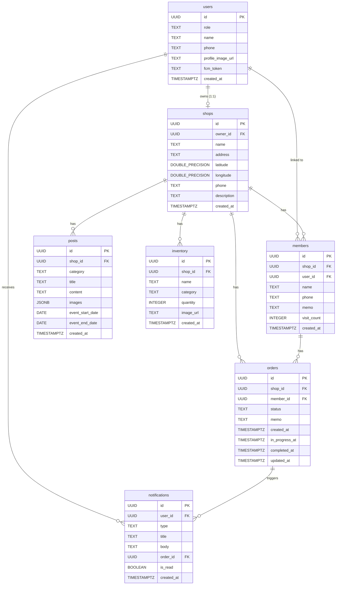

# 데이터베이스 스키마

> Supabase Postgres Best Practices 적용

## 데이터 흐름

### 사용자 등록 (소셜 로그인)
1. 소셜 로그인(카카오/네이버/Google) → Supabase Auth에 인증 정보 생성
2. 신규 사용자 → 프로필 설정 화면에서 역할(customer/shop_owner), 이름, 연락처 입력 → `users` 테이블에 INSERT
3. 기존 사용자 → `users` 테이블에서 role 조회 → 역할별 홈으로 이동

### 샵 등록
1. 사장님 가입 2단계 → 샵 이름, 주소, 연락처, 소개글 입력
2. 주소 입력 시 네이버 Geocoding API로 위도/경도 자동 변환
3. `shops` 테이블에 INSERT (owner_id = 현재 사용자)

### QR 스캔 회원 등록
1. 고객이 가게 QR코드 스캔 → `shop_id` 인식
2. `members` 테이블에서 해당 shop_id + user_id로 기존 회원 확인
3. 기존 회원 없으면 → `members` 테이블에 INSERT (user_id, name, phone을 users에서 가져옴)
4. 이미 등록된 회원이면 → "이미 등록된 회원입니다" 안내

### 수동 회원 등록 (앱 미가입 고객)
1. 사장님이 이름, 연락처 입력 → `members` 테이블에 INSERT (user_id = NULL)
2. 나중에 고객이 앱 가입 시 → phone 기준으로 `members.user_id` 자동 매칭

### 작업 접수
1. 사장님이 회원 선택(QR 스캔 또는 수동 검색) + 메모 입력
2. `orders` 테이블에 INSERT (status = 'received')
3. 고객에게 "접수됨" 푸시 알림 전송

### 작업 상태 변경
1. 사장님이 상태 변경 (received → in_progress → completed)
2. `orders` 테이블 UPDATE (status, in_progress_at 또는 completed_at 갱신)
3. DB Trigger → Edge Function → FCM으로 고객에게 푸시 알림 전송
4. `notifications` 테이블에 INSERT (알림 기록 저장)

### 게시글 작성
1. 사장님이 공지사항 또는 이벤트 작성 → 이미지 업로드(Storage) → `posts` 테이블에 INSERT
2. 이벤트인 경우 시작일/종료일 추가 저장

### 재고 관리
1. 사장님이 상품 등록 → 이미지 업로드(Storage, 선택) → `inventory` 테이블에 INSERT
2. 수량/정보 변경 → UPDATE
3. 상품 삭제 → DELETE

### 알림 조회 및 읽음 처리
1. 고객이 알림 화면 진입 → `notifications` 테이블에서 user_id로 조회 (최신순)
2. 화면 진입 시 전체 읽음 처리 → `is_read = true` UPDATE
3. 개별 알림 탭 → 해당 알림 읽음 처리 + order_id가 있으면 작업 상세로 이동

---

## 테이블 정의

### 테이블: users — 공통 사용자

| 컬럼 | 타입 | 제약조건 | 설명 |
|------|------|---------|------|
| id | UUID | PK, REFERENCES auth.users(id) | Supabase Auth UID와 동일 |
| role | TEXT | NOT NULL, CHECK (role IN ('customer', 'shop_owner')) | 사용자 역할 |
| name | TEXT | NOT NULL | 이름 |
| phone | TEXT | NOT NULL | 연락처 |
| profile_image_url | TEXT | NULLABLE | 프로필 이미지 URL (Storage) |
| fcm_token | TEXT | NULLABLE | FCM 푸시 알림 토큰 |
| created_at | TIMESTAMPTZ | NOT NULL, DEFAULT now() | 가입일 |

> PK: auth.users(id)를 참조하므로 UUID 유지 (auth.users가 UUIDv4 사용)

### 테이블: shops — 샵 정보

| 컬럼 | 타입 | 제약조건 | 설명 |
|------|------|---------|------|
| id | UUID | PK, DEFAULT uuid_generate_v7() | 샵 고유 ID (UUIDv7 시간순) |
| owner_id | UUID | NOT NULL, FK → users(id), UNIQUE | 사장님 (1인 1샵) |
| name | TEXT | NOT NULL | 샵 이름 |
| address | TEXT | NOT NULL | 주소 |
| latitude | DOUBLE PRECISION | NOT NULL | 위도 (Geocoding) |
| longitude | DOUBLE PRECISION | NOT NULL | 경도 (Geocoding) |
| phone | TEXT | NOT NULL | 샵 연락처 |
| description | TEXT | NULLABLE | 소개글 |
| created_at | TIMESTAMPTZ | NOT NULL, DEFAULT now() | 등록일 |

### 테이블: members — 샵별 회원 관리

| 컬럼 | 타입 | 제약조건 | 설명 |
|------|------|---------|------|
| id | UUID | PK, DEFAULT uuid_generate_v7() | 회원 고유 ID |
| shop_id | UUID | NOT NULL, FK → shops(id) ON DELETE CASCADE | 소속 샵 |
| user_id | UUID | NULLABLE, FK → users(id) ON DELETE SET NULL | 앱 사용자 연결 (미가입이면 NULL) |
| name | TEXT | NOT NULL | 이름 |
| phone | TEXT | NOT NULL | 연락처 |
| memo | TEXT | NULLABLE | 사장님 메모 |
| visit_count | INTEGER | NOT NULL, DEFAULT 0, CHECK (visit_count >= 0) | 방문(작업) 횟수 |
| created_at | TIMESTAMPTZ | NOT NULL, DEFAULT now() | 등록일 |

**제약조건:**
- UNIQUE(shop_id, user_id) WHERE user_id IS NOT NULL — 같은 샵에 동일 사용자 중복 등록 방지 (부분 유니크 인덱스)
- UNIQUE(shop_id, phone) — 같은 샵에 동일 연락처 중복 등록 방지

### 테이블: orders — 거트 작업 건

| 컬럼 | 타입 | 제약조건 | 설명 |
|------|------|---------|------|
| id | UUID | PK, DEFAULT uuid_generate_v7() | 작업 고유 ID |
| shop_id | UUID | NOT NULL, FK → shops(id) ON DELETE CASCADE | 샵 |
| member_id | UUID | NOT NULL, FK → members(id) | 회원 |
| status | TEXT | NOT NULL, DEFAULT 'received', CHECK (status IN ('received', 'in_progress', 'completed')) | 작업 상태 |
| memo | TEXT | NULLABLE | 작업 메모 |
| created_at | TIMESTAMPTZ | NOT NULL, DEFAULT now() | 접수일 (= received_at) |
| in_progress_at | TIMESTAMPTZ | NULLABLE | 작업중 전환 시각 |
| completed_at | TIMESTAMPTZ | NULLABLE | 완료 전환 시각 |
| updated_at | TIMESTAMPTZ | NOT NULL, DEFAULT now() | 최종 상태 변경일 |

### 테이블: posts — 샵 게시글 (공지사항/이벤트)

| 컬럼 | 타입 | 제약조건 | 설명 |
|------|------|---------|------|
| id | UUID | PK, DEFAULT uuid_generate_v7() | 게시글 고유 ID |
| shop_id | UUID | NOT NULL, FK → shops(id) ON DELETE CASCADE | 샵 |
| category | TEXT | NOT NULL, CHECK (category IN ('notice', 'event')) | 카테고리 |
| title | TEXT | NOT NULL | 제목 |
| content | TEXT | NOT NULL | 내용 |
| images | JSONB | NOT NULL, DEFAULT '[]'::jsonb | 이미지 URL 배열 (최대 5장) |
| event_start_date | DATE | NULLABLE | 이벤트 시작일 (이벤트만) |
| event_end_date | DATE | NULLABLE | 이벤트 종료일 (이벤트만) |
| created_at | TIMESTAMPTZ | NOT NULL, DEFAULT now() | 작성일 |

### 테이블: inventory — 가게 재고

| 컬럼 | 타입 | 제약조건 | 설명 |
|------|------|---------|------|
| id | UUID | PK, DEFAULT uuid_generate_v7() | 상품 고유 ID |
| shop_id | UUID | NOT NULL, FK → shops(id) ON DELETE CASCADE | 샵 |
| name | TEXT | NOT NULL | 상품명 |
| category | TEXT | NULLABLE | 카테고리 (자유 입력) |
| quantity | INTEGER | NOT NULL, DEFAULT 0, CHECK (quantity >= 0) | 재고 수량 |
| image_url | TEXT | NULLABLE | 상품 이미지 URL (없으면 기본 이미지) |
| created_at | TIMESTAMPTZ | NOT NULL, DEFAULT now() | 등록일 |

### 테이블: notifications — 알림

| 컬럼 | 타입 | 제약조건 | 설명 |
|------|------|---------|------|
| id | UUID | PK, DEFAULT uuid_generate_v7() | 알림 고유 ID |
| user_id | UUID | NOT NULL, FK → users(id) ON DELETE CASCADE | 수신 사용자 |
| type | TEXT | NOT NULL, CHECK (type IN ('status_change', 'completion', 'notice', 'receipt')) | 알림 유형 |
| title | TEXT | NOT NULL | 알림 제목 |
| body | TEXT | NOT NULL | 알림 내용 |
| order_id | UUID | NULLABLE, FK → orders(id) ON DELETE SET NULL | 연결된 작업 (주문 관련 알림) |
| is_read | BOOLEAN | NOT NULL, DEFAULT false | 읽음 여부 |
| created_at | TIMESTAMPTZ | NOT NULL, DEFAULT now() | 생성일 |

---

## 관계 다이어그램



---

## RLS 정책

> **성능 원칙**: `auth.uid()`를 `(select auth.uid())`로 감싸서 매 행이 아닌 쿼리당 1회만 호출되도록 한다.
> **보안 원칙**: 모든 테이블에 `FORCE ROW LEVEL SECURITY`를 적용하여 테이블 소유자에게도 RLS를 강제한다.
> **반복 로직 최적화**: shop ownership 확인을 `security definer` 헬퍼 함수로 분리하여 인덱스를 활용한다.

### 헬퍼 함수

```sql
-- shop ownership 확인 (RLS 정책에서 반복 사용)
create or replace function is_shop_owner(p_shop_id uuid)
returns boolean
language sql
security definer
set search_path = ''
as $$
  select exists (
    select 1 from public.shops
    where id = p_shop_id and owner_id = (select auth.uid())
  );
$$;

-- member의 user_id 확인 (orders RLS에서 사용)
create or replace function is_order_member(p_member_id uuid)
returns boolean
language sql
security definer
set search_path = ''
as $$
  select exists (
    select 1 from public.members
    where id = p_member_id and user_id = (select auth.uid())
  );
$$;
```

### users 테이블
- **SELECT**: 자신의 데이터만 조회 가능 (`(select auth.uid()) = id`)
- **INSERT**: 자신의 데이터만 삽입 가능 (`(select auth.uid()) = id`)
- **UPDATE**: 자신의 데이터만 수정 가능 (`(select auth.uid()) = id`). 수정 가능 컬럼: name, phone, profile_image_url, fcm_token

### shops 테이블
- **SELECT**: 모든 인증된 사용자가 조회 가능 (주변 샵 검색, 샵 상세 등)
- **INSERT**: `(select auth.uid()) = owner_id`
- **UPDATE**: `(select auth.uid()) = owner_id`

### members 테이블
- **SELECT**: shop owner이거나, 자신이 연결된 회원인 경우 (`is_shop_owner(shop_id)` OR `(select auth.uid()) = user_id`)
- **INSERT**: shop owner이거나, QR 스캔으로 자기 자신을 등록하는 경우
- **UPDATE**: shop owner만 (visit_count, memo 등 수정)

### orders 테이블
- **SELECT**: shop owner이거나, 해당 member의 user인 경우 (`is_shop_owner(shop_id)` OR `is_order_member(member_id)`)
- **INSERT**: shop owner만 (`is_shop_owner(shop_id)`)
- **UPDATE**: shop owner만 (`is_shop_owner(shop_id)`)
- **DELETE**: shop owner만 + received 상태 (`is_shop_owner(shop_id)` AND `status = 'received'`)

### posts 테이블
- **SELECT**: 모든 인증된 사용자가 조회 가능 (샵 상세에서 공지/이벤트 열람)
- **INSERT**: shop owner만 (`is_shop_owner(shop_id)`)
- **UPDATE**: shop owner만 (`is_shop_owner(shop_id)`)
- **DELETE**: shop owner만 (`is_shop_owner(shop_id)`)

### inventory 테이블
- **SELECT**: 모든 인증된 사용자가 조회 가능 (고객은 열람만 가능)
- **INSERT**: shop owner만 (`is_shop_owner(shop_id)`)
- **UPDATE**: shop owner만 (`is_shop_owner(shop_id)`)
- **DELETE**: shop owner만 (`is_shop_owner(shop_id)`)

### notifications 테이블
- **SELECT**: 자신의 알림만 조회 가능 (`(select auth.uid()) = user_id`)
- **INSERT**: Edge Function(service_role)에서만 생성 (DB 트리거 경유)
- **UPDATE**: 자신의 알림만 수정 가능 (`(select auth.uid()) = user_id`). 수정 가능 컬럼: is_read

---

## 인덱스

> **원칙**: 모든 FK 컬럼에 인덱스를 생성한다 (PostgreSQL은 FK에 자동 인덱스를 생성하지 않음).
> 복합 인덱스는 등호(=) 컬럼을 앞에, 범위(<, >) 컬럼을 뒤에 배치한다.
> 자주 필터링되는 조건에는 부분 인덱스(partial index)를 사용한다.

### FK 인덱스

| 테이블 | 컬럼 | 비고 |
|--------|------|------|
| shops | owner_id | UNIQUE 제약에 의해 자동 생성 |
| members | shop_id | 복합 인덱스에 포함 |
| members | user_id | 부분 유니크 인덱스에 포함 |
| orders | shop_id | 복합 인덱스에 포함 |
| orders | member_id | 단일 인덱스 생성 |
| posts | shop_id | 복합 인덱스에 포함 |
| inventory | shop_id | 단일 인덱스 생성 |
| notifications | user_id | 복합 인덱스에 포함 |
| notifications | order_id | 단일 인덱스 생성 |

### 비즈니스 인덱스

| 테이블 | 컬럼 | 유형 | 이유 |
|--------|------|------|------|
| members | (shop_id, name) | B-tree 복합 | 사장님이 회원 이름으로 검색 |
| members | (shop_id, phone) | B-tree 복합 (UNIQUE) | 연락처로 회원 검색 + 중복 확인 |
| members | (shop_id, user_id) WHERE user_id IS NOT NULL | 부분 유니크 | QR 스캔 시 기존 회원 확인 |
| orders | (shop_id, status) | B-tree 복합 | 샵별 상태 필터링 (대시보드, 작업 관리) |
| orders | (shop_id, created_at) | B-tree 복합 | 오늘의 작업 현황 조회 (대시보드) |
| posts | (shop_id, category, created_at DESC) | B-tree 복합 | 샵별 카테고리 필터링 + 최신순 정렬 |
| notifications | (user_id, created_at DESC) | B-tree 복합 | 사용자별 최신순 알림 조회 |

### 부분 인덱스 (Partial Index)

| 테이블 | 컬럼 | 조건 | 이유 |
|--------|------|------|------|
| orders | (shop_id, created_at) | WHERE status IN ('received', 'in_progress') | 활성 주문만 빈번 조회 (대시보드, 홈) |
| notifications | (user_id) | WHERE is_read = false | 읽지 않은 알림 카운트 (뱃지) |

---

## 마이그레이션 SQL

```sql
-- ============================================
-- 거트알림 데이터베이스 마이그레이션
-- Supabase (PostgreSQL)
-- Best Practices 적용
-- ============================================

-- UUIDv7 확장 활성화 (시간순 UUID, 인덱스 단편화 방지)
create extension if not exists pg_uuidv7;

-- ============================================
-- 1. users 테이블
-- ============================================
-- PK: auth.users(id) 참조이므로 UUID 유지 (auth가 UUIDv4 사용)
create table users (
  id uuid primary key references auth.users(id) on delete cascade,
  role text not null check (role in ('customer', 'shop_owner')),
  name text not null,
  phone text not null,
  profile_image_url text,
  fcm_token text,
  created_at timestamptz not null default now()
);

-- 2. shops 테이블
create table shops (
  id uuid primary key default uuid_generate_v7(),
  owner_id uuid not null unique references users(id) on delete cascade,
  name text not null,
  address text not null,
  latitude double precision not null,
  longitude double precision not null,
  phone text not null,
  description text,
  created_at timestamptz not null default now()
);

-- 3. members 테이블
create table members (
  id uuid primary key default uuid_generate_v7(),
  shop_id uuid not null references shops(id) on delete cascade,
  user_id uuid references users(id) on delete set null,
  name text not null,
  phone text not null,
  memo text,
  visit_count integer not null default 0 check (visit_count >= 0),
  created_at timestamptz not null default now(),
  unique (shop_id, phone)
);

-- user_id가 NOT NULL인 경우만 유니크 (부분 유니크 인덱스)
create unique index idx_members_shop_user
  on members (shop_id, user_id)
  where user_id is not null;

-- 4. orders 테이블
create table orders (
  id uuid primary key default uuid_generate_v7(),
  shop_id uuid not null references shops(id) on delete cascade,
  member_id uuid not null references members(id),
  status text not null default 'received'
    check (status in ('received', 'in_progress', 'completed')),
  memo text,
  created_at timestamptz not null default now(),
  in_progress_at timestamptz,
  completed_at timestamptz,
  updated_at timestamptz not null default now()
);

-- 5. posts 테이블
create table posts (
  id uuid primary key default uuid_generate_v7(),
  shop_id uuid not null references shops(id) on delete cascade,
  category text not null check (category in ('notice', 'event')),
  title text not null,
  content text not null,
  images jsonb not null default '[]'::jsonb,
  event_start_date date,
  event_end_date date,
  created_at timestamptz not null default now()
);

-- 6. inventory 테이블
create table inventory (
  id uuid primary key default uuid_generate_v7(),
  shop_id uuid not null references shops(id) on delete cascade,
  name text not null,
  category text,
  quantity integer not null default 0 check (quantity >= 0),
  image_url text,
  created_at timestamptz not null default now()
);

-- 7. notifications 테이블
create table notifications (
  id uuid primary key default uuid_generate_v7(),
  user_id uuid not null references users(id) on delete cascade,
  type text not null
    check (type in ('status_change', 'completion', 'notice', 'receipt')),
  title text not null,
  body text not null,
  order_id uuid references orders(id) on delete set null,
  is_read boolean not null default false,
  created_at timestamptz not null default now()
);

-- ============================================
-- 인덱스
-- ============================================

-- members: 비즈니스 인덱스 (FK 커버 포함)
create index idx_members_shop_name on members (shop_id, name);
-- (shop_id, phone)은 UNIQUE 제약에 의해 자동 인덱스 생성

-- orders: 비즈니스 인덱스 (FK 커버 포함)
create index idx_orders_shop_status on orders (shop_id, status);
create index idx_orders_shop_created on orders (shop_id, created_at);
create index idx_orders_member on orders (member_id);       -- FK 인덱스

-- orders: 활성 주문 부분 인덱스 (대시보드, 홈에서 빈번 조회)
create index idx_orders_active on orders (shop_id, created_at)
  where status in ('received', 'in_progress');

-- posts: 비즈니스 인덱스 (FK 커버 포함)
create index idx_posts_shop_category on posts (shop_id, category, created_at desc);

-- inventory: FK 인덱스
create index idx_inventory_shop on inventory (shop_id);

-- notifications: 비즈니스 인덱스 (FK 커버 포함)
create index idx_notifications_user_created on notifications (user_id, created_at desc);
create index idx_notifications_order on notifications (order_id);  -- FK 인덱스

-- notifications: 읽지 않은 알림 부분 인덱스 (뱃지 카운트)
create index idx_notifications_unread on notifications (user_id)
  where is_read = false;

-- shops: 좌표 범위 조회
create index idx_shops_location on shops (latitude, longitude);

-- ============================================
-- 트리거: updated_at 자동 갱신 (orders)
-- ============================================

create or replace function update_updated_at()
returns trigger as $$
begin
  new.updated_at = now();
  return new;
end;
$$ language plpgsql;

create trigger trigger_orders_updated_at
  before update on orders
  for each row
  execute function update_updated_at();

-- ============================================
-- 트리거: 상태 변경 시 타임스탬프 자동 기록 (orders)
-- ============================================

create or replace function set_order_status_timestamps()
returns trigger as $$
begin
  if new.status = 'in_progress' and old.status = 'received' then
    new.in_progress_at = now();
  elsif new.status = 'completed' and old.status = 'in_progress' then
    new.completed_at = now();
  end if;
  return new;
end;
$$ language plpgsql;

create trigger trigger_order_status_timestamps
  before update of status on orders
  for each row
  execute function set_order_status_timestamps();

-- ============================================
-- RLS 헬퍼 함수 (security definer)
-- ============================================
-- 반복되는 shop ownership 확인을 함수로 분리.
-- security definer로 실행되어 RLS를 우회하며, 인덱스를 활용한다.
-- search_path를 빈 문자열로 설정하여 스키마 주입을 방지한다.

create or replace function is_shop_owner(p_shop_id uuid)
returns boolean
language sql
security definer
set search_path = ''
as $$
  select exists (
    select 1 from public.shops
    where id = p_shop_id and owner_id = (select auth.uid())
  );
$$;

create or replace function is_order_member(p_member_id uuid)
returns boolean
language sql
security definer
set search_path = ''
as $$
  select exists (
    select 1 from public.members
    where id = p_member_id and user_id = (select auth.uid())
  );
$$;

-- ============================================
-- RLS 활성화 + 강제
-- ============================================
-- FORCE: 테이블 소유자(postgres)에게도 RLS를 강제한다

alter table users enable row level security;
alter table shops enable row level security;
alter table members enable row level security;
alter table orders enable row level security;
alter table posts enable row level security;
alter table inventory enable row level security;
alter table notifications enable row level security;

alter table users force row level security;
alter table shops force row level security;
alter table members force row level security;
alter table orders force row level security;
alter table posts force row level security;
alter table inventory force row level security;
alter table notifications force row level security;

-- ============================================
-- RLS 정책: users
-- ============================================
-- (select auth.uid())로 감싸서 쿼리당 1회만 호출 (행별 호출 방지)

create policy "users_select_own" on users
  for select to authenticated
  using ((select auth.uid()) = id);

create policy "users_insert_own" on users
  for insert to authenticated
  with check ((select auth.uid()) = id);

create policy "users_update_own" on users
  for update to authenticated
  using ((select auth.uid()) = id)
  with check ((select auth.uid()) = id);

-- ============================================
-- RLS 정책: shops
-- ============================================

create policy "shops_select_all" on shops
  for select to authenticated
  using (true);

create policy "shops_insert_owner" on shops
  for insert to authenticated
  with check ((select auth.uid()) = owner_id);

create policy "shops_update_owner" on shops
  for update to authenticated
  using ((select auth.uid()) = owner_id)
  with check ((select auth.uid()) = owner_id);

-- ============================================
-- RLS 정책: members
-- ============================================

create policy "members_select" on members
  for select to authenticated
  using (
    (select auth.uid()) = user_id
    or (select is_shop_owner(shop_id))
  );

create policy "members_insert" on members
  for insert to authenticated
  with check (
    (select auth.uid()) = user_id
    or (select is_shop_owner(shop_id))
  );

create policy "members_update_owner" on members
  for update to authenticated
  using ((select is_shop_owner(shop_id)));

-- ============================================
-- RLS 정책: orders
-- ============================================

create policy "orders_select" on orders
  for select to authenticated
  using (
    (select is_shop_owner(shop_id))
    or (select is_order_member(member_id))
  );

create policy "orders_insert_owner" on orders
  for insert to authenticated
  with check ((select is_shop_owner(shop_id)));

create policy "orders_update_owner" on orders
  for update to authenticated
  using ((select is_shop_owner(shop_id)));

create policy "orders_delete_owner" on orders
  for delete to authenticated
  using (
    (select is_shop_owner(shop_id))
    and status = 'received'
  );

-- ============================================
-- RLS 정책: posts
-- ============================================

create policy "posts_select_all" on posts
  for select to authenticated
  using (true);

create policy "posts_insert_owner" on posts
  for insert to authenticated
  with check ((select is_shop_owner(shop_id)));

create policy "posts_update_owner" on posts
  for update to authenticated
  using ((select is_shop_owner(shop_id)));

create policy "posts_delete_owner" on posts
  for delete to authenticated
  using ((select is_shop_owner(shop_id)));

-- ============================================
-- RLS 정책: inventory
-- ============================================

create policy "inventory_select_all" on inventory
  for select to authenticated
  using (true);

create policy "inventory_insert_owner" on inventory
  for insert to authenticated
  with check ((select is_shop_owner(shop_id)));

create policy "inventory_update_owner" on inventory
  for update to authenticated
  using ((select is_shop_owner(shop_id)));

create policy "inventory_delete_owner" on inventory
  for delete to authenticated
  using ((select is_shop_owner(shop_id)));

-- ============================================
-- RLS 정책: notifications
-- ============================================

create policy "notifications_select_own" on notifications
  for select to authenticated
  using ((select auth.uid()) = user_id);

create policy "notifications_update_own" on notifications
  for update to authenticated
  using ((select auth.uid()) = user_id)
  with check ((select auth.uid()) = user_id);

-- notifications INSERT는 Edge Function(service_role)에서만 수행
-- service_role은 RLS를 우회하므로 별도 정책 불필요

-- ============================================
-- Supabase Storage 버킷
-- ============================================

-- profile-images: 프로필 이미지 (users.profile_image_url)
-- post-images: 게시글 이미지 (posts.images)
-- inventory-images: 재고 상품 이미지 (inventory.image_url)
```

---

## Supabase Best Practices 적용 사항

### 1. PK: UUIDv7 사용 (인덱스 단편화 방지)

| 적용 전 | 적용 후 | 효과 |
|---------|---------|------|
| `gen_random_uuid()` (v4, 랜덤) | `uuid_generate_v7()` (v7, 시간순) | B-tree 인덱스 locality 개선, 삽입 성능 향상 |

- `users.id`만 예외: `auth.users(id)` 참조이므로 UUID 유지 (Supabase Auth가 UUIDv4 사용)
- `pg_uuidv7` 확장 필요

### 2. RLS: `(select auth.uid())` 캐싱

| 적용 전 | 적용 후 | 효과 |
|---------|---------|------|
| `auth.uid() = id` | `(select auth.uid()) = id` | 행별 함수 호출 → 쿼리당 1회 호출 (대규모 테이블에서 100x+ 개선) |

### 3. RLS: `security definer` 헬퍼 함수

| 적용 전 | 적용 후 | 효과 |
|---------|---------|------|
| 매 정책에서 `(SELECT owner_id FROM shops WHERE id = shop_id)` 서브쿼리 반복 | `is_shop_owner(shop_id)` 함수 1회 정의 | 코드 중복 제거, 인덱스 활용 보장, `search_path = ''`로 스키마 주입 방지 |

### 4. FORCE ROW LEVEL SECURITY

| 적용 전 | 적용 후 | 효과 |
|---------|---------|------|
| `ENABLE ROW LEVEL SECURITY`만 | `ENABLE` + `FORCE` | 테이블 소유자(postgres 역할)에게도 RLS 강제. Supabase Dashboard에서 직접 쿼리 시에도 보안 유지 |

### 5. FK 인덱스 누락 해결

| 적용 전 누락 | 적용 후 |
|-------------|---------|
| `inventory.shop_id` 인덱스 없음 | `idx_inventory_shop` 추가 |
| `notifications.order_id` 인덱스 없음 | `idx_notifications_order` 추가 |

> PostgreSQL은 FK 컬럼에 자동으로 인덱스를 생성하지 않는다. FK 인덱스가 없으면 JOIN과 CASCADE 연산에서 full table scan이 발생한다.

### 6. 부분 인덱스 (Partial Index)

| 인덱스 | 조건 | 효과 |
|--------|------|------|
| `idx_orders_active` | `status IN ('received', 'in_progress')` | 완료된 주문을 제외하여 인덱스 크기 축소. 대시보드/홈에서 활성 주문만 빈번 조회 |
| `idx_notifications_unread` | `is_read = false` | 읽은 알림을 제외하여 뱃지 카운트 쿼리 최적화 |

### 7. CHECK 제약조건 강화

| 컬럼 | 추가된 제약 | 이유 |
|------|-----------|------|
| `members.visit_count` | `CHECK (visit_count >= 0)` | 음수 방문 횟수 방지 |
| `inventory.quantity` | `CHECK (quantity >= 0)` | 음수 재고 방지 |

### 8. `to authenticated` 명시

모든 RLS 정책에 `to authenticated`를 명시하여, 인증된 사용자에게만 정책이 적용됨을 보장한다. `anon` 역할은 어떤 테이블에도 접근할 수 없다.

---

## 설계 포인트

- **members.user_id가 nullable** — 고객이 앱 미가입이어도 사장님이 이름+연락처만으로 수동 등록 가능. 나중에 고객이 앱 가입하면 phone 기준으로 자동 매칭
- **orders에 in_progress_at, completed_at 별도 저장** — 타임라인 UI에서 각 상태 도달 시각을 정확히 표시하기 위함. 트리거로 자동 기록
- **orders.memo만 저장** — UI 스펙에서 작업 접수 시 메모만 입력. 거트/텐션/라켓 정보는 현재 UI에서 수집하지 않음
- **shops.owner_id에 UNIQUE** — 1인 1샵 정책. 한 사장님은 하나의 샵만 등록 가능
- **notifications는 Edge Function에서만 INSERT** — 클라이언트에서 직접 알림을 생성하지 않고, DB 트리거 → Edge Function 경로로만 생성
- **Supabase Realtime 대상** — orders 테이블의 status 변경을 고객 앱에서 실시간 구독
- **커서 기반 페이지네이션 권장** — notifications, orders 목록은 UUIDv7 + created_at 기반 커서 페이지네이션 사용 권장 (OFFSET 방식 대비 일정한 O(1) 성능)
