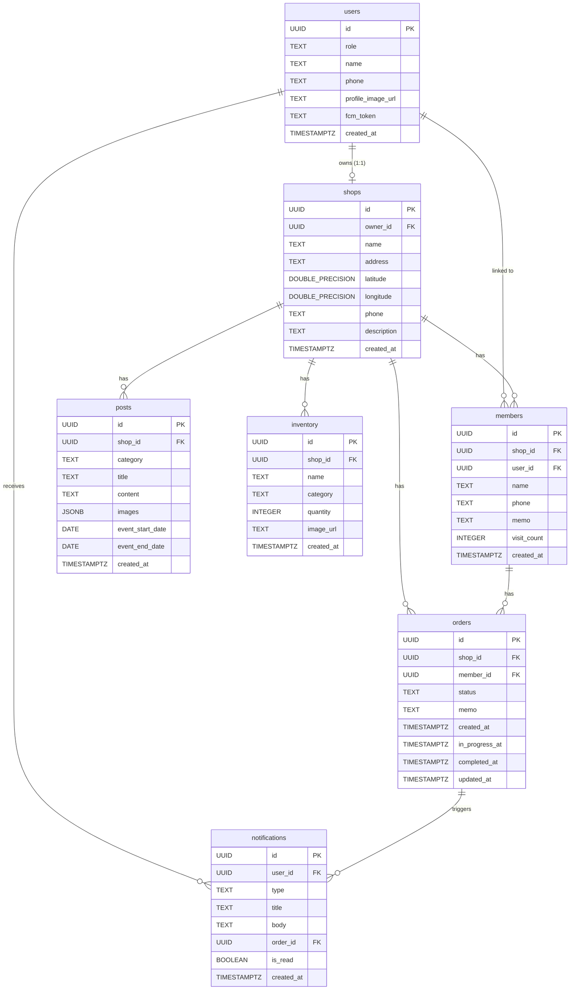

# 데이터베이스 스키마

## 데이터 흐름

### 사용자 등록 (소셜 로그인)
1. 소셜 로그인(카카오/네이버/Google) → Supabase Auth에 인증 정보 생성
2. 신규 사용자 → 프로필 설정 화면에서 역할(customer/shop_owner), 이름, 연락처 입력 → `users` 테이블에 INSERT
3. 기존 사용자 → `users` 테이블에서 role 조회 → 역할별 홈으로 이동

### 샵 등록
1. 사장님 가입 2단계 → 샵 이름, 주소, 연락처, 소개글 입력
2. 주소 입력 시 네이버 Geocoding API로 위도/경도 자동 변환
3. `shops` 테이블에 INSERT (owner_id = 현재 사용자)

### QR 스캔 회원 등록
1. 고객이 가게 QR코드 스캔 → `shop_id` 인식
2. `members` 테이블에서 해당 shop_id + user_id로 기존 회원 확인
3. 기존 회원 없으면 → `members` 테이블에 INSERT (user_id, name, phone을 users에서 가져옴)
4. 이미 등록된 회원이면 → "이미 등록된 회원입니다" 안내

### 수동 회원 등록 (앱 미가입 고객)
1. 사장님이 이름, 연락처 입력 → `members` 테이블에 INSERT (user_id = NULL)
2. 나중에 고객이 앱 가입 시 → phone 기준으로 `members.user_id` 자동 매칭

### 작업 접수
1. 사장님이 회원 선택(QR 스캔 또는 수동 검색) + 메모 입력
2. `orders` 테이블에 INSERT (status = 'received')
3. 고객에게 "접수됨" 푸시 알림 전송

### 작업 상태 변경
1. 사장님이 상태 변경 (received → in_progress → completed)
2. `orders` 테이블 UPDATE (status, in_progress_at 또는 completed_at 갱신)
3. DB Trigger → Edge Function → FCM으로 고객에게 푸시 알림 전송
4. `notifications` 테이블에 INSERT (알림 기록 저장)

### 게시글 작성
1. 사장님이 공지사항 또는 이벤트 작성 → 이미지 업로드(Storage) → `posts` 테이블에 INSERT
2. 이벤트인 경우 시작일/종료일 추가 저장

### 재고 관리
1. 사장님이 상품 등록 → 이미지 업로드(Storage, 선택) → `inventory` 테이블에 INSERT
2. 수량/정보 변경 → UPDATE
3. 상품 삭제 → DELETE

### 알림 조회 및 읽음 처리
1. 고객이 알림 화면 진입 → `notifications` 테이블에서 user_id로 조회 (최신순)
2. 화면 진입 시 전체 읽음 처리 → `is_read = true` UPDATE
3. 개별 알림 탭 → 해당 알림 읽음 처리 + order_id가 있으면 작업 상세로 이동

---

## 테이블 정의

### 테이블: users — 공통 사용자

| 컬럼 | 타입 | 제약조건 | 설명 |
|------|------|---------|------|
| id | UUID | PK, DEFAULT auth.uid() | Supabase Auth UID와 동일 |
| role | TEXT | NOT NULL, CHECK (role IN ('customer', 'shop_owner')) | 사용자 역할 |
| name | TEXT | NOT NULL | 이름 |
| phone | TEXT | NOT NULL | 연락처 |
| profile_image_url | TEXT | NULLABLE | 프로필 이미지 URL (Storage) |
| fcm_token | TEXT | NULLABLE | FCM 푸시 알림 토큰 |
| created_at | TIMESTAMPTZ | NOT NULL, DEFAULT now() | 가입일 |

### 테이블: shops — 샵 정보

| 컬럼 | 타입 | 제약조건 | 설명 |
|------|------|---------|------|
| id | UUID | PK, DEFAULT gen_random_uuid() | 샵 고유 ID |
| owner_id | UUID | NOT NULL, FK → users(id), UNIQUE | 사장님 (1인 1샵) |
| name | TEXT | NOT NULL | 샵 이름 |
| address | TEXT | NOT NULL | 주소 |
| latitude | DOUBLE PRECISION | NOT NULL | 위도 (Geocoding) |
| longitude | DOUBLE PRECISION | NOT NULL | 경도 (Geocoding) |
| phone | TEXT | NOT NULL | 샵 연락처 |
| description | TEXT | NULLABLE | 소개글 |
| created_at | TIMESTAMPTZ | NOT NULL, DEFAULT now() | 등록일 |

### 테이블: members — 샵별 회원 관리

| 컬럼 | 타입 | 제약조건 | 설명 |
|------|------|---------|------|
| id | UUID | PK, DEFAULT gen_random_uuid() | 회원 고유 ID |
| shop_id | UUID | NOT NULL, FK → shops(id) ON DELETE CASCADE | 소속 샵 |
| user_id | UUID | NULLABLE, FK → users(id) | 앱 사용자 연결 (미가입이면 NULL) |
| name | TEXT | NOT NULL | 이름 |
| phone | TEXT | NOT NULL | 연락처 |
| memo | TEXT | NULLABLE | 사장님 메모 |
| visit_count | INTEGER | NOT NULL, DEFAULT 0 | 방문(작업) 횟수 |
| created_at | TIMESTAMPTZ | NOT NULL, DEFAULT now() | 등록일 |

**제약조건:**
- UNIQUE(shop_id, user_id) WHERE user_id IS NOT NULL — 같은 샵에 동일 사용자 중복 등록 방지
- UNIQUE(shop_id, phone) — 같은 샵에 동일 연락처 중복 등록 방지

### 테이블: orders — 거트 작업 건

| 컬럼 | 타입 | 제약조건 | 설명 |
|------|------|---------|------|
| id | UUID | PK, DEFAULT gen_random_uuid() | 작업 고유 ID |
| shop_id | UUID | NOT NULL, FK → shops(id) ON DELETE CASCADE | 샵 |
| member_id | UUID | NOT NULL, FK → members(id) | 회원 |
| status | TEXT | NOT NULL, DEFAULT 'received', CHECK (status IN ('received', 'in_progress', 'completed')) | 작업 상태 |
| memo | TEXT | NULLABLE | 작업 메모 |
| created_at | TIMESTAMPTZ | NOT NULL, DEFAULT now() | 접수일 (= received_at) |
| in_progress_at | TIMESTAMPTZ | NULLABLE | 작업중 전환 시각 |
| completed_at | TIMESTAMPTZ | NULLABLE | 완료 전환 시각 |
| updated_at | TIMESTAMPTZ | NOT NULL, DEFAULT now() | 최종 상태 변경일 |

### 테이블: posts — 샵 게시글 (공지사항/이벤트)

| 컬럼 | 타입 | 제약조건 | 설명 |
|------|------|---------|------|
| id | UUID | PK, DEFAULT gen_random_uuid() | 게시글 고유 ID |
| shop_id | UUID | NOT NULL, FK → shops(id) ON DELETE CASCADE | 샵 |
| category | TEXT | NOT NULL, CHECK (category IN ('notice', 'event')) | 카테고리 |
| title | TEXT | NOT NULL | 제목 |
| content | TEXT | NOT NULL | 내용 |
| images | JSONB | NOT NULL, DEFAULT '[]'::jsonb | 이미지 URL 배열 (최대 5장) |
| event_start_date | DATE | NULLABLE | 이벤트 시작일 (이벤트만) |
| event_end_date | DATE | NULLABLE | 이벤트 종료일 (이벤트만) |
| created_at | TIMESTAMPTZ | NOT NULL, DEFAULT now() | 작성일 |

### 테이블: inventory — 가게 재고

| 컬럼 | 타입 | 제약조건 | 설명 |
|------|------|---------|------|
| id | UUID | PK, DEFAULT gen_random_uuid() | 상품 고유 ID |
| shop_id | UUID | NOT NULL, FK → shops(id) ON DELETE CASCADE | 샵 |
| name | TEXT | NOT NULL | 상품명 |
| category | TEXT | NULLABLE | 카테고리 (자유 입력) |
| quantity | INTEGER | NOT NULL, DEFAULT 0 | 재고 수량 |
| image_url | TEXT | NULLABLE | 상품 이미지 URL (없으면 기본 이미지) |
| created_at | TIMESTAMPTZ | NOT NULL, DEFAULT now() | 등록일 |

### 테이블: notifications — 알림

| 컬럼 | 타입 | 제약조건 | 설명 |
|------|------|---------|------|
| id | UUID | PK, DEFAULT gen_random_uuid() | 알림 고유 ID |
| user_id | UUID | NOT NULL, FK → users(id) ON DELETE CASCADE | 수신 사용자 |
| type | TEXT | NOT NULL, CHECK (type IN ('status_change', 'completion', 'notice', 'receipt')) | 알림 유형 |
| title | TEXT | NOT NULL | 알림 제목 |
| body | TEXT | NOT NULL | 알림 내용 |
| order_id | UUID | NULLABLE, FK → orders(id) ON DELETE SET NULL | 연결된 작업 (주문 관련 알림) |
| is_read | BOOLEAN | NOT NULL, DEFAULT false | 읽음 여부 |
| created_at | TIMESTAMPTZ | NOT NULL, DEFAULT now() | 생성일 |

---

## 관계 다이어그램



---

## RLS 정책

### users 테이블
- **SELECT**: 자신의 데이터만 조회 가능 (`auth.uid() = id`)
- **INSERT**: 자신의 데이터만 삽입 가능 (`auth.uid() = id`)
- **UPDATE**: 자신의 데이터만 수정 가능 (`auth.uid() = id`). 수정 가능 컬럼: name, phone, profile_image_url, fcm_token

### shops 테이블
- **SELECT**: 모든 인증된 사용자가 조회 가능 (주변 샵 검색, 샵 상세 등)
- **INSERT**: `role = 'shop_owner'`인 사용자만 (`auth.uid() = owner_id`)
- **UPDATE**: 해당 샵의 owner만 (`auth.uid() = owner_id`)

### members 테이블
- **SELECT**: 해당 shop의 owner이거나, 자신이 연결된 회원인 경우 (`auth.uid() = (SELECT owner_id FROM shops WHERE id = shop_id)` OR `auth.uid() = user_id`)
- **INSERT**: 해당 shop의 owner이거나, QR 스캔으로 자기 자신을 등록하는 경우
- **UPDATE**: 해당 shop의 owner만 (visit_count, memo 등 수정)

### orders 테이블
- **SELECT**: 해당 shop의 owner이거나, 해당 member의 user인 경우
- **INSERT**: 해당 shop의 owner만 (작업 접수)
- **UPDATE**: 해당 shop의 owner만 (상태 변경)
- **DELETE**: 해당 shop의 owner만 (received 상태인 작업만 삭제 가능)

### posts 테이블
- **SELECT**: 모든 인증된 사용자가 조회 가능 (샵 상세에서 공지/이벤트 열람)
- **INSERT**: 해당 shop의 owner만
- **UPDATE**: 해당 shop의 owner만
- **DELETE**: 해당 shop의 owner만

### inventory 테이블
- **SELECT**: 모든 인증된 사용자가 조회 가능 (고객은 열람만 가능)
- **INSERT**: 해당 shop의 owner만
- **UPDATE**: 해당 shop의 owner만
- **DELETE**: 해당 shop의 owner만

### notifications 테이블
- **SELECT**: 자신의 알림만 조회 가능 (`auth.uid() = user_id`)
- **INSERT**: Edge Function(service_role)에서만 생성 (DB 트리거 경유)
- **UPDATE**: 자신의 알림만 수정 가능 (`auth.uid() = user_id`). 수정 가능 컬럼: is_read

---

## 인덱스

| 테이블 | 컬럼 | 유형 | 이유 |
|--------|------|------|------|
| members | shop_id, name | 복합 인덱스 | 사장님이 회원 이름으로 검색 빈번 |
| members | shop_id, phone | 복합 인덱스 | 연락처로 회원 검색 + 중복 확인 |
| members | shop_id, user_id | 복합 인덱스 | QR 스캔 시 기존 회원 확인 |
| orders | shop_id, status | 복합 인덱스 | 샵별 상태 필터링 빈번 (대시보드, 작업 관리) |
| orders | shop_id, created_at | 복합 인덱스 | 오늘의 작업 현황 조회 (대시보드) |
| orders | member_id | 단일 인덱스 | 회원별 작업 이력 조회 |
| posts | shop_id, category | 복합 인덱스 | 샵별 카테고리 필터링 (공지/이벤트) |
| notifications | user_id, created_at | 복합 인덱스 | 사용자별 최신순 알림 조회 |
| notifications | user_id, is_read | 복합 인덱스 | 읽지 않은 알림 카운트 (뱃지) |
| shops | latitude, longitude | 복합 인덱스 | 주변 샵 검색 시 좌표 범위 조회 |

---

## 마이그레이션 SQL

```sql
-- ============================================
-- 거트알림 데이터베이스 마이그레이션
-- Supabase (PostgreSQL)
-- ============================================

-- 1. users 테이블
CREATE TABLE users (
  id UUID PRIMARY KEY REFERENCES auth.users(id) ON DELETE CASCADE,
  role TEXT NOT NULL CHECK (role IN ('customer', 'shop_owner')),
  name TEXT NOT NULL,
  phone TEXT NOT NULL,
  profile_image_url TEXT,
  fcm_token TEXT,
  created_at TIMESTAMPTZ NOT NULL DEFAULT now()
);

-- 2. shops 테이블
CREATE TABLE shops (
  id UUID PRIMARY KEY DEFAULT gen_random_uuid(),
  owner_id UUID NOT NULL UNIQUE REFERENCES users(id) ON DELETE CASCADE,
  name TEXT NOT NULL,
  address TEXT NOT NULL,
  latitude DOUBLE PRECISION NOT NULL,
  longitude DOUBLE PRECISION NOT NULL,
  phone TEXT NOT NULL,
  description TEXT,
  created_at TIMESTAMPTZ NOT NULL DEFAULT now()
);

-- 3. members 테이블
CREATE TABLE members (
  id UUID PRIMARY KEY DEFAULT gen_random_uuid(),
  shop_id UUID NOT NULL REFERENCES shops(id) ON DELETE CASCADE,
  user_id UUID REFERENCES users(id) ON DELETE SET NULL,
  name TEXT NOT NULL,
  phone TEXT NOT NULL,
  memo TEXT,
  visit_count INTEGER NOT NULL DEFAULT 0,
  created_at TIMESTAMPTZ NOT NULL DEFAULT now(),
  UNIQUE (shop_id, phone)
);

-- members: user_id가 NOT NULL인 경우만 유니크 제약 (부분 유니크 인덱스)
CREATE UNIQUE INDEX idx_members_shop_user
  ON members (shop_id, user_id)
  WHERE user_id IS NOT NULL;

-- 4. orders 테이블
CREATE TABLE orders (
  id UUID PRIMARY KEY DEFAULT gen_random_uuid(),
  shop_id UUID NOT NULL REFERENCES shops(id) ON DELETE CASCADE,
  member_id UUID NOT NULL REFERENCES members(id),
  status TEXT NOT NULL DEFAULT 'received' CHECK (status IN ('received', 'in_progress', 'completed')),
  memo TEXT,
  created_at TIMESTAMPTZ NOT NULL DEFAULT now(),
  in_progress_at TIMESTAMPTZ,
  completed_at TIMESTAMPTZ,
  updated_at TIMESTAMPTZ NOT NULL DEFAULT now()
);

-- 5. posts 테이블
CREATE TABLE posts (
  id UUID PRIMARY KEY DEFAULT gen_random_uuid(),
  shop_id UUID NOT NULL REFERENCES shops(id) ON DELETE CASCADE,
  category TEXT NOT NULL CHECK (category IN ('notice', 'event')),
  title TEXT NOT NULL,
  content TEXT NOT NULL,
  images JSONB NOT NULL DEFAULT '[]'::jsonb,
  event_start_date DATE,
  event_end_date DATE,
  created_at TIMESTAMPTZ NOT NULL DEFAULT now()
);

-- 6. inventory 테이블
CREATE TABLE inventory (
  id UUID PRIMARY KEY DEFAULT gen_random_uuid(),
  shop_id UUID NOT NULL REFERENCES shops(id) ON DELETE CASCADE,
  name TEXT NOT NULL,
  category TEXT,
  quantity INTEGER NOT NULL DEFAULT 0,
  image_url TEXT,
  created_at TIMESTAMPTZ NOT NULL DEFAULT now()
);

-- 7. notifications 테이블
CREATE TABLE notifications (
  id UUID PRIMARY KEY DEFAULT gen_random_uuid(),
  user_id UUID NOT NULL REFERENCES users(id) ON DELETE CASCADE,
  type TEXT NOT NULL CHECK (type IN ('status_change', 'completion', 'notice', 'receipt')),
  title TEXT NOT NULL,
  body TEXT NOT NULL,
  order_id UUID REFERENCES orders(id) ON DELETE SET NULL,
  is_read BOOLEAN NOT NULL DEFAULT false,
  created_at TIMESTAMPTZ NOT NULL DEFAULT now()
);

-- ============================================
-- 인덱스
-- ============================================

CREATE INDEX idx_members_shop_name ON members (shop_id, name);
CREATE INDEX idx_members_shop_phone ON members (shop_id, phone);

CREATE INDEX idx_orders_shop_status ON orders (shop_id, status);
CREATE INDEX idx_orders_shop_created ON orders (shop_id, created_at);
CREATE INDEX idx_orders_member ON orders (member_id);

CREATE INDEX idx_posts_shop_category ON posts (shop_id, category);

CREATE INDEX idx_notifications_user_created ON notifications (user_id, created_at DESC);
CREATE INDEX idx_notifications_user_read ON notifications (user_id, is_read);

CREATE INDEX idx_shops_location ON shops (latitude, longitude);

-- ============================================
-- updated_at 자동 갱신 트리거 (orders)
-- ============================================

CREATE OR REPLACE FUNCTION update_updated_at()
RETURNS TRIGGER AS $$
BEGIN
  NEW.updated_at = now();
  RETURN NEW;
END;
$$ LANGUAGE plpgsql;

CREATE TRIGGER trigger_orders_updated_at
  BEFORE UPDATE ON orders
  FOR EACH ROW
  EXECUTE FUNCTION update_updated_at();

-- ============================================
-- 상태 변경 시 타임스탬프 자동 기록 (orders)
-- ============================================

CREATE OR REPLACE FUNCTION set_order_status_timestamps()
RETURNS TRIGGER AS $$
BEGIN
  IF NEW.status = 'in_progress' AND OLD.status = 'received' THEN
    NEW.in_progress_at = now();
  ELSIF NEW.status = 'completed' AND OLD.status = 'in_progress' THEN
    NEW.completed_at = now();
  END IF;
  RETURN NEW;
END;
$$ LANGUAGE plpgsql;

CREATE TRIGGER trigger_order_status_timestamps
  BEFORE UPDATE OF status ON orders
  FOR EACH ROW
  EXECUTE FUNCTION set_order_status_timestamps();

-- ============================================
-- RLS 활성화
-- ============================================

ALTER TABLE users ENABLE ROW LEVEL SECURITY;
ALTER TABLE shops ENABLE ROW LEVEL SECURITY;
ALTER TABLE members ENABLE ROW LEVEL SECURITY;
ALTER TABLE orders ENABLE ROW LEVEL SECURITY;
ALTER TABLE posts ENABLE ROW LEVEL SECURITY;
ALTER TABLE inventory ENABLE ROW LEVEL SECURITY;
ALTER TABLE notifications ENABLE ROW LEVEL SECURITY;

-- ============================================
-- RLS 정책: users
-- ============================================

CREATE POLICY "users_select_own" ON users
  FOR SELECT USING (auth.uid() = id);

CREATE POLICY "users_insert_own" ON users
  FOR INSERT WITH CHECK (auth.uid() = id);

CREATE POLICY "users_update_own" ON users
  FOR UPDATE USING (auth.uid() = id)
  WITH CHECK (auth.uid() = id);

-- ============================================
-- RLS 정책: shops
-- ============================================

CREATE POLICY "shops_select_all" ON shops
  FOR SELECT USING (auth.uid() IS NOT NULL);

CREATE POLICY "shops_insert_owner" ON shops
  FOR INSERT WITH CHECK (auth.uid() = owner_id);

CREATE POLICY "shops_update_owner" ON shops
  FOR UPDATE USING (auth.uid() = owner_id)
  WITH CHECK (auth.uid() = owner_id);

-- ============================================
-- RLS 정책: members
-- ============================================

CREATE POLICY "members_select" ON members
  FOR SELECT USING (
    auth.uid() = user_id
    OR auth.uid() = (SELECT owner_id FROM shops WHERE id = shop_id)
  );

CREATE POLICY "members_insert" ON members
  FOR INSERT WITH CHECK (
    auth.uid() = user_id
    OR auth.uid() = (SELECT owner_id FROM shops WHERE id = shop_id)
  );

CREATE POLICY "members_update_owner" ON members
  FOR UPDATE USING (
    auth.uid() = (SELECT owner_id FROM shops WHERE id = shop_id)
  );

-- ============================================
-- RLS 정책: orders
-- ============================================

CREATE POLICY "orders_select" ON orders
  FOR SELECT USING (
    auth.uid() = (SELECT owner_id FROM shops WHERE id = shop_id)
    OR auth.uid() = (SELECT user_id FROM members WHERE id = member_id)
  );

CREATE POLICY "orders_insert_owner" ON orders
  FOR INSERT WITH CHECK (
    auth.uid() = (SELECT owner_id FROM shops WHERE id = shop_id)
  );

CREATE POLICY "orders_update_owner" ON orders
  FOR UPDATE USING (
    auth.uid() = (SELECT owner_id FROM shops WHERE id = shop_id)
  );

CREATE POLICY "orders_delete_owner" ON orders
  FOR DELETE USING (
    auth.uid() = (SELECT owner_id FROM shops WHERE id = shop_id)
    AND status = 'received'
  );

-- ============================================
-- RLS 정책: posts
-- ============================================

CREATE POLICY "posts_select_all" ON posts
  FOR SELECT USING (auth.uid() IS NOT NULL);

CREATE POLICY "posts_insert_owner" ON posts
  FOR INSERT WITH CHECK (
    auth.uid() = (SELECT owner_id FROM shops WHERE id = shop_id)
  );

CREATE POLICY "posts_update_owner" ON posts
  FOR UPDATE USING (
    auth.uid() = (SELECT owner_id FROM shops WHERE id = shop_id)
  );

CREATE POLICY "posts_delete_owner" ON posts
  FOR DELETE USING (
    auth.uid() = (SELECT owner_id FROM shops WHERE id = shop_id)
  );

-- ============================================
-- RLS 정책: inventory
-- ============================================

CREATE POLICY "inventory_select_all" ON inventory
  FOR SELECT USING (auth.uid() IS NOT NULL);

CREATE POLICY "inventory_insert_owner" ON inventory
  FOR INSERT WITH CHECK (
    auth.uid() = (SELECT owner_id FROM shops WHERE id = shop_id)
  );

CREATE POLICY "inventory_update_owner" ON inventory
  FOR UPDATE USING (
    auth.uid() = (SELECT owner_id FROM shops WHERE id = shop_id)
  );

CREATE POLICY "inventory_delete_owner" ON inventory
  FOR DELETE USING (
    auth.uid() = (SELECT owner_id FROM shops WHERE id = shop_id)
  );

-- ============================================
-- RLS 정책: notifications
-- ============================================

CREATE POLICY "notifications_select_own" ON notifications
  FOR SELECT USING (auth.uid() = user_id);

CREATE POLICY "notifications_update_own" ON notifications
  FOR UPDATE USING (auth.uid() = user_id)
  WITH CHECK (auth.uid() = user_id);

-- notifications INSERT는 Edge Function(service_role)에서만 수행

-- ============================================
-- Supabase Storage 버킷
-- ============================================

-- profile-images: 프로필 이미지 (users.profile_image_url)
-- post-images: 게시글 이미지 (posts.images)
-- inventory-images: 재고 상품 이미지 (inventory.image_url)
```

---

## 설계 포인트

- **members.user_id가 nullable** — 고객이 앱 미가입이어도 사장님이 이름+연락처만으로 수동 등록 가능. 나중에 고객이 앱 가입하면 phone 기준으로 자동 매칭
- **orders에 in_progress_at, completed_at 별도 저장** — 타임라인 UI에서 각 상태 도달 시각을 정확히 표시하기 위함. 트리거로 자동 기록
- **orders.memo만 저장** — UI 스펙에서 작업 접수 시 메모만 입력. 거트/텐션/라켓 정보는 현재 UI에서 수집하지 않음
- **shops.owner_id에 UNIQUE** — 1인 1샵 정책. 한 사장님은 하나의 샵만 등록 가능
- **notifications는 Edge Function에서만 INSERT** — 클라이언트에서 직접 알림을 생성하지 않고, DB 트리거 → Edge Function 경로로만 생성
- **Supabase Realtime 대상** — orders 테이블의 status 변경을 고객 앱에서 실시간 구독
