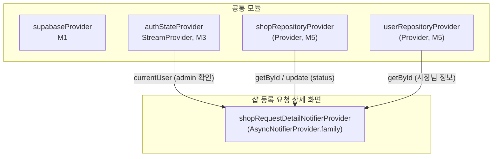

# 관리자 샵 등록 요청 상세 — 상태 설계

> 화면 ID: `admin-shop-request-detail`
> UI 스펙: `docs/ui-specs/admin-shop-request-detail.md`
> 유스케이스: UC-샵 등록 승인 관리

---

## 상태 데이터 (State)

| 이름 | 타입 | 초기값 | 설명 |
|------|------|--------|------|
| `shopRequestDetailState` | `AsyncValue<ShopRequestDetailState>` | `AsyncLoading` | 샵 등록 요청 상세 전체 상태 |

### ShopRequestDetailState (freezed)

| 필드 | 타입 | 초기값 | 설명 |
|------|------|--------|------|
| `shop` | `Shop` | DB에서 로드 | 샵 상세 정보 (status, reject_reason, reviewed_at 포함) |
| `ownerName` | `String` | DB에서 로드 | 신청자(사장님) 이름 (users.name) |
| `ownerPhone` | `String` | DB에서 로드 | 신청자 연락처 (users.phone) |
| `ownerCreatedAt` | `DateTime` | DB에서 로드 | 신청자 가입일 (users.created_at) |
| `processingAction` | `ShopReviewAction?` | `null` | 현재 처리 중인 액션 (승인/거절). null이면 미처리 |

### ShopReviewAction (Enum)

| 값 | 설명 |
|----|------|
| `approving` | 승인 처리 중 |
| `rejecting` | 거절 처리 중 |

---

## 비-상태 데이터 (Non-State)

| 이름 | 출처 | 설명 |
|------|------|------|
| `authState` | `authStateProvider` (M3) | 현재 인증된 사용자. role이 admin인지 확인 |
| `shopRepository` | `shopRepositoryProvider` (M5) | shops 테이블 조회 및 UPDATE (status, reject_reason, reviewed_at) |
| `userRepository` | `userRepositoryProvider` (M5) | users 테이블 조회 (사장님 정보) |

---

## 상태 변화 조건표

| 트리거 | 상태 변화 | UI 변화 |
|--------|----------|---------|
| 화면 진입 | `AsyncLoading` → shops + users 조인 조회 → `AsyncData(ShopRequestDetailState)` | 전체 스켈레톤 shimmer → 상세 정보 표시 |
| 데이터 로드 실패 | `AsyncError` | ErrorView "요청 정보를 불러올 수 없습니다" + 재시도 버튼 |
| 승인 버튼 탭 | - | 확인 다이얼로그 "이 샵을 승인하시겠습니까?" 표시 |
| 승인 확인 | `processingAction` = `approving` → shops UPDATE (status='approved', reviewed_at=now()) | 승인 버튼 로딩, 거절 버튼 비활성 |
| 승인 성공 | `processingAction` = null, `shop.status` = 'approved' | "승인 처리되었습니다" 토스트 + 목록으로 복귀 |
| 승인 실패 | `processingAction` = null | "처리에 실패했습니다. 다시 시도해주세요" 에러 스낵바 + 버튼 재활성화 |
| 거절 버튼 탭 | - | 거절 사유 입력 다이얼로그 표시 |
| 거절 확인 (사유 입력 후) | `processingAction` = `rejecting` → shops UPDATE (status='rejected', reject_reason, reviewed_at=now()) | 거절 버튼 로딩, 승인 버튼 비활성 |
| 거절 성공 | `processingAction` = null, `shop.status` = 'rejected' | "거절 처리되었습니다" 토스트 + 목록으로 복귀 |
| 거절 실패 | `processingAction` = null | "처리에 실패했습니다. 다시 시도해주세요" 에러 스낵바 + 버튼 재활성화 |

---

## Provider 구조

### Provider 상세

| Provider | 타입 | 역할 |
|----------|------|------|
| `shopRequestDetailNotifierProvider` | `AsyncNotifierProvider.family<ShopRequestDetailNotifier, ShopRequestDetailState, String>` | 샵 등록 요청 상세 상태 관리. shopId를 family 파라미터로 받음. 상세 조회, 승인/거절 처리 |

---

## 노출 인터페이스

### 읽기 (State)

| Provider | 타입 | 설명 |
|----------|------|------|
| `shopRequestDetailNotifierProvider(shopId)` | `AsyncNotifierProvider.family<..., ShopRequestDetailState, String>` | 샵 등록 요청 상세 전체 상태 |

### 쓰기 (Actions)

| 메서드 | 파라미터 | 설명 |
|--------|---------|------|
| `approve()` | - | 샵 승인 처리. shops.status = 'approved', reviewed_at = now(). 성공 시 목록으로 복귀 |
| `reject(String reason)` | `String` | 샵 거절 처리. shops.status = 'rejected', reject_reason = reason, reviewed_at = now(). 성공 시 목록으로 복귀 |

---

## 참조하는 공통 모듈

| 모듈 | 용도 |
|------|------|
| M1 (supabaseProvider) | Supabase 클라이언트 |
| M3 (authStateProvider) | 현재 인증 사용자 정보 (admin 역할 확인) |
| M4 (Shop, User) | 샵/사용자 데이터 모델 |
| M5 (ShopRepository, UserRepository) | shops 조회/UPDATE, users 조회 |
| M6 (AppException, ErrorHandler) | 에러 처리 및 사용자 메시지 매핑 |
| M9 (ConfirmDialog, ErrorView, SkeletonShimmer, AppToast) | 승인 확인 다이얼로그, 에러 화면, 스켈레톤 로딩, 성공/에러 스낵바 |
