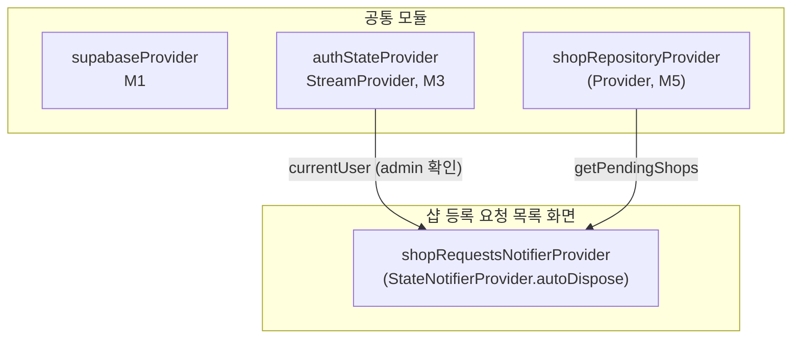

# 관리자 샵 등록 요청 목록 — 상태 설계

> 화면 ID: `admin-shop-requests`
> UI 스펙: `docs/ui-specs/admin-shop-requests.md`
> 유스케이스: UC-샵 등록 승인 관리

---

## 상태 데이터 (State)

| 이름 | 타입 | 초기값 | 설명 |
|------|------|--------|------|
| `shopRequestsState` | `ShopRequestsState` | `ShopRequestsState()` | 샵 등록 요청 목록 전체 상태 (isLoading, requests, error 포함) |

### ShopRequestsState (freezed)

| 필드 | 타입 | 초기값 | 설명 |
|------|------|--------|------|
| `requests` | `List<Shop>` | `[]` | 대기 중 샵 등록 요청 목록 |
| `isLoading` | `bool` | `true` | 데이터 로딩 중 여부 |
| `error` | `String?` | `null` | 에러 메시지 (에러 발생 시) |

---

## 비-상태 데이터 (Non-State)

| 이름 | 출처 | 설명 |
|------|------|------|
| `authState` | `authStateProvider` (M3) | 현재 인증된 사용자. role이 admin인지 확인 |
| `shopRepository` | `shopRepositoryProvider` (M5) | shops 테이블 조회 |

---

## 상태 변화 조건표

| 트리거 | 상태 변화 | UI 변화 |
|--------|----------|---------|
| 화면 진입 | `AsyncLoading` → shops 전체 조회 + pending 카운트 → `AsyncData(ShopRequestsState)` | 스켈레톤 shimmer → 요청 카드 목록 표시 |
| 데이터 로드 실패 | `AsyncError` | ErrorView "요청 목록을 불러올 수 없습니다" + 재시도 버튼 |
| 필터 탭 선택 | `selectedFilter` 변경 → 해당 상태로 목록 재필터링 | 선택된 탭 활성화, 목록 갱신 |
| 요청 카드 탭 | - | 상세 화면(`admin-shop-request-detail`)으로 이동 (shopId 전달) |
| 당겨서 새로고침 | 데이터 재조회 | RefreshIndicator 표시 → 목록 갱신 |
| 상세 화면에서 복귀 | 목록 + pending 카운트 재조회 | 최신 상태 반영 |

---

## Provider 구조

### Provider 상세

| Provider | 타입 | 역할 |
|----------|------|------|
| `shopRequestsNotifierProvider` | `StateNotifierProvider.autoDispose<ShopRequestsNotifier, ShopRequestsState>` | 샵 등록 요청 목록 전체 상태 관리. 목록 조회, 새로고침. 화면 이탈 시 자동 해제(autoDispose) |

---

## 노출 인터페이스

### 읽기 (State)

| Provider | 타입 | 설명 |
|----------|------|------|
| `shopRequestsNotifierProvider` | `StateNotifierProvider.autoDispose<ShopRequestsNotifier, ShopRequestsState>` | 요청 목록 전체 상태. 화면 이탈 시 자동 해제 |

### 쓰기 (Actions)

| 메서드 | 파라미터 | 설명 |
|--------|---------|------|
| `loadRequests()` | - | 대기 중(pending) 샵 등록 요청 목록 조회. 화면 진입 시, 상세 화면에서 복귀 시 호출 |

---

## 참조하는 공통 모듈

| 모듈 | 용도 |
|------|------|
| M1 (supabaseProvider) | Supabase 클라이언트 |
| M3 (authStateProvider) | 현재 인증 사용자 정보 (admin 역할 확인) |
| M4 (Shop) | 샵 데이터 모델 |
| M5 (ShopRepository) | shops 테이블 조회 (전체, 상태별 필터링, 카운트) |
| M6 (AppException, ErrorHandler) | 에러 처리 및 사용자 메시지 매핑 |
| M9 (ErrorView, EmptyState, SkeletonShimmer) | 에러 화면, 빈 상태, 스켈레톤 로딩 |
