# 고객 홈 — 상태 설계

> 화면 ID: `customer-home`
> 최종 수정일: 2026-02-24

---

## 상태 데이터 (State)

| 이름 | 타입 | 초기값 | 설명 |
|------|------|--------|------|
| `activeOrders` | `AsyncValue<List<Order>>` | `AsyncLoading` | 현재 활성 작업 목록 (received + in_progress + 24시간 이내 completed) |
| `isRefreshing` | `bool` | `false` | Pull-to-refresh 진행 중 여부 |

> `AsyncValue`는 Riverpod의 내장 상태 타입으로 loading / data / error 3상태를 자동 처리한다.

---

## 비-상태 데이터 (Non-State)

| 이름 | 출처 | 설명 |
|------|------|------|
| `currentUser` | `currentUserProvider` (M3 인증 모듈) | 현재 로그인한 사용자 정보. user_id를 쿼리 조건으로 사용 |
| `unreadNotificationCount` | `unreadNotificationCountProvider` (알림 공통 Provider) | 읽지 않은 알림 수. 앱바 뱃지에 표시. 이 화면이 소유하지 않음 |
| `receivedCount` | `activeOrders`에서 파생 | 접수됨 상태 건수. `activeOrders.where(status == received).length`로 계산 |
| `inProgressCount` | `activeOrders`에서 파생 | 작업중 상태 건수. `activeOrders.where(status == inProgress).length`로 계산 |

> `receivedCount`, `inProgressCount`는 별도 상태가 아니라 `activeOrders`에서 파생(derived)한다. Riverpod의 `select` 또는 별도 Provider로 계산값만 노출한다.

---

## 상태 변화 조건표

| 트리거 | 상태 변화 | UI 변화 |
|--------|-----------|---------|
| 화면 최초 진입 | `activeOrders`: `AsyncLoading` | 스켈레톤 shimmer 표시 (요약 카드 1개 + 작업 카드 3개) |
| 데이터 로드 성공 (0건) | `activeOrders`: `AsyncData([])` | 빈 상태 UI (일러스트 + "아직 진행 중인 작업이 없습니다" + CTA 버튼) |
| 데이터 로드 성공 (1건 이상) | `activeOrders`: `AsyncData([...])` | 요약 카드 + 작업 카드 목록 표시 |
| 데이터 로드 실패 | `activeOrders`: `AsyncError(e)` | 에러 아이콘 + "데이터를 불러올 수 없습니다" + 재시도 버튼 |
| Pull-to-refresh 시작 | `isRefreshing`: `true` | RefreshIndicator 표시. 기존 목록 유지 |
| Pull-to-refresh 완료 | `isRefreshing`: `false`, `activeOrders` 갱신 | 목록 갱신, RefreshIndicator 사라짐 |
| Realtime: 작업 상태 변경 (UPDATE) | `activeOrders` 내 해당 작업의 status 갱신 | 해당 카드 상태 뱃지 색상 전환 (300ms 애니메이션) |
| Realtime: 새 작업 접수 (INSERT) | `activeOrders` 목록 최상단에 추가 | 새 카드 Slide + Fade 애니메이션 (300ms) |
| Realtime: 작업 완료 후 24시간 경과 | `activeOrders`에서 해당 작업 제거 | 카드 Fade-out 후 목록에서 제거 |
| 재시도 버튼 탭 | `activeOrders`: `AsyncLoading` | 스켈레톤 shimmer로 전환 후 재조회 |
| 앱 포그라운드 복귀 | `activeOrders` 재조회 | 목록 자동 갱신 |

---

## Provider 구조

```mermaid
flowchart TD
    subgraph 공통 모듈
        AUTH[currentUserProvider<br/>M3 인증]
        NOTI_COUNT[unreadNotificationCountProvider<br/>알림 공통]
        ORDER_REPO[orderRepositoryProvider<br/>M5 리포지토리]
    end

    subgraph 고객 홈 Provider
        STREAM[activeOrdersStreamProvider<br/>StreamProvider]
        NOTIFIER[customerHomeNotifier<br/>AsyncNotifier]
        RECEIVED[receivedCountProvider<br/>Provider &#40;파생&#41;]
        IN_PROGRESS[inProgressCountProvider<br/>Provider &#40;파생&#41;]
    end

    AUTH -->|user_id| STREAM
    ORDER_REPO -->|Realtime stream| STREAM
    STREAM -->|실시간 데이터| NOTIFIER
    NOTIFIER -->|activeOrders| RECEIVED
    NOTIFIER -->|activeOrders| IN_PROGRESS

    subgraph Widget
        HOME_SCREEN[CustomerHomeScreen]
    end

    NOTIFIER -->|AsyncValue&lt;List&lt;Order&gt;&gt;| HOME_SCREEN
    RECEIVED -->|int| HOME_SCREEN
    IN_PROGRESS -->|int| HOME_SCREEN
    NOTI_COUNT -->|int| HOME_SCREEN
```

### Provider 설명

| Provider | 타입 | 역할 |
|----------|------|------|
| `activeOrdersStreamProvider` | `StreamProvider<List<Order>>` | Supabase Realtime으로 orders 테이블 변경을 구독. members.user_id 조건 필터링 |
| `customerHomeNotifier` | `AsyncNotifierProvider` | 화면의 메인 상태 관리. 초기 로드, refresh, Realtime 이벤트 처리 |
| `receivedCountProvider` | `Provider<int>` | activeOrders에서 received 상태 건수 파생 |
| `inProgressCountProvider` | `Provider<int>` | activeOrders에서 in_progress 상태 건수 파생 |

---

## 노출 인터페이스

### 읽기 (State)

| 이름 | 타입 | 설명 |
|------|------|------|
| `activeOrders` | `AsyncValue<List<Order>>` | 활성 작업 목록 (loading / data / error) |
| `isRefreshing` | `bool` | Pull-to-refresh 진행 중 여부 |
| `receivedCount` | `int` | 접수됨 상태 건수 (파생) |
| `inProgressCount` | `int` | 작업중 상태 건수 (파생) |

### 쓰기 (Actions)

| 이름 | 파라미터 | 설명 |
|------|----------|------|
| `refresh()` | 없음 | Pull-to-refresh 시 데이터 재조회. isRefreshing 토글 관리 |
| `retry()` | 없음 | 에러 상태에서 재시도. AsyncLoading으로 전환 후 재조회 |

> Realtime 구독 시작/해제는 Provider 라이프사이클이 자동 관리한다. `activeOrdersStreamProvider`가 화면에 마운트될 때 구독 시작, 언마운트 시 자동 해제된다.
