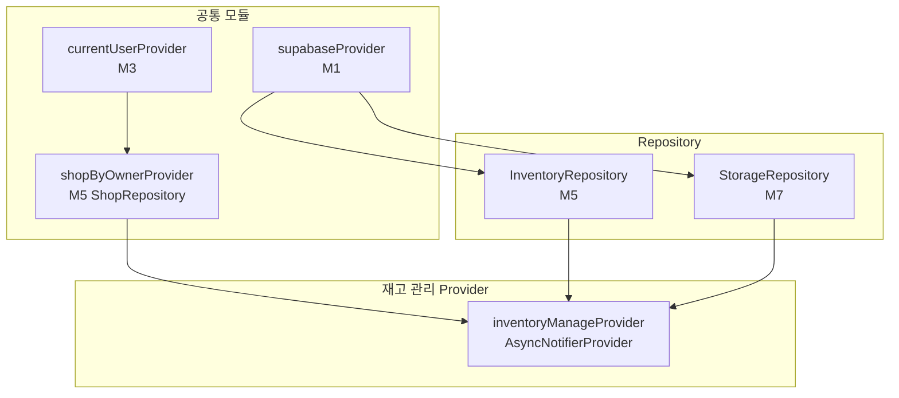

# 재고 관리 — 상태 설계

> 화면 ID: `owner-inventory-manage`
> UI 스펙: `docs/ui-specs/inventory-manage.md`
> 유스케이스: `docs/usecases/8-inventory-manage/spec.md`

---

## 상태 데이터 (State)

| 이름 | 타입 | 초기값 | 설명 |
|------|------|--------|------|
| `items` | `List<InventoryItem>` | `[]` | 재고 상품 목록 (name ASC 정렬) |
| `isLoading` | `bool` | `false` | 최초 데이터 로딩 중 여부 |
| `error` | `String?` | `null` | 에러 메시지 |

---

## 비-상태 데이터 (Non-State)

| 이름 | 출처 | 설명 |
|------|------|------|
| `shopId` | `currentUserProvider` → `ShopRepository.getByOwner()` | 현재 사장님의 샵 ID. 인증 모듈(M3)에서 제공하는 사용자 정보로 조회 |
| `supabaseClient` | `supabaseProvider` (M1) | Supabase 클라이언트 인스턴스 |
| `categoryOptions` | `InventoryCategory.values` | 고정 카테고리 enum: 라켓, 상의, 하의, 가방, 신발, 악세서리, 기타 (`enums.dart`에 정의) |

---

## 상태 변화 조건표

| 트리거 | 상태 변화 | UI 변화 |
|--------|-----------|---------|
| 화면 최초 진입 | `isLoading = true` → 데이터 로드 → `isLoading = false`, `items` 갱신 | 스켈레톤 shimmer → 상품 그리드 표시 또는 빈 상태 |
| 데이터 로드 실패 | `error = AppException(...)`, `isLoading = false` | ErrorView 위젯 표시 ("데이터를 불러올 수 없습니다" + 재시도 버튼) |
| FAB(+) 탭 | 상태 변화 없음 (UI 이벤트) | "상품 추가" 바텀시트 표시 (빈 폼) |
| 상품 카드 탭 | 상태 변화 없음 (UI 이벤트) | "상품 수정" 바텀시트 표시 (기존 정보 채움) |
| 상품 저장 (추가) | `addItem()` → 이미지 업로드(있으면) → `InventoryRepository.create()` → `items`에 새 상품 추가 | 바텀시트 닫기 + "상품이 추가되었습니다" 토스트 + 그리드 갱신 |
| 상품 저장 (수정) | `updateItem()` → 이미지 업로드(있으면) → `InventoryRepository.update()` → `items`에서 해당 상품 갱신 | 바텀시트 닫기 + "상품이 수정되었습니다" 토스트 + 그리드 갱신 |
| 상품 저장 실패 | `error` 갱신 | 에러 토스트 표시, 바텀시트 유지 |
| 상품 삭제 확인 | `deleteItem()` → `InventoryRepository.delete()` → `items`에서 해당 상품 제거 | 다이얼로그 닫기 + 그리드 갱신 |
| 상품 삭제 실패 | `error` 갱신 | 에러 토스트 표시, 상품 유지 |
| 상품 0건 | `items = []`, `isLoading = false` | EmptyState 위젯 (아이콘 `inventory_2` + "등록된 상품이 없습니다" + "'+' 버튼으로 상품을 등록하세요") |

---

## Provider 구조

### Provider 상세

| Provider | 타입 | 역할 |
|----------|------|------|
| `inventoryManageProvider` | `AsyncNotifierProvider<InventoryManageNotifier, InventoryManageState>` | 재고 관리 전체 상태 관리. 상품 목록 조회, 추가/수정/삭제 액션 처리, 이미지 업로드 |
| `shopByOwnerProvider` | `FutureProvider<Shop>` | 현재 사장님의 샵 정보 조회 (M5 ShopRepository). shopId 제공 |

---

## 노출 인터페이스

### 읽기 (State)

| 항목 | 타입 | 설명 |
|------|------|------|
| `state.items` | `List<InventoryItem>` | 재고 상품 목록 (name ASC 정렬) |
| `state.isLoading` | `bool` | 로딩 중 여부 |
| `state.error` | `String?` | 에러 메시지 |

### 쓰기 (Actions)

| 메서드 | 파라미터 | 설명 |
|--------|----------|------|
| `loadItems(shopId)` | `String shopId` | 재고 목록 조회. `InventoryRepository.getByShop(shopId)` 호출 (name ASC) |
| `addItem({shopId, name, category, quantity, imageBytes?, imageExtension?})` | `String shopId`, `String name`, `InventoryCategory category`, `int quantity`, `Uint8List? imageBytes`, `String? imageExtension` | 상품 추가. 이미지 있으면 `inventory-images` 버킷에 업로드 후 URL 저장. `InventoryRepository.create()` 호출. 성공 시 `true` 반환 |
| `updateItem(id, data, {imageBytes?, imageExtension?})` | `String id`, `Map<String, dynamic> data`, `Uint8List? imageBytes`, `String? imageExtension` | 상품 수정. 이미지 있으면 업로드 후 URL을 data에 추가. `InventoryRepository.update()` 호출. 성공 시 `true` 반환 |
| `deleteItem(id)` | `String id` | 상품 삭제. `InventoryRepository.delete(id)` 호출. 성공 시 `true` 반환 |

---

## 참조하는 공통 모듈

| 모듈 | 용도 |
|------|------|
| M1 (supabaseProvider) | Supabase 클라이언트 |
| M3 (currentUserProvider) | 현재 사용자 정보 → shopId 조회 |
| M4 (InventoryItem) | 재고 상품 모델 |
| M5 (InventoryRepository, ShopRepository) | 데이터 조회/변경 |
| M6 (AppException, ErrorHandler) | 에러 처리 |
| M7 (StorageRepository) | 상품 이미지 업로드 (`inventory-images` 버킷) |
| M9 (SkeletonShimmer, EmptyState, ErrorView, ConfirmDialog, AppToast) | 공통 위젯 (스켈레톤, 빈 상태, 에러, 삭제 확인, 토스트) |
| M10 (Validators.productName, Validators.quantity) | 상품명/수량 유효성 검증 |
