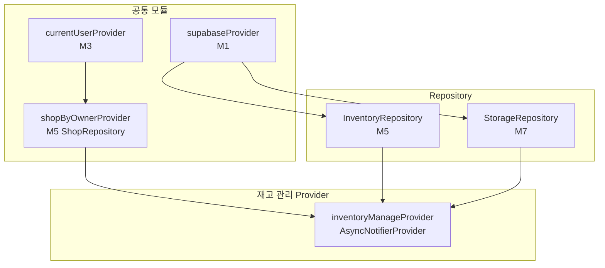

# 재고 관리 — 상태 설계

> 화면 ID: `owner-inventory-manage`
> UI 스펙: `docs/ui-specs/inventory-manage.md`
> 유스케이스: `docs/usecases/8-inventory-manage/spec.md`

---

## 상태 데이터 (State)

| 이름 | 타입 | 초기값 | 설명 |
|------|------|--------|------|
| `items` | `List<InventoryItem>` | `[]` | 재고 상품 목록 (name ASC 정렬) |
| `isLoading` | `bool` | `true` | 최초 데이터 로딩 중 여부 |
| `error` | `AppException?` | `null` | 에러 발생 시 에러 객체 |
| `isSaving` | `bool` | `false` | 상품 저장(추가/수정) 중 여부. 저장 버튼 로딩 + 중복 탭 방지 |
| `deletingItemId` | `String?` | `null` | 현재 삭제 중인 상품 ID. 삭제 진행 중 UI 표시용 |

---

## 비-상태 데이터 (Non-State)

| 이름 | 출처 | 설명 |
|------|------|------|
| `shopId` | `currentUserProvider` → `ShopRepository.getByOwner()` | 현재 사장님의 샵 ID. 인증 모듈(M3)에서 제공하는 사용자 정보로 조회 |
| `supabaseClient` | `supabaseProvider` (M1) | Supabase 클라이언트 인스턴스 |
| `categoryOptions` | 상수 | 고정 카테고리 목록: `['라켓', '상의', '하의', '가방', '신발', '악세서리']` |

---

## 상태 변화 조건표

| 트리거 | 상태 변화 | UI 변화 |
|--------|-----------|---------|
| 화면 최초 진입 | `isLoading = true` → 데이터 로드 → `isLoading = false`, `items` 갱신 | 스켈레톤 shimmer → 상품 그리드 표시 또는 빈 상태 |
| 데이터 로드 실패 | `error = AppException(...)`, `isLoading = false` | ErrorView 위젯 표시 ("데이터를 불러올 수 없습니다" + 재시도 버튼) |
| FAB(+) 탭 | 상태 변화 없음 (UI 이벤트) | "상품 추가" 바텀시트 표시 (빈 폼) |
| 상품 카드 탭 | 상태 변화 없음 (UI 이벤트) | "상품 수정" 바텀시트 표시 (기존 정보 채움) |
| 상품 저장 (추가) | `isSaving = true` → API 호출 → `isSaving = false`, `items`에 새 상품 추가 | 저장 버튼 로딩 → 바텀시트 닫기 + "저장되었습니다" 토스트 + 그리드 갱신 |
| 상품 저장 (수정) | `isSaving = true` → API 호출 → `isSaving = false`, `items`에서 해당 상품 갱신 | 저장 버튼 로딩 → 바텀시트 닫기 + "저장되었습니다" 토스트 + 그리드 갱신 |
| 상품 저장 실패 | `isSaving = false`, `error` 갱신 | 에러 스낵바 표시 ("저장에 실패했습니다. 다시 시도해 주세요"), 저장 버튼 재활성화 |
| 상품 삭제 확인 | `deletingItemId = itemId` → API 호출 → `deletingItemId = null`, `items`에서 해당 상품 제거 | 다이얼로그 닫기 + "삭제되었습니다" 토스트 + 그리드 갱신 |
| 상품 삭제 실패 | `deletingItemId = null` | 에러 스낵바 표시 ("삭제에 실패했습니다. 다시 시도해 주세요"), 상품 유지 |
| 이미지 업로드 실패 | `isSaving = false` | 에러 스낵바 표시 ("이미지 업로드에 실패했습니다. 다시 시도해 주세요"), 저장 버튼 재활성화 |
| 상품 0건 | `items = []`, `isLoading = false` | EmptyState 위젯 (아이콘 `inventory_2` + "등록된 상품이 없습니다" + "'+' 버튼으로 상품을 등록하세요") |

---

## Provider 구조

### Provider 상세

| Provider | 타입 | 역할 |
|----------|------|------|
| `inventoryManageProvider` | `AsyncNotifierProvider<InventoryManageNotifier, InventoryManageState>` | 재고 관리 전체 상태 관리. 상품 목록 조회, 추가/수정/삭제 액션 처리, 이미지 업로드 |
| `shopByOwnerProvider` | `FutureProvider<Shop>` | 현재 사장님의 샵 정보 조회 (M5 ShopRepository). shopId 제공 |

---

## 노출 인터페이스

### 읽기 (State)

| 항목 | 타입 | 설명 |
|------|------|------|
| `state.items` | `List<InventoryItem>` | 재고 상품 목록 (name ASC 정렬) |
| `state.isLoading` | `bool` | 로딩 중 여부 |
| `state.error` | `AppException?` | 에러 객체 |
| `state.isSaving` | `bool` | 저장 중 여부 (저장 버튼 로딩 상태) |
| `state.deletingItemId` | `String?` | 삭제 중인 상품 ID |

### 쓰기 (Actions)

| 메서드 | 파라미터 | 설명 |
|--------|----------|------|
| `loadItems()` | 없음 | 재고 목록 조회. `InventoryRepository.getByShop(shopId)` 호출 (name ASC) |
| `addItem(name, category, quantity, imageFile?)` | `String name`, `String category`, `int quantity`, `File? imageFile` | 상품 추가. 이미지가 있으면 Storage 업로드 후 `InventoryRepository.create()` 호출 |
| `updateItem(itemId, name, category, quantity, imageFile?, imageChanged)` | `String itemId`, `String name`, `String category`, `int quantity`, `File? imageFile`, `bool imageChanged` | 상품 수정. 이미지 변경 시 Storage 업로드 후 `InventoryRepository.update()` 호출 |
| `deleteItem(itemId)` | `String itemId` | 상품 삭제. `InventoryRepository.delete(itemId)` 호출 |

---

## 참조하는 공통 모듈

| 모듈 | 용도 |
|------|------|
| M1 (supabaseProvider) | Supabase 클라이언트 |
| M3 (currentUserProvider) | 현재 사용자 정보 → shopId 조회 |
| M4 (InventoryItem) | 재고 상품 모델 |
| M5 (InventoryRepository, ShopRepository) | 데이터 조회/변경 |
| M6 (AppException, ErrorHandler) | 에러 처리 |
| M7 (StorageRepository) | 상품 이미지 업로드 (`inventory-images` 버킷) |
| M9 (SkeletonShimmer, EmptyState, ErrorView, ConfirmDialog, AppToast) | 공통 위젯 (스켈레톤, 빈 상태, 에러, 삭제 확인, 토스트) |
| M10 (Validators.productName, Validators.quantity) | 상품명/수량 유효성 검증 |
