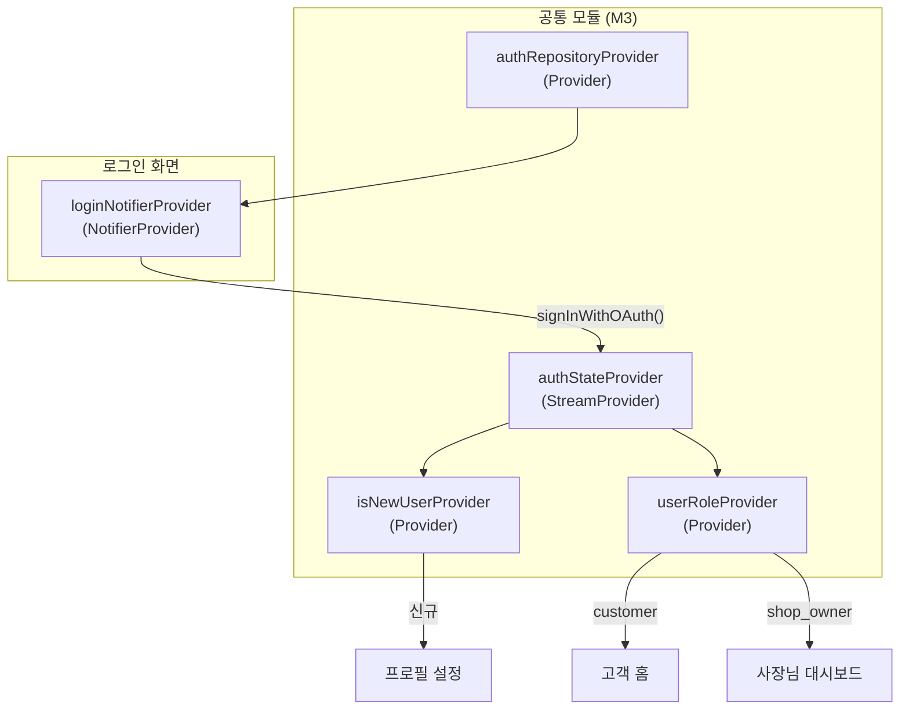

# 로그인 — 상태 설계

> 최종 수정일: 2026-02-24

---

## 상태 데이터 (State)

| 이름 | 타입 | 초기값 | 설명 |
|------|------|--------|------|
| `loginState` | `LoginState` | `LoginState.idle()` | 로그인 화면의 현재 상태 |

### LoginState (freezed union)

| 변형 | 필드 | 설명 |
|------|------|------|
| `idle` | - | 기본 상태. 모든 소셜 로그인 버튼 활성 |
| `authenticating` | `OAuthProvider provider` | 특정 소셜 로그인 진행 중. 해당 버튼에 스피너 표시, 전체 버튼 비활성 |
| `error` | `String message` | 로그인 실패. 에러 스낵바 표시 후 idle로 자동 복귀 |

---

## 비-상태 데이터 (Non-State)

| 이름 | 출처 | 설명 |
|------|------|------|
| `authState` | `authStateProvider` (M3) | Supabase Auth 세션 스트림. 로그인 성공 시 자동으로 상태가 갱신됨 |
| `isNewUser` | `isNewUserProvider` (M3) | 신규 사용자 여부. 로그인 성공 후 라우팅 분기에 사용 |
| `userRole` | `userRoleProvider` (M3) | 현재 사용자 역할. 기존 사용자의 역할별 라우팅에 사용 |
| `authRepository` | `authRepositoryProvider` (M3) | 소셜 로그인 API 호출을 담당하는 리포지토리 |

---

## 상태 변화 조건표

| 트리거 | 상태 변화 | UI 변화 |
|--------|----------|---------|
| 화면 진입 | `idle` | 소셜 로그인 버튼 3개 활성 상태로 표시 |
| 카카오 로그인 버튼 탭 | `idle` -> `authenticating(kakao)` | 카카오 버튼에 스피너 표시, 전체 버튼 비활성 |
| 네이버 로그인 버튼 탭 | `idle` -> `authenticating(naver)` | 네이버 버튼에 스피너 표시, 전체 버튼 비활성 |
| Google 로그인 버튼 탭 | `idle` -> `authenticating(google)` | Google 버튼에 스피너 표시, 전체 버튼 비활성 |
| 소셜 로그인 성공 (기존 고객) | `authenticating` -> `idle` | 고객 홈 화면으로 이동 (go_router 리다이렉트) |
| 소셜 로그인 성공 (기존 사장님) | `authenticating` -> `idle` | 사장님 대시보드로 이동 (go_router 리다이렉트) |
| 소셜 로그인 성공 (신규 사용자) | `authenticating` -> `idle` | 프로필 설정 화면으로 이동 (go_router 리다이렉트) |
| 사용자 취소 | `authenticating` -> `idle` | 버튼 기본 상태 복원. 별도 메시지 없음 |
| 네트워크 오류 | `authenticating` -> `error("네트워크 연결을 확인해주세요")` | 에러 스낵바 3초 표시 후 idle 복귀 |
| 기타 로그인 실패 | `authenticating` -> `error("로그인에 실패했습니다. 다시 시도해주세요")` | 에러 스낵바 3초 표시 후 idle 복귀 |

---

## Provider 구조

---

## 노출 인터페이스

### 읽기 (State)

| Provider | 타입 | 설명 |
|----------|------|------|
| `loginNotifierProvider` | `NotifierProvider<LoginNotifier, LoginState>` | 로그인 화면의 현재 상태. idle / authenticating(provider) / error(message) |

### 쓰기 (Actions)

| 메서드 | 파라미터 | 설명 |
|--------|---------|------|
| `signInWithKakao()` | - | 카카오 소셜 로그인 시작. `AuthRepository.signInWithOAuth(OAuthProvider.kakao)` 호출 |
| `signInWithNaver()` | - | 네이버 소셜 로그인 시작. `AuthRepository.signInWithOAuth(OAuthProvider.naver)` 호출 |
| `signInWithGoogle()` | - | Google 소셜 로그인 시작. `AuthRepository.signInWithOAuth(OAuthProvider.google)` 호출 |

> 로그인 성공 후 라우팅은 `authStateProvider` 변경을 감지하는 go_router 리다이렉트에서 처리한다. LoginNotifier는 인증 API 호출과 에러 처리만 담당한다.
