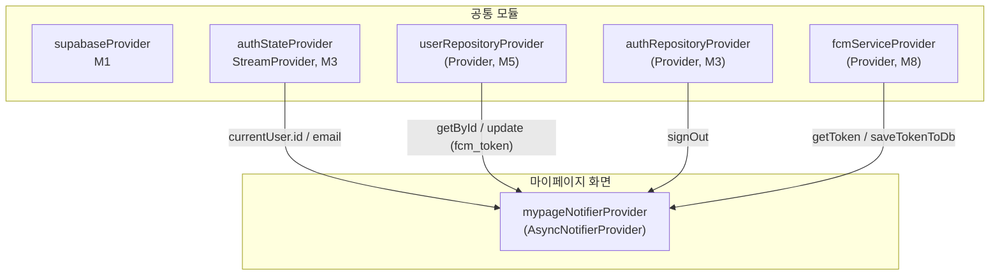

# 마이페이지 — 상태 설계

> 화면 ID: `customer-mypage`
> UI 스펙: `docs/ui-specs/mypage.md`
> 유스케이스: UC-9 프로필 수정 (프로필 조회/수정 진입점)

---

## 상태 데이터 (State)

| 이름 | 타입 | 초기값 | 설명 |
|------|------|--------|------|
| `mypageState` | `AsyncValue<MypageState>` | `AsyncLoading` | 마이페이지 전체 상태. 초기 프로필 데이터 로딩 포함 |

### MypageState (freezed)

| 필드 | 타입 | 초기값 | 설명 |
|------|------|--------|------|
| `userName` | `String` | DB에서 로드 | 사용자 이름 (users.name) |
| `userPhone` | `String` | DB에서 로드 | 사용자 연락처 (users.phone) |
| `userEmail` | `String?` | Auth에서 로드 | 사용자 이메일 (auth.currentUser.email) |
| `profileImageUrl` | `String?` | DB에서 로드 | 프로필 이미지 URL (users.profile_image_url) |
| `pushEnabled` | `bool` | `true` | 푸시 알림 활성화 여부 (로컬 + fcm_token 존재 여부) |
| `appVersion` | `String` | 패키지 정보 | 앱 버전 문자열 (예: "v1.0.0") |
| `isTogglingPush` | `bool` | `false` | 푸시 알림 토글 변경 중 여부 |
| `isLoggingOut` | `bool` | `false` | 로그아웃 처리 중 여부 |

---

## 비-상태 데이터 (Non-State)

| 이름 | 출처 | 설명 |
|------|------|------|
| `authState` | `authStateProvider` (M3) | 현재 인증된 사용자. `auth.currentUser.id`로 users 조회, `auth.currentUser.email`로 이메일 표시 |
| `authRepository` | `authRepositoryProvider` (M3) | 로그아웃 API 호출. `signOut()` |
| `userRepository` | `userRepositoryProvider` (M5) | users 테이블 조회. `getById()`, FCM 토큰 등록/삭제 `update()` |
| `fcmService` | `fcmServiceProvider` (M8) | FCM 토큰 취득. `getToken()`, `saveTokenToDb()` |

---

## 상태 변화 조건표

| 트리거 | 상태 변화 | UI 변화 |
|--------|----------|---------|
| 화면 진입 | `AsyncLoading` → users 조회 + 이메일/앱 버전 로드 → `AsyncData(MypageState)` | 프로필 섹션 스켈레톤 shimmer → 이름, 연락처, 이메일, 프로필 이미지 표시 |
| 데이터 로드 실패 | `AsyncError` | ErrorView "프로필을 불러올 수 없습니다" + 재시도 버튼 |
| 프로필 수정 후 복귀 | `userName`, `userPhone`, `profileImageUrl` 갱신 | 프로필 섹션의 이름/연락처/이미지 갱신 반영 |
| 푸시 알림 토글 ON | `isTogglingPush` = true → FCM 토큰 등록 → `pushEnabled` = true, `isTogglingPush` = false | 토글 로딩 → 토글 ON 상태 |
| 푸시 알림 토글 OFF | `isTogglingPush` = true → FCM 토큰 삭제 → `pushEnabled` = false, `isTogglingPush` = false | 토글 로딩 → 토글 OFF 상태 |
| 푸시 알림 토글 실패 | `pushEnabled` 이전 값으로 롤백, `isTogglingPush` = false | 에러 스낵바 "알림 설정 변경에 실패했습니다" + 토글 원복 |
| 로그아웃 버튼 탭 | - | 확인 다이얼로그 "로그아웃 하시겠습니까?" |
| 로그아웃 확인 | `isLoggingOut` = true → signOut() → 세션 삭제 | 로그인 화면으로 이동 |
| 로그아웃 실패 | `isLoggingOut` = false | 에러 스낵바 "로그아웃에 실패했습니다" |
| 프로필 수정 버튼 탭 | - | 프로필 수정 화면(`customer-profile-edit`)으로 이동 |
| 하단 탭 전환 | - | 해당 화면으로 이동 (go_router) |

---

## Provider 구조

### Provider 상세

| Provider | 타입 | 역할 |
|----------|------|------|
| `mypageNotifierProvider` | `AsyncNotifierProvider<MypageNotifier, MypageState>` | 마이페이지 전체 상태 관리. 프로필 데이터 로드, 푸시 알림 토글, 로그아웃 처리 |

---

## 노출 인터페이스

### 읽기 (State)

| Provider | 타입 | 설명 |
|----------|------|------|
| `mypageNotifierProvider` | `AsyncNotifierProvider<MypageNotifier, MypageState>` | 마이페이지 전체 상태. AsyncValue로 로딩/에러/데이터 분기 |

### 쓰기 (Actions)

| 메서드 | 파라미터 | 설명 |
|--------|---------|------|
| `refresh()` | - | 프로필 데이터 재조회. 프로필 수정 화면에서 복귀 시 호출 |
| `togglePushNotification(bool enabled)` | `bool` | 푸시 알림 토글 변경. ON: FCM 토큰 취득 → users.fcm_token 저장. OFF: users.fcm_token = null로 UPDATE |
| `logout()` | - | 확인 다이얼로그 표시 후 `AuthRepository.signOut()` 호출. 성공 시 로그인 화면으로 이동 |

---

## 참조하는 공통 모듈

| 모듈 | 용도 |
|------|------|
| M1 (supabaseProvider) | Supabase 클라이언트 |
| M3 (authStateProvider, authRepositoryProvider) | 현재 인증 사용자 정보, 로그아웃 |
| M4 (User) | 사용자 데이터 모델 |
| M5 (UserRepository) | users 테이블 조회 (`getById`), FCM 토큰 업데이트 (`update`) |
| M6 (AppException, ErrorHandler) | 에러 처리 및 사용자 메시지 매핑 |
| M8 (FcmService) | FCM 토큰 취득/저장 (푸시 알림 토글) |
| M9 (ConfirmDialog, ErrorView, SkeletonShimmer, AppToast) | 로그아웃 확인 다이얼로그, 에러 화면, 스켈레톤 로딩, 성공/에러 스낵바 |
