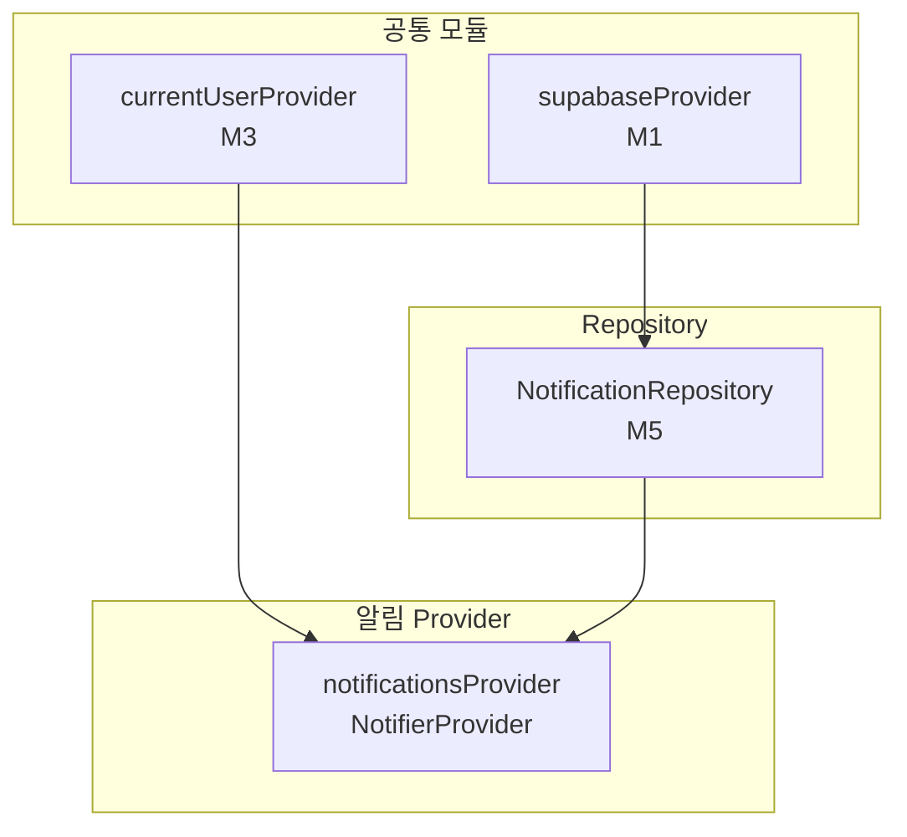

# 알림 — 상태 설계

> 화면 ID: `customer-notifications`
> UI 스펙: `docs/ui-specs/notifications.md`
> 유스케이스: `docs/usecases/10-notification/spec.md`

---

## 상태 데이터 (State)

| 이름 | 타입 | 초기값 | 설명 |
|------|------|--------|------|
| `notifications` | `List<NotificationItem>` | `[]` | 알림 목록 (created_at DESC 정렬, 최신순) |
| `isLoading` | `bool` | `true` | 최초 데이터 로딩 중 여부 |
| `error` | `AppException?` | `null` | 에러 발생 시 에러 객체 |
| `isRefreshing` | `bool` | `false` | Pull-to-refresh 중 여부 |

---

## 비-상태 데이터 (Non-State)

| 이름 | 출처 | 설명 |
|------|------|------|
| `userId` | `currentUserProvider` (M3) | 현재 로그인된 사용자 ID. 알림 조회 조건으로 사용 |
| `supabaseClient` | `supabaseProvider` (M1) | Supabase 클라이언트 인스턴스 |

---

## 상태 변화 조건표

| 트리거 | 상태 변화 | UI 변화 |
|--------|-----------|---------|
| 화면 최초 진입 | `isLoading = true` → 알림 목록 조회 + 전체 읽음 처리 → `isLoading = false`, `notifications` 갱신 | 스켈레톤 shimmer → 알림 리스트 표시 또는 빈 상태 |
| 데이터 로드 실패 | `error = AppException(...)`, `isLoading = false` | ErrorView 위젯 표시 ("알림을 불러올 수 없습니다" + 재시도 버튼) |
| 전체 읽음 처리 실패 | 상태 변화 없음 (무시) | 알림 리스트는 정상 표시. 뱃지 카운트는 다음 진입 시 재시도 |
| Pull-to-refresh | `isRefreshing = true` → 알림 목록 재조회 → `isRefreshing = false`, `notifications` 갱신 | RefreshIndicator 표시 → 리스트 갱신 |
| 알림 아이템 탭 (order_id 있음) | 상태 변화 없음 (네비게이션 이벤트) | 작업 상세 화면(`customer-order-detail`)으로 이동 (order_id 전달) |
| 알림 아이템 탭 (order_id 없음) | 상태 변화 없음 | 화면 전환 없음 |
| 알림 0건 | `notifications = []`, `isLoading = false` | EmptyState 위젯 (아이콘 `notifications_none` + "알림이 없습니다") |

---

## Provider 구조

### Provider 상세

| Provider | 타입 | 역할 |
|----------|------|------|
| `notificationsProvider` | `NotifierProvider<NotificationsNotifier, NotificationsState>` | 알림 화면 전체 상태 관리. 알림 목록 조회, 전체 읽음 처리, Pull-to-refresh 처리 |

---

## 노출 인터페이스

### 읽기 (State)

| 항목 | 타입 | 설명 |
|------|------|------|
| `state.notifications` | `List<NotificationItem>` | 알림 목록 (최신순) |
| `state.isLoading` | `bool` | 로딩 중 여부 |
| `state.error` | `AppException?` | 에러 객체 |
| `state.isRefreshing` | `bool` | Pull-to-refresh 중 여부 |

### 쓰기 (Actions)

| 메서드 | 파라미터 | 설명 |
|--------|----------|------|
| `loadNotifications()` | 없음 | 알림 목록 조회 + 전체 읽음 처리. `NotificationRepository.getByUser(userId)` 호출 (created_at DESC). 성공 시 `NotificationRepository.markAllAsRead(userId)` 병렬 호출 |
| `refresh()` | 없음 | Pull-to-refresh. 알림 목록 재조회 |
| `navigateToOrder(orderId)` | `String orderId` | 주문 관련 알림 탭 시 작업 상세 화면으로 이동. go_router를 통해 `/customer/order/:orderId` 라우트로 이동 |

---

## 참조하는 공통 모듈

| 모듈 | 용도 |
|------|------|
| M1 (supabaseProvider) | Supabase 클라이언트 |
| M2 (routerProvider) | 알림 탭 시 작업 상세 화면으로 이동 (go_router) |
| M3 (currentUserProvider) | 현재 사용자 ID → 알림 조회 조건 |
| M4 (NotificationItem, NotificationType) | 알림 모델 및 유형 Enum |
| M5 (NotificationRepository) | 알림 조회, 읽음 처리 |
| M6 (AppException, ErrorHandler) | 에러 처리 |
| M9 (SkeletonShimmer, EmptyState, ErrorView) | 공통 위젯 (스켈레톤, 빈 상태, 에러) |
| M11 (Formatters.relativeTime) | 상대 시간 포맷 ("방금 전", "2시간 전", "3일 전") |
