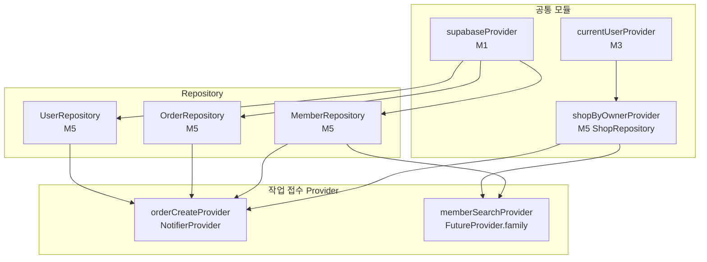

# 작업 접수 — 상태 설계

> 화면 ID: `owner-order-create`
> UI 스펙: `docs/ui-specs/order-create.md`
> 참조 유스케이스: UC-3 (회원 등록), UC-4 (작업 접수)

---

## 상태 데이터 (State)

| 이름 | 타입 | 초기값 | 설명 |
|------|------|--------|------|
| `selectedMember` | `Member?` | `null` | QR 스캔 또는 수동 검색으로 선택된 회원 객체 |
| `memo` | `String` | `""` | 작업 메모 입력값 (0~500자) |
| `searchQuery` | `String` | `""` | 회원 검색 입력값 |
| `searchResults` | `AsyncValue<List<Member>>` | `AsyncData([])` | 회원 검색 결과 (최대 5건) |
| `isSubmitting` | `bool` | `false` | 작업 접수 API 호출 중 여부 |
| `isScanning` | `bool` | `false` | QR 스캔 후 회원 조회 중 여부 |
| `error` | `AppException?` | `null` | 에러 발생 시 에러 객체 |

---

## 비-상태 데이터 (Non-State)

| 이름 | 출처 | 설명 |
|------|------|------|
| `shopId` | `currentUserProvider` → `ShopRepository.getByOwner()` | 현재 사장님의 샵 ID. 작업 접수 시 `orders.shop_id`로 사용 |
| `supabaseClient` | `supabaseProvider` (M1) | Supabase 클라이언트 인스턴스 |
| `isFormDirty` | `selectedMember` 또는 `memo`에서 파생 | 뒤로가기 시 확인 다이얼로그 표시 여부. `selectedMember != null \|\| memo.isNotEmpty` |
| `canSubmit` | `selectedMember`, `isSubmitting`에서 파생 | 접수 버튼 활성화 여부. `selectedMember != null && !isSubmitting` |

---

## 상태 변화 조건표

| 트리거 | 상태 변화 | UI 변화 |
|--------|-----------|---------|
| 화면 최초 진입 | 모든 상태 초기값 | QR 스캔 영역 + 회원 검색 영역 표시, 회원 정보 카드 및 작업 폼 숨김 |
| "QR 스캔하기" 버튼 탭 | 카메라 권한 확인 후 QR 스캔 화면 진입 | 전체 화면 카메라 뷰 표시 |
| QR 스캔 성공 (기존 회원) | `isScanning = true` → 회원 조회 → `selectedMember = member`, `isScanning = false` | 로딩 → 회원 정보 카드 표시 + "기존 회원입니다" 토스트 + 메모 입력 폼 표시 |
| QR 스캔 성공 (신규 회원) | `isScanning = true` → users 조회 → members INSERT → `selectedMember = newMember`, `isScanning = false` | 로딩 → 회원 정보 카드 표시 + "회원이 등록되었습니다" 토스트 + 메모 입력 폼 표시 |
| QR 스캔 실패 | `error = AppException(...)`, `isScanning = false` | "유효하지 않은 QR코드입니다" 토스트 |
| 검색어 입력 (2글자 이상) | `searchQuery = 입력값` → 300ms debounce → `searchResults = AsyncLoading` → 검색 → `searchResults = AsyncData(results)` | 검색 결과 드롭다운 표시 (최대 5건) |
| 검색어 삭제 (2글자 미만) | `searchQuery = 입력값`, `searchResults = AsyncData([])` | 검색 결과 드롭다운 숨김 |
| 검색 결과 항목 탭 | `selectedMember = 선택된 회원`, `searchQuery = ""`, `searchResults = AsyncData([])` | 회원 정보 카드 표시 + 메모 입력 폼 표시, 검색 드롭다운 숨김 |
| "변경" 버튼 탭 | `selectedMember = null`, `memo = ""` | QR 스캔/검색 영역 다시 표시, 폼 초기화 |
| 메모 입력 | `memo = 입력값` | 실시간 반영 |
| "작업 접수하기" 버튼 탭 | `isSubmitting = true` → orders INSERT → `isSubmitting = false` | 접수 버튼 로딩 인디케이터, 입력 비활성화 |
| 작업 접수 성공 | 대시보드로 네비게이션 | "작업이 접수되었습니다" 토스트 (3초간 "연속 접수" 버튼 포함) |
| 작업 접수 실패 | `isSubmitting = false`, `error = AppException(...)` | 에러 스낵바 표시, 접수 버튼 재활성화, 입력 데이터 유지 |
| 뒤로가기 (폼 dirty) | 확인 다이얼로그 표시 | "작성 중인 내용이 있습니다. 나가시겠습니까?" |
| 뒤로가기 (폼 clean) | 이전 화면으로 복귀 | 대시보드 또는 이전 화면 |

---

## Provider 구조

### Provider 상세

| Provider | 타입 | 역할 |
|----------|------|------|
| `orderCreateProvider` | `NotifierProvider<OrderCreateNotifier, OrderCreateState>` | 작업 접수 화면 전체 상태 관리. QR 스캔 후 회원 조회/등록, 검색, 접수 액션 처리 |
| `memberSearchProvider(query)` | `FutureProvider.family<List<Member>, String>` | 검색어 기반 회원 검색. `MemberRepository.search(shopId, query)` 호출. debounce는 UI 레이어에서 처리 |

---

## 노출 인터페이스

### 읽기 (State)

| 항목 | 타입 | 설명 |
|------|------|------|
| `state.selectedMember` | `Member?` | 선택된 회원 객체 (이름, 연락처, 방문 횟수 포함) |
| `state.memo` | `String` | 메모 입력값 |
| `state.searchQuery` | `String` | 회원 검색어 |
| `state.searchResults` | `AsyncValue<List<Member>>` | 회원 검색 결과 |
| `state.isSubmitting` | `bool` | 접수 중 여부 |
| `state.isScanning` | `bool` | QR 스캔 후 회원 조회 중 여부 |
| `state.error` | `AppException?` | 에러 객체 |
| `state.canSubmit` | `bool` (파생) | 접수 버튼 활성화 여부 |
| `state.isFormDirty` | `bool` (파생) | 폼에 입력 내용 존재 여부 |

### 쓰기 (Actions)

| 메서드 | 파라미터 | 설명 |
|--------|----------|------|
| `onQrScanned(userId)` | `String userId` | QR 스캔 성공 시 호출. user_id로 기존 회원 확인 → 없으면 자동 등록 → selectedMember 설정 |
| `searchMembers(query)` | `String query` | 이름/연락처로 회원 검색 (2글자 이상, debounce 300ms는 UI에서 처리) |
| `selectMember(member)` | `Member member` | 검색 결과에서 회원 선택 |
| `clearMember()` | 없음 | 선택된 회원 초기화 ("변경" 버튼) |
| `updateMemo(memo)` | `String memo` | 메모 입력값 갱신 |
| `submit()` | 없음 | 작업 접수. orders INSERT + 성공 시 대시보드 이동 |

---

## 참조하는 공통 모듈

| 모듈 | 용도 |
|------|------|
| M1 (supabaseProvider) | Supabase 클라이언트 |
| M3 (currentUserProvider) | 현재 사용자 정보 → shopId 조회 |
| M4 (Member, Order, OrderStatus) | 회원 모델, 주문 모델 및 상태 Enum |
| M5 (MemberRepository, OrderRepository, UserRepository, ShopRepository) | 회원 검색/등록, 작업 접수, 사용자 정보 조회 |
| M6 (AppException, ErrorHandler) | 에러 처리 |
| M9 (AppToast) | 성공/에러 토스트 메시지 |
| M10 (Validators.memo) | 메모 유효성 검증 (0~500자) |
