# 작업 상세 — 상태 설계

> 화면 ID: `customer-order-detail`
> 최종 수정일: 2026-02-24

---

## 상태 데이터 (State)

| 이름 | 타입 | 초기값 | 설명 |
|------|------|--------|------|
| `orderDetail` | `AsyncValue<OrderWithShop>` | `AsyncLoading` | 작업 상세 정보 (order + shop 조인 데이터) |

> `OrderWithShop`은 Order 모델에 Shop 정보(name, address, phone, latitude, longitude)가 포함된 복합 모델이다.

---

## 비-상태 데이터 (Non-State)

| 이름 | 출처 | 설명 |
|------|------|------|
| `orderId` | 라우터 path parameter | 화면 진입 시 전달받는 작업 ID. Provider의 family 파라미터로 사용 |
| `timelineSteps` | `orderDetail`에서 파생 | 타임라인 단계별 도달 여부와 시각. status, created_at, in_progress_at, completed_at에서 계산 |

---

## 상태 변화 조건표

| 트리거 | 상태 변화 | UI 변화 |
|--------|-----------|---------|
| 화면 최초 진입 | `orderDetail`: `AsyncLoading` | 스켈레톤 shimmer (상태 뱃지 + 타임라인 + 샵 정보) |
| 데이터 로드 성공 | `orderDetail`: `AsyncData(orderWithShop)` | 상태 뱃지(Large) + 타임라인 + 메모(있으면) + 샵 정보 표시 |
| 데이터 로드 실패 | `orderDetail`: `AsyncError(e)` | 에러 아이콘 + "데이터를 불러올 수 없습니다" + 재시도 버튼 |
| Realtime: status 변경 | `orderDetail` 내 order.status 갱신, 타임스탬프 갱신 | 상태 뱃지 색상/텍스트 전환 (300ms). 타임라인 해당 노드 활성화 + 시각 표시 |
| 재시도 버튼 탭 | `orderDetail`: `AsyncLoading` | 스켈레톤 shimmer로 전환 후 재조회 |

---

## Provider 구조

```mermaid
flowchart TD
    subgraph 공통 모듈
        ORDER_REPO[orderRepositoryProvider<br/>M5 리포지토리]
    end

    subgraph 작업 상세 Provider
        STREAM[orderDetailStreamProvider&#40;orderId&#41;<br/>StreamProvider.family]
        TIMELINE[timelineStepsProvider&#40;orderId&#41;<br/>Provider.family &#40;파생&#41;]
    end

    ORDER_REPO -->|Realtime stream by id| STREAM
    STREAM -->|orderDetail| TIMELINE

    subgraph Widget
        DETAIL_SCREEN[OrderDetailScreen]
    end

    STREAM -->|AsyncValue&lt;OrderWithShop&gt;| DETAIL_SCREEN
    TIMELINE -->|List&lt;TimelineStep&gt;| DETAIL_SCREEN
```

### Provider 설명

| Provider | 타입 | 역할 |
|----------|------|------|
| `orderDetailStreamProvider(orderId)` | `StreamProvider.family<OrderWithShop, String>` | 특정 order의 Realtime 변경을 구독. orders + shops 조인 데이터 반환 |
| `timelineStepsProvider(orderId)` | `Provider.family<List<TimelineStep>, String>` | orderDetail에서 타임라인 단계 목록을 파생. 각 단계의 활성 여부, 도달 시각, 색상 정보 포함 |

### TimelineStep 파생 모델

| 필드 | 타입 | 설명 |
|------|------|------|
| `status` | `OrderStatus` | 단계 상태 (received / inProgress / completed) |
| `isActive` | `bool` | 현재 상태까지 도달 여부 |
| `reachedAt` | `DateTime?` | 도달 시각. 미도달이면 null |
| `label` | `String` | 표시 텍스트 ("접수됨" / "작업중" / "완료") |

---

## 노출 인터페이스

### 읽기 (State)

| 이름 | 타입 | 설명 |
|------|------|------|
| `orderDetail` | `AsyncValue<OrderWithShop>` | 작업 상세 데이터 (loading / data / error) |
| `timelineSteps` | `List<TimelineStep>` | 타임라인 단계 목록 (파생) |

### 쓰기 (Actions)

| 이름 | 파라미터 | 설명 |
|------|----------|------|
| `retry()` | 없음 | 에러 상태에서 재시도. AsyncLoading으로 전환 후 재조회 |

> 이 화면은 조회 전용이므로 데이터 변경 Action이 없다. Realtime 구독은 `orderDetailStreamProvider`의 라이프사이클이 자동 관리한다. 화면 진입 시 구독 시작, 화면 이탈(dispose) 시 자동 해제.
