# 작업 이력 — 상태 설계

> 화면 ID: `customer-order-history`
> 최종 수정일: 2026-02-24

---

## 상태 데이터 (State)

| 이름 | 타입 | 초기값 | 설명 |
|------|------|--------|------|
| `completedOrders` | `AsyncValue<List<Order>>` | `AsyncLoading` | 완료된 작업 목록 (status = completed, 최신순) |
| `isLoadingMore` | `bool` | `false` | 다음 페이지 로딩 중 여부 (무한 스크롤) |
| `hasMore` | `bool` | `true` | 추가 페이지 존재 여부 |
| `cursor` | `String?` | `null` | 커서 기반 페이지네이션용. 마지막 항목의 created_at (UUIDv7 기반) |

---

## 비-상태 데이터 (Non-State)

| 이름 | 출처 | 설명 |
|------|------|------|
| `currentUser` | `currentUserProvider` (M3 인증 모듈) | 현재 사용자 정보. user_id를 쿼리 조건으로 사용 |
| `pageSize` | 상수 (20) | 한 페이지당 로드 건수 |

---

## 상태 변화 조건표

| 트리거 | 상태 변화 | UI 변화 |
|--------|-----------|---------|
| 화면 최초 진입 | `completedOrders`: `AsyncLoading` | 스켈레톤 shimmer 카드 4개 표시 |
| 첫 페이지 로드 성공 (0건) | `completedOrders`: `AsyncData([])`, `hasMore`: `false` | 빈 상태 (일러스트 + "아직 완료된 작업이 없습니다") |
| 첫 페이지 로드 성공 (1건 이상) | `completedOrders`: `AsyncData([...])`, `cursor` 갱신, `hasMore` 판정 | 작업 카드 목록 표시 |
| 첫 페이지 로드 실패 | `completedOrders`: `AsyncError(e)` | 에러 아이콘 + "데이터를 불러올 수 없습니다" + 재시도 버튼 |
| 스크롤 하단 도달 (hasMore = true) | `isLoadingMore`: `true` | 목록 하단에 로딩 인디케이터 표시 |
| 다음 페이지 로드 성공 | `completedOrders`에 추가 항목 append, `cursor` 갱신, `isLoadingMore`: `false` | 추가 카드 렌더링, 로딩 인디케이터 사라짐 |
| 다음 페이지 로드 성공 (추가 데이터 없음) | `hasMore`: `false`, `isLoadingMore`: `false` | 로딩 인디케이터 사라짐. 더 이상 자동 로드 안 함 |
| 다음 페이지 로드 실패 | `isLoadingMore`: `false` | "더 불러오기에 실패했습니다" 스낵바. 기존 목록 유지 |
| Pull-to-refresh | `completedOrders` 초기화 후 첫 페이지 재조회, `cursor`: `null`, `hasMore`: `true` | RefreshIndicator 표시. 완료 후 목록 갱신 |
| 재시도 버튼 탭 | `completedOrders`: `AsyncLoading` | 스켈레톤 shimmer로 전환 후 재조회 |

---

## Provider 구조

```mermaid
flowchart TD
    subgraph 공통 모듈
        AUTH[currentUserProvider<br/>M3 인증]
        ORDER_REPO[orderRepositoryProvider<br/>M5 리포지토리]
    end

    subgraph 작업 이력 Provider
        NOTIFIER[orderHistoryNotifier<br/>AsyncNotifier]
    end

    AUTH -->|user_id| NOTIFIER
    ORDER_REPO -->|getByMemberUser &#40;completed, paginated&#41;| NOTIFIER

    subgraph Widget
        HISTORY_SCREEN[OrderHistoryScreen]
    end

    NOTIFIER -->|AsyncValue&lt;List&lt;Order&gt;&gt;| HISTORY_SCREEN
    NOTIFIER -->|isLoadingMore, hasMore| HISTORY_SCREEN
```

### Provider 설명

| Provider | 타입 | 역할 |
|----------|------|------|
| `orderHistoryNotifier` | `AsyncNotifierProvider` | 완료된 작업 목록의 페이지네이션 상태 관리. 초기 로드, 추가 로드, refresh 처리 |

> 작업 이력 화면은 Realtime 구독 대신 Pull-to-refresh로 데이터를 갱신한다. 완료된 작업은 빈번히 변경되지 않으므로 Realtime 비용 대비 효용이 낮다.

---

## 노출 인터페이스

### 읽기 (State)

| 이름 | 타입 | 설명 |
|------|------|------|
| `completedOrders` | `AsyncValue<List<Order>>` | 완료된 작업 목록 (loading / data / error) |
| `isLoadingMore` | `bool` | 다음 페이지 로딩 중 여부 |
| `hasMore` | `bool` | 추가 페이지 존재 여부 |

### 쓰기 (Actions)

| 이름 | 파라미터 | 설명 |
|------|----------|------|
| `loadMore()` | 없음 | 다음 페이지 로드. `hasMore`가 false이거나 `isLoadingMore`가 true이면 무시 |
| `refresh()` | 없음 | Pull-to-refresh. 상태 초기화 후 첫 페이지부터 재조회 |
| `retry()` | 없음 | 에러 상태에서 재시도. AsyncLoading으로 전환 후 첫 페이지 재조회 |
