# 작업 관리 — 상태 설계

> 화면 ID: `owner-order-manage`
> UI 스펙: `docs/ui-specs/order-manage.md`
> 참조 유스케이스: UC-5 (작업 상태 변경 + 푸시 알림)

---

## 상태 데이터 (State)

| 이름 | 타입 | 초기값 | 설명 |
|------|------|--------|------|
| `orders` | `List<Order>` | `[]` | 전체 작업 목록 (member.name 포함, 최신순 정렬) |
| `statusCounts` | `Map<OrderStatus?, int>` | `{}` | 상태별 건수. 키가 `null`이면 전체 건수 |
| `selectedFilter` | `OrderStatus?` | `null` | 선택된 상태 필터 (`null` = 전체) |
| `searchQuery` | `String` | `""` | 검색 키워드 (회원명 필터) |
| `isSearchMode` | `bool` | `false` | 검색바 활성 여부 |
| `isLoading` | `bool` | `true` | 최초 데이터 로딩 중 여부 |
| `error` | `AppException?` | `null` | 에러 발생 시 에러 객체 |
| `changingOrderId` | `String?` | `null` | 현재 상태 변경 중인 주문 ID (낙관적 UI용) |
| `hasMore` | `bool` | `true` | 추가 로드 가능 여부 (무한 스크롤) |

---

## 비-상태 데이터 (Non-State)

| 이름 | 출처 | 설명 |
|------|------|------|
| `shopId` | `currentUserProvider` → `ShopRepository.getByOwner()` | 현재 사장님의 샵 ID. 조회 조건으로 사용 |
| `supabaseClient` | `supabaseProvider` (M1) | Supabase 클라이언트 인스턴스 |
| `filteredOrders` | `orders`, `selectedFilter`, `searchQuery`에서 파생 | 필터 + 검색이 적용된 작업 목록 |
| `initialFilter` | 라우터 query parameter | 대시보드에서 진입 시 전달되는 초기 상태 필터 (`statusFilter`) |

---

## 상태 변화 조건표

| 트리거 | 상태 변화 | UI 변화 |
|--------|-----------|---------|
| 화면 최초 진입 | `isLoading = true` → 데이터 로드 (50건) → `isLoading = false`, `orders`, `statusCounts` 갱신 | 스켈레톤 shimmer 카드 5개 → 필터 탭 + 작업 목록 표시 |
| 대시보드에서 필터 전달 진입 | `selectedFilter = 전달된 statusFilter`, 이후 최초 진입과 동일 | 해당 필터 탭이 선택된 상태로 목록 표시 |
| 데이터 로드 실패 | `error = AppException(...)`, `isLoading = false` | ErrorView 위젯 표시 ("데이터를 불러올 수 없습니다" + 재시도 버튼) |
| Pull-to-refresh | `isLoading = true` (기존 데이터 유지) → 재조회 → `isLoading = false` | RefreshIndicator 표시 후 목록 + 건수 갱신 |
| 필터 탭 변경 | `selectedFilter = 선택된 상태` | 해당 상태의 작업만 표시, 애니메이션 전환 |
| 검색 아이콘 탭 | `isSearchMode = true` | 앱바가 검색바로 변환 |
| 검색어 입력 | `searchQuery = 입력값` | 회원명으로 목록 실시간 필터링 |
| 검색바 닫기 | `isSearchMode = false`, `searchQuery = ""` | 앱바 복원, 전체 목록 표시 |
| 스크롤 하단 도달 | 다음 50건 로드 → `orders`에 추가, `hasMore` 갱신 | 하단 로딩 인디케이터 후 추가 카드 표시 |
| 상태 변경 버튼 탭 | `changingOrderId = orderId` → 낙관적 UI (즉시 상태 갱신) → API 호출 → `changingOrderId = null`, `statusCounts` 재계산 | 뱃지/버튼 즉시 갱신 + "실행 취소" 스낵바 3초 표시 |
| 상태 변경 실패 | `changingOrderId = null`, 이전 상태로 롤백 | 에러 스낵바 표시, 뱃지/버튼 원복 |
| 실행 취소 탭 (스낵바) | 이전 상태로 UPDATE API 호출, `statusCounts` 재계산 | 뱃지/버튼/건수 원복 |
| 작업 카드 탭 | (상태 변화 없음 — 바텀시트 표시) | 작업 상세 바텀시트 (회원 정보 + 메모 + 상태 타임라인 + 상태 변경 옵션) |
| 스와이프 삭제 (접수됨만) | 확인 다이얼로그 → orders DELETE → `orders`에서 제거, `statusCounts` 재계산 | "이 작업을 삭제하시겠습니까?" → 목록에서 카드 제거 |
| Realtime: orders INSERT | `orders` 앞에 추가, `statusCounts` 재계산 | 목록에 새 카드 추가, 필터 탭 건수 갱신 |
| Realtime: orders UPDATE | 해당 주문의 status 갱신, `statusCounts` 재계산 | 상태 뱃지 + 버튼 갱신, 필터 탭 건수 갱신 |
| Realtime: orders DELETE | `orders`에서 제거, `statusCounts` 재계산 | 목록에서 카드 제거, 필터 탭 건수 갱신 |
| 작업이 0건 (전체) | `orders = []`, 건수 모두 0 | EmptyState: 일러스트 + "등록된 작업이 없습니다" + "작업 접수 버튼으로 새 작업을 등록하세요" |
| 작업이 0건 (필터) | 해당 필터에 매칭되는 항목 없음 | "해당 상태의 작업이 없습니다" |

---

## Provider 구조

```mermaid
flowchart TD
    subgraph 공통 모듈
        SP[supabaseProvider<br/>M1]
        AUTH[currentUserProvider<br/>M3]
        SHOP[shopByOwnerProvider<br/>M5 ShopRepository]
    end

    subgraph Repository
        OR[OrderRepository<br/>M5]
    end

    subgraph 작업 관리 Provider
        MANAGE[orderManageProvider<br/>AsyncNotifierProvider]
        STREAM[ordersRealtimeProvider<br/>StreamProvider]
        FILTERED[filteredOrdersProvider<br/>Provider &#40;파생&#41;]
    end

    SP --> OR
    AUTH --> SHOP
    SHOP --> MANAGE
    OR --> MANAGE
    SP --> STREAM
    SHOP --> STREAM
    STREAM -->|INSERT/UPDATE/DELETE 이벤트| MANAGE
    MANAGE --> FILTERED
```

### Provider 상세

| Provider | 타입 | 역할 |
|----------|------|------|
| `orderManageProvider` | `AsyncNotifierProvider<OrderManageNotifier, OrderManageState>` | 작업 관리 화면 전체 상태 관리. 목록 조회, 필터링, 상태 변경, 삭제, 페이지네이션 처리 |
| `ordersRealtimeProvider` | `StreamProvider<List<Order>>` | `OrderRepository.streamByShop(shopId)` 구독. INSERT/UPDATE/DELETE 이벤트 수신 후 `orderManageProvider` 갱신 트리거 |
| `filteredOrdersProvider` | `Provider<List<Order>>` | `orders` + `selectedFilter` + `searchQuery`로 파생된 필터링 결과. 날짜별 그룹핑 포함 |

---

## 노출 인터페이스

### 읽기 (State)

| 항목 | 타입 | 설명 |
|------|------|------|
| `state.orders` | `List<Order>` | 전체 작업 목록 (Order 모델에 member.name 포함) |
| `state.statusCounts` | `Map<OrderStatus?, int>` | 상태별 건수 (필터 탭 표시용) |
| `state.selectedFilter` | `OrderStatus?` | 현재 선택된 필터 |
| `state.searchQuery` | `String` | 검색 키워드 |
| `state.isSearchMode` | `bool` | 검색바 활성 여부 |
| `state.isLoading` | `bool` | 로딩 중 여부 |
| `state.error` | `AppException?` | 에러 객체 |
| `state.changingOrderId` | `String?` | 상태 변경 중인 주문 ID |
| `state.hasMore` | `bool` | 추가 로드 가능 여부 |
| `filteredOrders` | `List<Order>` (파생) | 필터 + 검색 적용된 목록 |

### 쓰기 (Actions)

| 메서드 | 파라미터 | 설명 |
|--------|----------|------|
| `refresh()` | 없음 | Pull-to-refresh. 목록 + 건수 재조회 |
| `loadMore()` | 없음 | 무한 스크롤. 다음 50건 추가 로드 |
| `setFilter(status)` | `OrderStatus? status` | 상태 필터 변경 (`null` = 전체) |
| `setSearchMode(enabled)` | `bool enabled` | 검색바 활성/비활성 전환 |
| `setSearchQuery(query)` | `String query` | 검색 키워드 갱신 |
| `changeOrderStatus(orderId, newStatus)` | `String orderId`, `OrderStatus newStatus` | 주문 상태 변경. 낙관적 UI 적용 후 API 호출. 실패 시 롤백 |
| `undoStatusChange(orderId, previousStatus)` | `String orderId`, `OrderStatus previousStatus` | 상태 변경 실행 취소 |
| `deleteOrder(orderId)` | `String orderId` | 작업 삭제 (접수됨 상태만 허용). 확인 다이얼로그 후 호출 |

---

## 참조하는 공통 모듈

| 모듈 | 용도 |
|------|------|
| M1 (supabaseProvider) | Supabase 클라이언트 |
| M3 (currentUserProvider) | 현재 사용자 정보 → shopId 조회 |
| M4 (Order, OrderStatus, Member) | 주문 모델, 상태 Enum, 회원 모델 |
| M5 (OrderRepository, ShopRepository) | 작업 목록 조회/변경/삭제, Realtime 구독 |
| M6 (AppException, ErrorHandler) | 에러 처리 |
| M9 (StatusBadge, SkeletonShimmer, EmptyState, ErrorView, ConfirmDialog, AppToast) | 상태 뱃지, 스켈레톤, 빈 상태, 에러 화면, 삭제 확인 다이얼로그, 실행 취소 스낵바 |
| M11 (Formatters.dateTime) | 접수 시간 포맷 ("HH:mm" 또는 "M/D HH:mm") |
