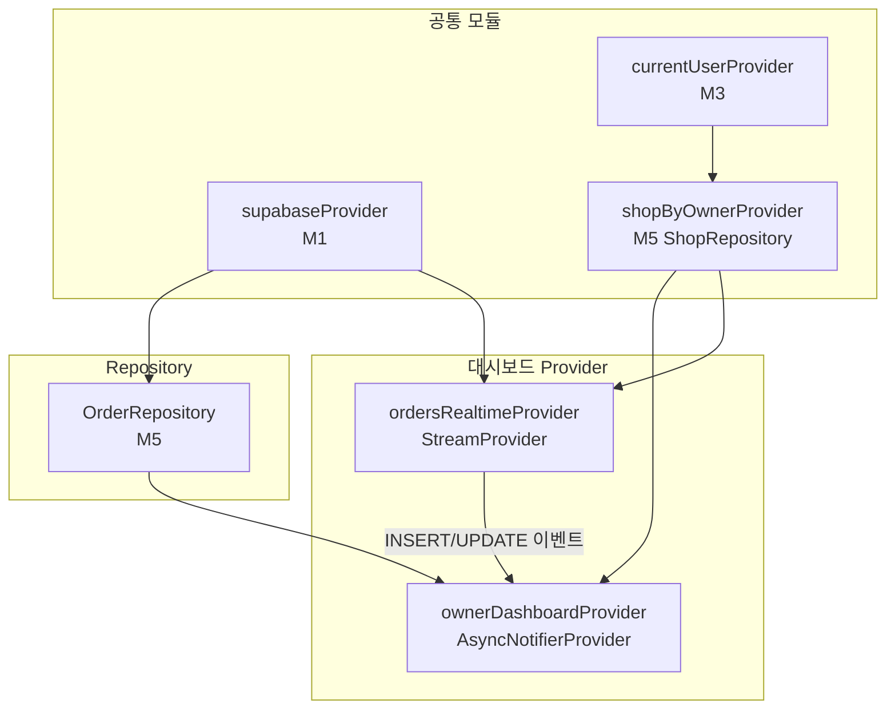

# 사장님 대시보드 — 상태 설계

> 화면 ID: `owner-dashboard`
> UI 스펙: `docs/ui-specs/owner-dashboard.md`

---

## 상태 데이터 (State)

| 이름 | 타입 | 초기값 | 설명 |
|------|------|--------|------|
| `receivedCount` | `int` | `0` | 오늘 접수됨 상태 건수 |
| `inProgressCount` | `int` | `0` | 오늘 작업중 상태 건수 |
| `completedCount` | `int` | `0` | 오늘 완료 상태 건수 |
| `recentOrders` | `List<Order>` | `[]` | 최근 작업 목록 (최대 5건, 오늘 기준, 최신순) |
| `isLoading` | `bool` | `true` | 최초 데이터 로딩 중 여부 |
| `error` | `AppException?` | `null` | 에러 발생 시 에러 객체 |
| `changingOrderId` | `String?` | `null` | 현재 상태 변경 중인 주문 ID (낙관적 UI용) |

---

## 비-상태 데이터 (Non-State)

| 이름 | 출처 | 설명 |
|------|------|------|
| `shopId` | `currentUserProvider` → `ShopRepository.getByOwner()` | 현재 사장님의 샵 ID. 인증 모듈(M3)에서 제공하는 사용자 정보로 조회 |
| `shopName` | `ShopRepository.getByOwner()` | 앱바에 표시할 샵 이름 |
| `supabaseClient` | `supabaseProvider` (M1) | Supabase 클라이언트 인스턴스 |
| `todayStart` | 로컬 계산 | 오늘 00:00:00 KST 기준 DateTime. DB 타임존이 Asia/Seoul이므로 클라이언트 로컬 시간 기준으로 계산 |

---

## 상태 변화 조건표

| 트리거 | 상태 변화 | UI 변화 |
|--------|-----------|---------|
| 화면 최초 진입 | `isLoading = true` → 데이터 로드 → `isLoading = false`, 카운트 및 목록 갱신 | 스켈레톤 shimmer → 카운트 카드 + 최근 작업 목록 표시 |
| 데이터 로드 실패 | `error = AppException(...)`, `isLoading = false` | ErrorView 위젯 표시 ("데이터를 불러올 수 없습니다" + 재시도 버튼) |
| Pull-to-refresh | `isLoading = true` (기존 데이터 유지) → 재조회 → `isLoading = false` | RefreshIndicator 표시 후 카운트 + 목록 갱신 |
| Realtime: orders INSERT | 카운트 재계산, `recentOrders` 앞에 추가 (5건 초과 시 마지막 제거) | 카운트 숫자 애니메이션 갱신, 목록에 새 카드 추가 |
| Realtime: orders UPDATE | 해당 주문의 status 갱신, 카운트 재계산 | 상태 뱃지 + 버튼 갱신, 카운트 숫자 갱신 |
| 상태 변경 버튼 탭 | `changingOrderId = orderId` → API 호출 → `changingOrderId = null` | 버튼 로딩 → 성공 시 뱃지/버튼/카운트 갱신 + "실행 취소" 스낵바 3초 |
| 상태 변경 실패 | `changingOrderId = null`, 이전 상태로 롤백 | 에러 스낵바 표시, 뱃지/버튼 원복 |
| 실행 취소 탭 (스낵바) | 이전 상태로 UPDATE API 호출, 카운트 재계산 | 뱃지/버튼/카운트 원복 |
| 작업이 0건 | `recentOrders = []`, 카운트 모두 0 | 카운트 카드 "0" 표시 + EmptyState 위젯 ("오늘 접수된 작업이 없습니다") |

---

## Provider 구조

### Provider 상세

| Provider | 타입 | 역할 |
|----------|------|------|
| `ownerDashboardProvider` | `AsyncNotifierProvider<OwnerDashboardNotifier, OwnerDashboardState>` | 대시보드 전체 상태 관리. 카운트 조회, 최근 목록 조회, 상태 변경 액션 처리 |
| `ordersRealtimeProvider` | `StreamProvider<List<Order>>` | `OrderRepository.streamByShop(shopId)` 구독. INSERT/UPDATE 이벤트 수신 후 `ownerDashboardProvider` 갱신 트리거 |
| `shopByOwnerProvider` | `FutureProvider<Shop>` | 현재 사장님의 샵 정보 조회 (M5 ShopRepository). 앱바 샵 이름 + shopId 제공 |

---

## 노출 인터페이스

### 읽기 (State)

| 항목 | 타입 | 설명 |
|------|------|------|
| `state.receivedCount` | `int` | 오늘 접수됨 건수 |
| `state.inProgressCount` | `int` | 오늘 작업중 건수 |
| `state.completedCount` | `int` | 오늘 완료 건수 |
| `state.recentOrders` | `List<Order>` | 최근 작업 목록 (Order 모델에 member.name 포함) |
| `state.isLoading` | `bool` | 로딩 중 여부 |
| `state.error` | `AppException?` | 에러 객체 |
| `state.changingOrderId` | `String?` | 상태 변경 중인 주문 ID |

### 쓰기 (Actions)

| 메서드 | 파라미터 | 설명 |
|--------|----------|------|
| `refresh()` | 없음 | Pull-to-refresh. 카운트 + 최근 목록 재조회 |
| `changeOrderStatus(orderId, newStatus)` | `String orderId`, `OrderStatus newStatus` | 주문 상태 변경. 낙관적 UI 적용 후 API 호출. 실패 시 롤백 |
| `undoStatusChange(orderId, previousStatus)` | `String orderId`, `OrderStatus previousStatus` | 상태 변경 실행 취소. "실행 취소" 스낵바에서 호출 |

---

## 참조하는 공통 모듈

| 모듈 | 용도 |
|------|------|
| M1 (supabaseProvider) | Supabase 클라이언트 |
| M3 (currentUserProvider) | 현재 사용자 정보 → shopId 조회 |
| M4 (Order, OrderStatus) | 주문 모델 및 상태 Enum |
| M5 (OrderRepository, ShopRepository) | 데이터 조회/변경 |
| M6 (AppException, ErrorHandler) | 에러 처리 |
| M9 (StatusBadge, SkeletonShimmer, EmptyState, ErrorView) | 공통 위젯 |
| M11 (Formatters.dateTime) | 접수 시간 포맷 ("HH:mm 접수") |
