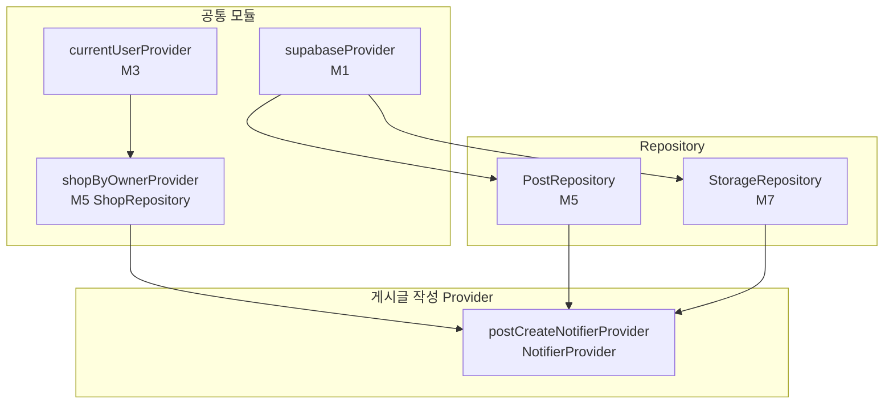

# 게시글 작성 — 상태 설계

> 화면 ID: `owner-post-create`
> UI 스펙: `docs/ui-specs/post-create.md`
> 유스케이스: `docs/usecases/7-post-manage/spec.md`

---

## 상태 데이터 (State)

| 이름 | 타입 | 초기값 | 설명 |
|------|------|--------|------|
| `category` | `PostCategory?` | `null` | 선택된 카테고리 (`notice` / `event`) |
| `title` | `String` | `""` | 게시글 제목 (1~100자) |
| `content` | `String` | `""` | 게시글 내용 (1~2000자) |
| `images` | `List<String>` | `[]` | 첨부된 이미지 URL 목록 (최대 5장, 업로드 즉시 URL 저장) |
| `eventStartDate` | `DateTime?` | `null` | 이벤트 시작일 (이벤트 카테고리 선택 시 필수) |
| `eventEndDate` | `DateTime?` | `null` | 이벤트 종료일 (이벤트 카테고리 선택 시 필수) |
| `isSubmitting` | `bool` | `false` | 등록 API 호출 중 여부 |
| `isUploadingImage` | `bool` | `false` | 이미지 업로드 중 여부 |
| `errorMessage` | `String?` | `null` | 에러 메시지 (유효성 검증/API 에러 공용) |
| `editingPostId` | `String?` | `null` | 수정 모드 시 편집 중인 게시글 ID |
| `isLoadingPost` | `bool` | `false` | 수정 모드 진입 시 게시글 로딩 중 여부 |

---

## 비-상태 데이터 (Non-State)

| 이름 | 출처 | 설명 |
|------|------|------|
| `shopId` | `currentUserProvider` → `ShopRepository.getByOwner()` | 현재 사장님의 샵 ID. 게시글 등록 시 `posts.shop_id`로 사용 |
| `supabaseClient` | `supabaseProvider` (M1) | Supabase 클라이언트 인스턴스 |
| `storageRepository` | `storageRepositoryProvider` (M7) | 이미지 업로드용 Storage 리포지토리 |
| `postRepository` | `postRepositoryProvider` (M5) | 게시글 CRUD 리포지토리 |

---

## 상태 변화 조건표

| 트리거 | 상태 변화 | UI 변화 |
|--------|-----------|---------|
| 화면 진입 | 초기 상태 (모든 필드 비어있음, `category = null`) | 빈 폼 표시, 등록 버튼 비활성 (`#E8E0D8`) |
| 카테고리 선택 (공지사항) | `category = PostCategory.notice`, `eventStartDate = null`, `eventEndDate = null`, `dateError = null` | 공지사항 칩 강조, 이벤트 기간 영역 숨김 |
| 카테고리 선택 (이벤트) | `category = PostCategory.event` | 이벤트 칩 강조, 이벤트 기간 입력 영역 표시 |
| 제목 입력 | `title = 입력값`, `titleError = null` | 실시간 텍스트 반영, 필수 필드 완료 시 등록 버튼 활성화 |
| 내용 입력 | `content = 입력값`, `contentError = null` | 실시간 텍스트 반영, 글자 수 카운터 갱신 ("N/2000") |
| 이미지 추가 | `isUploadingImage = true` → Storage 업로드 → `images = [...images, uploadedUrl]`, `isUploadingImage = false` | 업로드 중 인디케이터 표시, 완료 후 가로 스크롤 리스트에 썸네일 추가, 5장 도달 시 추가 버튼 숨김 |
| 이미지 업로드 실패 | `isUploadingImage = false`, `errorMessage = '이미지 업로드에 실패했습니다'` | 에러 메시지 표시 |
| 이미지 삭제 | `images = images.where(!=target)` | 해당 썸네일 제거, 5장 미만이면 추가 버튼 다시 표시 |
| 시작일 선택 | `eventStartDate = 선택일`, `dateError = null` | 시작일 필드에 날짜 표시 |
| 종료일 선택 | `eventEndDate = 선택일`, `dateError = null` | 종료일 필드에 날짜 표시 |
| 등록 버튼 탭 (검증 성공) | `isSubmitting = true` → posts INSERT (이미지는 이미 업로드 완료) → `isSubmitting = false` | 등록 버튼에 로딩 인디케이터, 입력 필드 비활성화 |
| 등록 성공 | `isSubmitting = false` | "게시글이 등록되었습니다" 토스트 표시 후 이전 화면 복귀 |
| 등록 실패 (DB INSERT) | `isSubmitting = false`, `errorMessage = '게시글 등록에 실패했습니다'` | 에러 스낵바 표시, 등록 버튼 재활성화 |
| 등록 버튼 탭 (검증 실패) | `errorMessage` 갱신 (제목/내용/날짜 에러 메시지) | 에러 메시지 표시 |
| 뒤로가기 (입력 내용 있음) | 상태 변화 없음 | "작성 중인 내용이 있습니다. 나가시겠습니까?" 확인 다이얼로그 표시 |
| 뒤로가기 (입력 내용 없음) | 상태 변화 없음 | 이전 화면으로 즉시 복귀 |

---

## Provider 구조

### Provider 상세

| Provider | 타입 | 역할 |
|----------|------|------|
| `postCreateNotifierProvider` | `NotifierProvider<PostCreateNotifier, PostCreateState>` | 게시글 작성 폼 전체 상태 관리. 필드 갱신, 유효성 검증, 이미지 업로드 + 게시글 등록 처리 |
| `shopByOwnerProvider` | `FutureProvider<Shop>` | 현재 사장님의 샵 정보 조회 (M5 ShopRepository). shopId 제공 |

---

## 노출 인터페이스

### 읽기 (State)

| 항목 | 타입 | 설명 |
|------|------|------|
| `state.category` | `PostCategory?` | 선택된 카테고리 |
| `state.title` | `String` | 제목 입력값 |
| `state.content` | `String` | 내용 입력값 |
| `state.images` | `List<String>` | 첨부 이미지 URL 목록 |
| `state.eventStartDate` | `DateTime?` | 이벤트 시작일 |
| `state.eventEndDate` | `DateTime?` | 이벤트 종료일 |
| `state.isSubmitting` | `bool` | 등록 중 여부 |
| `state.isUploadingImage` | `bool` | 이미지 업로드 중 여부 |
| `state.errorMessage` | `String?` | 에러 메시지 (유효성 검증/API 에러 공용) |
| `state.editingPostId` | `String?` | 수정 모드 시 편집 중인 게시글 ID |
| `state.isLoadingPost` | `bool` | 수정 모드 진입 시 게시글 로딩 중 여부 |

### 쓰기 (Actions)

| 메서드 | 파라미터 | 설명 |
|--------|----------|------|
| `selectCategory(category)` | `PostCategory category` | 카테고리 선택. 이벤트→공지 전환 시 날짜 필드 초기화 |
| `updateTitle(title)` | `String title` | 제목 입력값 갱신 |
| `updateContent(content)` | `String content` | 내용 입력값 갱신 |
| `addImage(bytes, extension)` | `Uint8List bytes`, `String extension` | 이미지를 Storage에 즉시 업로드하고 URL을 images에 추가 (최대 5장) |
| `removeImage(index)` | `int index` | 해당 인덱스의 이미지 제거 |
| `setEventDates({startDate, endDate})` | `DateTime? startDate`, `DateTime? endDate` | 이벤트 시작일/종료일 설정 |
| `loadPost(postId)` | `String postId` | 수정 모드: 기존 게시글 데이터 로드 |
| `submit(shopId)` | `String shopId` | 유효성 검증 → posts INSERT/UPDATE. 성공 시 `true` 반환 |

---

## 참조하는 공통 모듈

| 모듈 | 용도 |
|------|------|
| M1 (supabaseProvider) | Supabase 클라이언트 |
| M3 (currentUserProvider) | 현재 사용자 정보 → shopId 조회 |
| M4 (Post, PostCategory) | 게시글 모델 및 카테고리 Enum |
| M5 (PostRepository, ShopRepository) | 게시글 등록, 샵 정보 조회 |
| M6 (AppException, ErrorHandler) | 에러 처리 |
| M7 (StorageRepository) | 이미지 업로드 (post-images 버킷) |
| M9 (AppToast, ConfirmDialog, LoadingIndicator) | 토스트 메시지, 뒤로가기 확인 다이얼로그, 버튼 로딩 |
| M10 (Validators.postTitle, Validators.postContent) | 제목/내용 유효성 검증 |
