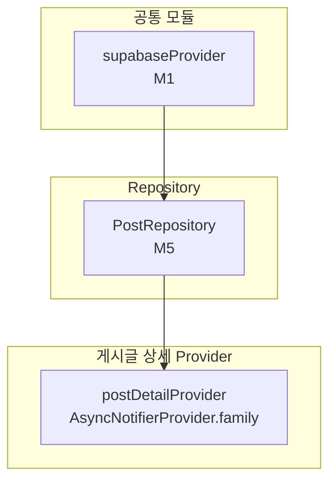

# 게시글 상세 — 상태 설계

> 화면 ID: `customer-post-detail`
> UI 스펙: `docs/ui-specs/post-detail.md`
> 유스케이스: `docs/usecases/7-post-manage/spec.md`

---

## 상태 데이터 (State)

| 이름 | 타입 | 초기값 | 설명 |
|------|------|--------|------|
| `post` | `Post?` | `null` | 조회된 게시글 데이터 |
| `isLoading` | `bool` | `true` | 데이터 로딩 중 여부 |
| `error` | `AppException?` | `null` | 에러 발생 시 에러 객체 |

---

## 비-상태 데이터 (Non-State)

| 이름 | 출처 | 설명 |
|------|------|------|
| `postId` | 라우트 파라미터 (`GoRouterState.pathParameters['postId']`) | 조회할 게시글 ID |
| `supabaseClient` | `supabaseProvider` (M1) | Supabase 클라이언트 인스턴스 |
| `postRepository` | `postRepositoryProvider` (M5) | 게시글 CRUD 리포지토리 |

---

## 상태 변화 조건표

| 트리거 | 상태 변화 | UI 변화 |
|--------|-----------|---------|
| 화면 진입 | `isLoading = true` → `posts` 테이블에서 `id = postId` 단건 조회 → `isLoading = false`, `post` 갱신 | 스켈레톤 shimmer → 게시글 전문 표시 (카테고리 뱃지, 제목, 작성자/날짜, 본문, 이미지) |
| 데이터 로드 실패 | `error = AppException(...)`, `isLoading = false` | ErrorView 위젯 표시 ("데이터를 불러올 수 없습니다" + 재시도 버튼) |
| 재시도 버튼 탭 | `isLoading = true`, `error = null` → 재조회 | 스켈레톤 shimmer → 게시글 전문 또는 에러 |
| 이미지 탭 | 상태 변화 없음 | 이미지 전체 화면 뷰어 표시 (줌 가능) |
| 뒤로가기 | 상태 변화 없음 | 이전 화면 (게시글 목록 또는 샵 상세)으로 복귀 |

---

## Provider 구조

### Provider 상세

| Provider | 타입 | 역할 |
|----------|------|------|
| `postDetailProvider` | `AsyncNotifierProvider.family<PostDetailNotifier, PostDetailState, String>` | 게시글 상세 상태 관리. family 파라미터는 `postId`. 단건 조회 및 에러 처리 |

---

## 노출 인터페이스

### 읽기 (State)

| 항목 | 타입 | 설명 |
|------|------|------|
| `state.post` | `Post?` | 게시글 데이터 (카테고리, 제목, 내용, 이미지, 날짜) |
| `state.isLoading` | `bool` | 로딩 중 여부 |
| `state.error` | `AppException?` | 에러 객체 |

### 쓰기 (Actions)

| 메서드 | 파라미터 | 설명 |
|--------|----------|------|
| `retry()` | 없음 | 게시글 상세 데이터 재조회 |

---

## 참조하는 공통 모듈

| 모듈 | 용도 |
|------|------|
| M1 (supabaseProvider) | Supabase 클라이언트 |
| M4 (Post, PostCategory) | 게시글 모델 및 카테고리 Enum |
| M5 (PostRepository) | 게시글 상세 조회 (`getById`) |
| M6 (AppException, ErrorHandler) | 에러 처리 |
| M9 (SkeletonShimmer, ErrorView) | 스켈레톤 로딩, 에러 화면 |
| M11 (Formatters.date) | 작성일 포맷 ("YYYY-MM-DD") |
