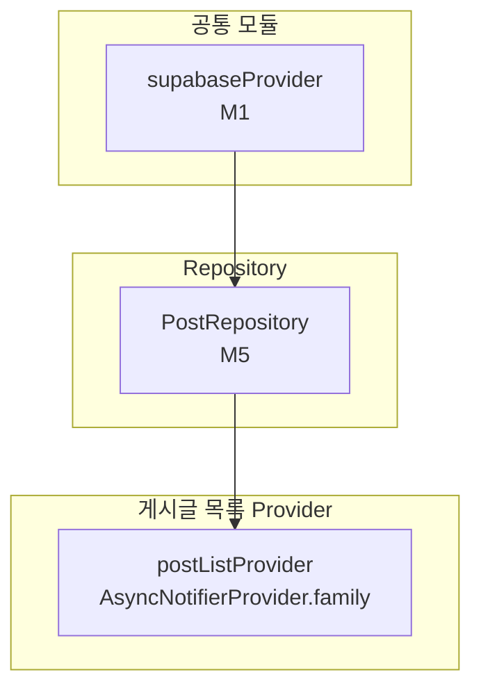

# 게시글 목록 — 상태 설계

> 화면 ID: `customer-post-list`
> UI 스펙: `docs/ui-specs/post-list.md`
> 유스케이스: `docs/usecases/7-post-manage/spec.md`

---

## 상태 데이터 (State)

| 이름 | 타입 | 초기값 | 설명 |
|------|------|--------|------|
| `noticePosts` | `List<Post>` | `[]` | 공지사항 게시글 목록 (최신순) |
| `eventPosts` | `List<Post>` | `[]` | 이벤트 게시글 목록 (최신순) |
| `isLoading` | `bool` | `true` | 최초 데이터 로딩 중 여부 |
| `error` | `AppException?` | `null` | 에러 발생 시 에러 객체 |

---

## 비-상태 데이터 (Non-State)

| 이름 | 출처 | 설명 |
|------|------|------|
| `shopId` | 라우트 파라미터 (`GoRouterState.pathParameters['shopId']`) | 게시글을 조회할 샵 ID |
| `initialCategory` | 라우트 파라미터 (`GoRouterState.uri.queryParameters['category']`) | 진입 시 초기 선택 탭 (`notice` / `event`). 없으면 `notice` 기본값 |
| `selectedTabIndex` | `TabController.index` (위젯 로컬) | 현재 선택된 탭 인덱스 (0: 공지사항, 1: 이벤트). TabController가 관리 |
| `supabaseClient` | `supabaseProvider` (M1) | Supabase 클라이언트 인스턴스 |
| `postRepository` | `postRepositoryProvider` (M5) | 게시글 CRUD 리포지토리 |

---

## 상태 변화 조건표

| 트리거 | 상태 변화 | UI 변화 |
|--------|-----------|---------|
| 화면 진입 | `isLoading = true` → 공지사항 + 이벤트 목록 동시 조회 → `isLoading = false`, `noticePosts` + `eventPosts` 갱신 | 스켈레톤 shimmer (카드 3개) → 게시글 카드 리스트 표시 |
| 데이터 로드 실패 | `error = AppException(...)`, `isLoading = false` | ErrorView 위젯 표시 ("데이터를 불러올 수 없습니다" + 재시도 버튼) |
| 탭 전환 (공지사항) | 상태 변화 없음 (이미 로드됨) | 공지사항 게시글 리스트 표시, 탭 인디케이터 이동 |
| 탭 전환 (이벤트) | 상태 변화 없음 (이미 로드됨) | 이벤트 게시글 리스트 표시, 탭 인디케이터 이동 |
| 게시글 0건 (해당 카테고리) | `noticePosts = []` 또는 `eventPosts = []` | "등록된 게시글이 없습니다" 빈 상태 텍스트 (EmptyState) |
| 게시글 카드 탭 | 상태 변화 없음 | `customer-post-detail` 화면으로 이동 (postId 전달) |
| 재시도 버튼 탭 | `isLoading = true`, `error = null` → 재조회 | 스켈레톤 shimmer → 카드 리스트 또는 에러 |

---

## Provider 구조

### Provider 상세

| Provider | 타입 | 역할 |
|----------|------|------|
| `postListProvider` | `AsyncNotifierProvider.family<PostListNotifier, PostListState, String>` | 샵별 게시글 목록 상태 관리. family 파라미터는 `shopId`. 공지사항/이벤트 목록을 한 번에 조회하여 캐싱 |

---

## 노출 인터페이스

### 읽기 (State)

| 항목 | 타입 | 설명 |
|------|------|------|
| `state.noticePosts` | `List<Post>` | 공지사항 게시글 목록 |
| `state.eventPosts` | `List<Post>` | 이벤트 게시글 목록 |
| `state.isLoading` | `bool` | 로딩 중 여부 |
| `state.error` | `AppException?` | 에러 객체 |

### 쓰기 (Actions)

| 메서드 | 파라미터 | 설명 |
|--------|----------|------|
| `refresh()` | 없음 | 공지사항 + 이벤트 게시글 목록 재조회 |

---

## 참조하는 공통 모듈

| 모듈 | 용도 |
|------|------|
| M1 (supabaseProvider) | Supabase 클라이언트 |
| M4 (Post, PostCategory) | 게시글 모델 및 카테고리 Enum |
| M5 (PostRepository) | 게시글 목록 조회 (`getByShopAndCategory`) |
| M6 (AppException, ErrorHandler) | 에러 처리 |
| M9 (SkeletonShimmer, EmptyState, ErrorView) | 스켈레톤 로딩, 빈 상태, 에러 화면 |
| M11 (Formatters.date) | 게시 날짜 포맷 ("YYYY-MM-DD") |
