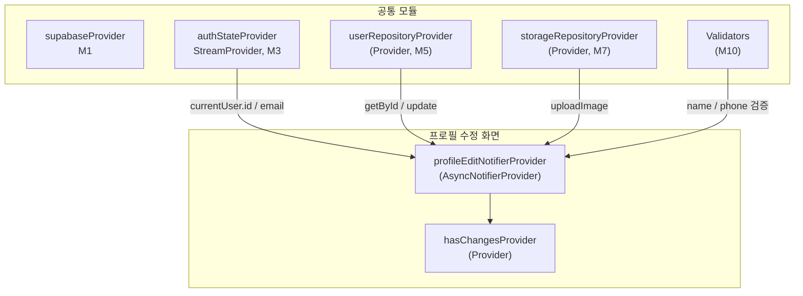

# 프로필 수정 — 상태 설계

> 화면 ID: `customer-profile-edit`
> UI 스펙: `docs/ui-specs/profile-edit.md`
> 유스케이스: UC-9 프로필 수정

---

## 상태 데이터 (State)

| 이름 | 타입 | 초기값 | 설명 |
|------|------|--------|------|
| `profileEditState` | `AsyncValue<ProfileEditState>` | `AsyncLoading` | 프로필 수정 화면의 전체 상태. 초기 데이터 로딩 포함 |

### ProfileEditState (freezed)

| 필드 | 타입 | 초기값 | 설명 |
|------|------|--------|------|
| `name` | `String` | DB에서 로드 | 이름 입력값 |
| `phone` | `String` | DB에서 로드 | 연락처 입력값 (하이픈 포함 포맷) |
| `profileImageUrl` | `String?` | DB에서 로드 | 현재 프로필 이미지 URL |
| `newImageFile` | `File?` | `null` | 새로 선택한 이미지 파일 (업로드 전) |
| `originalName` | `String` | DB에서 로드 | 원본 이름 (변경 감지용) |
| `originalPhone` | `String` | DB에서 로드 | 원본 연락처 (변경 감지용) |
| `originalImageUrl` | `String?` | DB에서 로드 | 원본 프로필 이미지 URL (변경 감지용) |
| `status` | `ProfileEditStatus` | `idle` | 현재 저장 상태 |
| `nameError` | `String?` | `null` | 이름 필드 유효성 에러 메시지 |
| `phoneError` | `String?` | `null` | 연락처 필드 유효성 에러 메시지 |

### ProfileEditStatus (Enum)

| 값 | 설명 |
|----|------|
| `idle` | 기본 상태 (입력 대기) |
| `saving` | 이미지 업로드 + users 테이블 UPDATE API 호출 중 |
| `error` | API 호출 실패 |

### 파생 상태

| 이름 | 로직 | 설명 |
|------|------|------|
| `hasChanges` | `name != originalName \|\| phone != originalPhone \|\| newImageFile != null` | 변경사항 존재 여부. 저장 버튼 활성/비활성 및 뒤로가기 확인 다이얼로그에 사용 |

---

## 비-상태 데이터 (Non-State)

| 이름 | 출처 | 설명 |
|------|------|------|
| `authState` | `authStateProvider` (M3) | 현재 인증된 사용자. `auth.currentUser.id`로 users 테이블 조회, `auth.currentUser.email`로 이메일 읽기전용 표시 |
| `userEmail` | `authStateProvider` (M3) | `auth.currentUser.email`. 이메일 필드에 읽기전용으로 표시 |
| `userRepository` | `userRepositoryProvider` (M5) | users 테이블 CRUD. `getById()`, `update()` 호출 |
| `storageRepository` | `storageRepositoryProvider` (M7) | 프로필 이미지 업로드. `uploadImage('profile-images', ...)` 호출 |
| `validators` | `Validators` (M10) | 이름/연락처 유효성 검증 함수 |

---

## 상태 변화 조건표

| 트리거 | 상태 변화 | UI 변화 |
|--------|----------|---------|
| 화면 진입 | `AsyncLoading` → users 테이블 조회 → `AsyncData(ProfileEditState)` | 스켈레톤 shimmer → 입력 필드에 현재 값 표시, 이메일 읽기전용 (회색 배경) |
| 데이터 로드 실패 | `AsyncError` | ErrorView "프로필을 불러올 수 없습니다" + 재시도 버튼 |
| 이름 입력 | `name` 갱신 | 실시간 텍스트 반영. `hasChanges` 갱신 → 저장 버튼 활성/비활성 |
| 이름 포커스 해제 | `nameError` = `Validators.name(value)` 결과 | 에러 메시지 표시 또는 해제 |
| 연락처 입력 | `phone` 갱신 (자동 하이픈 포맷) | 포맷팅된 연락처 표시. `hasChanges` 갱신 |
| 연락처 포커스 해제 | `phoneError` = `Validators.phone(value)` 결과 | 에러 메시지 표시 또는 해제 |
| 카메라 버튼 탭 | - | 이미지 소스 선택 바텀시트 표시 (카메라/갤러리) |
| 이미지 선택 완료 | `newImageFile` = 선택한 파일 | 프로필 이미지 영역에 새 이미지 미리보기 표시. `hasChanges` = true |
| 저장 버튼 탭 (유효) | `status` = `saving` | 저장 버튼에 로딩 인디케이터, 모든 입력 비활성 |
| 저장 버튼 탭 (무효) | 각 필드 에러 갱신 | 해당 필드 테두리 빨간색 + 에러 메시지 표시 |
| 이미지 업로드 성공 | `profileImageUrl` = 새 URL | - (내부 처리, UI 변경 없음) |
| 이미지 업로드 실패 | `status` = `error`, `newImageFile` = null | 에러 스낵바 "이미지 업로드에 실패했습니다. 다시 시도해 주세요.", 이전 이미지로 롤백 |
| DB UPDATE 성공 | `status` = `idle` | 성공 스낵바 "프로필이 수정되었습니다" + 마이페이지로 복귀 |
| DB UPDATE 실패 | `status` = `error` | 에러 스낵바 "프로필 수정에 실패했습니다. 다시 시도해 주세요." + 입력 재활성화 |
| 뒤로가기 (변경사항 있음) | - | 확인 다이얼로그 "변경사항이 저장되지 않습니다. 나가시겠습니까?" |
| 뒤로가기 (변경사항 없음) | - | 바로 마이페이지로 복귀 |

---

## Provider 구조

### Provider 상세

| Provider | 타입 | 역할 |
|----------|------|------|
| `profileEditNotifierProvider` | `AsyncNotifierProvider<ProfileEditNotifier, ProfileEditState>` | 프로필 수정 전체 상태 관리. 초기 데이터 로드, 입력 갱신, 이미지 선택, 유효성 검증, 저장 API 호출 |
| `hasChangesProvider` | `Provider<bool>` | 변경사항 존재 여부. 저장 버튼 활성/비활성 및 뒤로가기 확인 다이얼로그 표시에 사용 |

---

## 노출 인터페이스

### 읽기 (State)

| Provider | 타입 | 설명 |
|----------|------|------|
| `profileEditNotifierProvider` | `AsyncNotifierProvider<ProfileEditNotifier, ProfileEditState>` | 프로필 수정 화면 전체 상태. AsyncValue로 로딩/에러/데이터 분기 |
| `hasChangesProvider` | `Provider<bool>` | 변경사항 존재 여부 |

### 쓰기 (Actions)

| 메서드 | 파라미터 | 설명 |
|--------|---------|------|
| `updateName(String value)` | `String` | 이름 입력값 갱신 |
| `validateName()` | - | 이름 유효성 검증 (`Validators.name` 사용). 포커스 해제 시 호출 |
| `updatePhone(String value)` | `String` | 연락처 입력값 갱신 (자동 하이픈 포맷 적용) |
| `validatePhone()` | - | 연락처 유효성 검증 (`Validators.phone` 사용). 포커스 해제 시 호출 |
| `pickImage(ImageSource source)` | `ImageSource` | 카메라 또는 갤러리에서 프로필 이미지 선택 |
| `save()` | - | 전체 유효성 검증 → 이미지 변경 시 Storage 업로드 → users 테이블 UPDATE. 성공 시 마이페이지로 복귀 |

---

## 참조하는 공통 모듈

| 모듈 | 용도 |
|------|------|
| M1 (supabaseProvider) | Supabase 클라이언트 |
| M3 (authStateProvider) | 현재 인증 사용자 정보 (id, email) |
| M4 (User) | 사용자 데이터 모델 |
| M5 (UserRepository) | users 테이블 조회/수정 (`getById`, `update`) |
| M6 (AppException, ErrorHandler) | 에러 처리 및 사용자 메시지 매핑 |
| M7 (StorageRepository) | 프로필 이미지 업로드 (`profile-images` 버킷) |
| M9 (AppToast, ConfirmDialog, ErrorView, PhoneInputField) | 성공/에러 스낵바, 뒤로가기 확인 다이얼로그, 에러 화면, 전화번호 입력 |
| M10 (Validators.name, Validators.phone) | 이름/연락처 유효성 검증 |
| M11 (Formatters.phone) | 연락처 하이픈 자동 포맷 |
