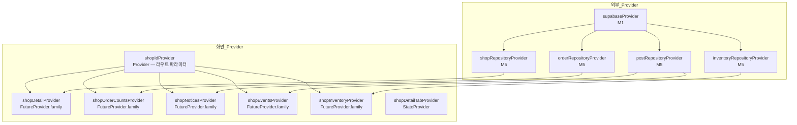

# 샵 상세 — 상태 설계

> 화면 ID: `customer-shop-detail`
> 참조: `docs/ui-specs/shop-detail.md`, `docs/common-modules.md`

---

## 상태 데이터 (State)

| 이름 | 타입 | 초기값 | 설명 |
|------|------|--------|------|
| `shopDetail` | `AsyncValue<Shop>` | `AsyncLoading` | 샵 상세 정보 (이름, 주소, 연락처, 소개글, 좌표) |
| `orderCounts` | `AsyncValue<OrderCounts>` | `AsyncLoading` | 접수/작업중 건수 (`receivedCount`, `inProgressCount`) |
| `selectedTabIndex` | `int` | `0` | 현재 선택된 카테고리 탭 (0: 공지사항, 1: 이벤트, 2: 가게재고) |
| `notices` | `AsyncValue<List<Post>>` | `AsyncLoading` | 공지사항 목록 |
| `events` | `AsyncValue<List<Post>>` | `AsyncLoading` | 이벤트 목록 |
| `inventoryItems` | `AsyncValue<List<InventoryItem>>` | `AsyncLoading` | 재고 목록 |

> `OrderCounts`는 `{receivedCount: int, inProgressCount: int}`를 담는 화면 전용 모델이다.

---

## 비-상태 데이터 (Non-State)

| 이름 | 출처 | 설명 |
|------|------|------|
| `shopId` | 라우트 파라미터 (`go_router`) | 조회 대상 샵 ID |
| `shopRepository` | `M5 ShopRepository` Provider | 샵 상세 조회 |
| `orderRepository` | `M5 OrderRepository` Provider | 샵별 활성 작업 건수 조회 |
| `postRepository` | `M5 PostRepository` Provider | 공지사항/이벤트 목록 조회 |
| `inventoryRepository` | `M5 InventoryRepository` Provider | 재고 목록 조회 |
| `router` | `M2 routerProvider` | 화면 이동 (게시글 상세, 게시글 목록) |
| `Formatters.phone` | `M11` | 전화번호 표시 포맷 |

---

## 상태 변화 조건표

| 트리거 | 상태 변화 | UI 변화 |
|--------|-----------|---------|
| 화면 진입 | `shopDetail` → `AsyncLoading` → 조회 결과, `orderCounts` → `AsyncLoading` → 집계 결과 | 스켈레톤 shimmer → 샵 정보 표시 |
| 화면 진입 (탭 데이터) | `notices`, `events`, `inventoryItems` → 각각 조회 | 탭별 콘텐츠 준비 완료 |
| 탭 전환 | `selectedTabIndex` → 0/1/2 | 탭 인디케이터 이동, 하단 콘텐츠 교체 |
| 길찾기 버튼 탭 | (외부 앱 호출) | 네이버 지도 앱 실행 / 웹 폴백 |
| 연락처 탭 | (외부 앱 호출) | 전화 앱 실행 |
| 지도 미리보기 탭 | (외부 앱 호출) | 네이버 지도 앱에서 해당 위치 표시 |
| 공지사항/이벤트 카드 탭 | (네비게이션) | 게시글 상세 화면으로 이동 (`post_id` 전달) |
| 에러 발생 | `shopDetail` → `AsyncError` | 에러 아이콘 + 메시지 + [다시 시도] 버튼 |
| 재시도 버튼 탭 | 전체 상태 → `AsyncLoading` → 재조회 | 로딩 상태 → 정상 또는 에러 |

---

## Provider 구조

---

## 노출 인터페이스

### 읽기 (State)

| Provider | 타입 | 설명 |
|----------|------|------|
| `shopDetailProvider(shopId)` | `FutureProvider.family<Shop, String>` | 샵 상세 정보 |
| `shopOrderCountsProvider(shopId)` | `FutureProvider.family<OrderCounts, String>` | 접수/작업중 건수 |
| `shopNoticesProvider(shopId)` | `FutureProvider.family<List<Post>, String>` | 공지사항 목록 |
| `shopEventsProvider(shopId)` | `FutureProvider.family<List<Post>, String>` | 이벤트 목록 |
| `shopInventoryProvider(shopId)` | `FutureProvider.family<List<InventoryItem>, String>` | 재고 목록 |
| `shopDetailTabProvider` | `StateProvider<int>` | 선택된 탭 인덱스 |

### 쓰기 (Actions)

| 액션 | Provider | 메서드/동작 | 설명 |
|------|----------|-------------|------|
| 탭 전환 | `shopDetailTabProvider` | `state = tabIndex` | 카테고리 탭 인덱스 변경 |
| 데이터 재조회 | 각 `FutureProvider` | `ref.invalidate(provider)` | 에러 시 재시도 |
