# 샵 QR코드 — 상태 설계

> 화면 ID: `owner-shop-qr`
> UI 스펙: `docs/ui-specs/shop-qr.md`

---

## 상태 데이터 (State)

| 이름 | 타입 | 초기값 | 설명 |
|------|------|--------|------|
| `shopInfo` | `AsyncValue<Shop>` | `AsyncLoading` | 현재 사장님의 샵 정보 (id, name). QR코드 생성 및 샵 이름 표시에 사용 |
| `isSaving` | `bool` | `false` | 인쇄용 QR코드 이미지 저장 중 여부 |
| `isSharing` | `bool` | `false` | QR코드 공유 시트 호출 중 여부 |

---

## 비-상태 데이터 (Non-State)

| 이름 | 출처 | 설명 |
|------|------|------|
| `qrData` | `shopInfo`에서 파생 | QR코드에 인코딩할 딥링크 URL. `https://gutalarm.app/shop/{shopId}` |
| `shopName` | `shopInfo`에서 파생 | QR코드 아래에 표시할 샵 이름 |
| `supabaseClient` | `supabaseProvider` (M1) | Supabase 클라이언트 인스턴스 |

---

## 상태 변화 조건표

| 트리거 | 상태 변화 | UI 변화 |
|--------|-----------|---------|
| 화면 최초 진입 | `shopInfo = AsyncLoading` → 샵 정보 로드 → `shopInfo = AsyncData(shop)` | 중앙 로딩 인디케이터 → QR코드 + 샵 이름 + 안내 문구 + 버튼 표시 |
| 샵 정보 로드 실패 | `shopInfo = AsyncError(e)` | 에러 아이콘 + "데이터를 불러올 수 없습니다" + 재시도 버튼 |
| "공유" 버튼 탭 | `isSharing = true` → QR 이미지 PNG 생성 → 시스템 공유 시트 표시 → `isSharing = false` | 버튼 로딩 → 시스템 공유 시트 (카카오톡, 메시지, 이메일 등) |
| "인쇄용 다운로드" 버튼 탭 | `isSaving = true` → 고해상도 QR 이미지 생성 → 갤러리 저장 → `isSaving = false` | 버튼 로딩 → "QR코드가 저장되었습니다" 스낵바 |
| 인쇄용 다운로드 실패 | `isSaving = false` | "저장에 실패했습니다" 에러 스낵바 |
| 재시도 버튼 탭 | `shopInfo = AsyncLoading` → 재조회 | 로딩 인디케이터 → 정상 화면 |

---

## Provider 구조

```mermaid
flowchart TD
    subgraph 공통 모듈
        SP[supabaseProvider<br/>M1]
        AUTH[currentUserProvider<br/>M3]
        SHOP_REPO[shopByOwnerProvider<br/>M5 ShopRepository]
    end

    subgraph 샵 QR Provider
        QR[shopQrProvider<br/>NotifierProvider]
        QR_DATA[qrDataProvider<br/>Provider &#40;파생&#41;]
    end

    SP --> SHOP_REPO
    AUTH --> SHOP_REPO
    SHOP_REPO --> QR
    QR --> QR_DATA

    subgraph Widget
        QR_SCREEN[ShopQrScreen]
    end

    QR -->|shopInfo, isSaving, isSharing| QR_SCREEN
    QR_DATA -->|String: 딥링크 URL| QR_SCREEN
```

### Provider 상세

| Provider | 타입 | 역할 |
|----------|------|------|
| `shopQrProvider` | `NotifierProvider<ShopQrNotifier, ShopQrState>` | 샵 QR코드 화면 상태 관리. 샵 정보 조회, 공유/다운로드 액션 처리 |
| `qrDataProvider` | `Provider<String>` | `shopQrProvider`의 shopInfo에서 파생. QR코드에 인코딩할 딥링크 URL 문자열 반환 |

> 이 화면은 표시 전용이므로 Realtime 구독이 필요하지 않다. 샵 정보는 `shopByOwnerProvider` 캐시를 활용하여 빠르게 로드한다.

---

## 노출 인터페이스

### 읽기 (State)

| 항목 | 타입 | 설명 |
|------|------|------|
| `state.shopInfo` | `AsyncValue<Shop>` | 샵 정보 (loading / data / error) |
| `state.isSaving` | `bool` | 인쇄용 다운로드 중 여부 |
| `state.isSharing` | `bool` | 공유 중 여부 |
| `qrData` | `String` (파생) | QR코드 딥링크 URL (`https://gutalarm.app/shop/{shopId}`) |

### 쓰기 (Actions)

| 메서드 | 파라미터 | 설명 |
|--------|----------|------|
| `shareQr()` | 없음 | QR코드를 PNG 이미지로 생성하여 시스템 공유 시트 호출. 공유 텍스트: "거트알림 앱으로 QR을 스캔하면 회원 등록이 됩니다" |
| `downloadPrintableQr()` | 없음 | 고해상도(1024x1024px) QR코드 이미지를 갤러리에 저장. 하단에 샵 이름 + "거트알림 앱으로 스캔하세요" 포함 |
| `retry()` | 없음 | 에러 상태에서 재시도. 샵 정보 재조회 |

---

## 참조하는 공통 모듈

| 모듈 | 용도 |
|------|------|
| M1 (supabaseProvider) | Supabase 클라이언트 |
| M3 (currentUserProvider) | 현재 사용자 정보 → shopId 조회 |
| M4 (Shop) | 샵 모델 |
| M5 (ShopRepository) | 샵 정보 조회 |
| M6 (AppException, ErrorHandler) | 에러 처리 |
| M9 (AppToast, ErrorView) | 저장 완료/에러 토스트, 에러 화면 |
