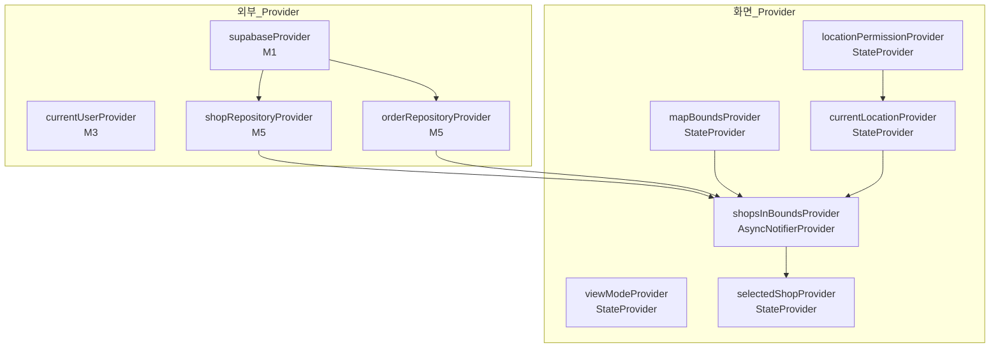

# 주변 샵 검색 — 상태 설계

> 화면 ID: `customer-shop-search`
> 참조: `docs/ui-specs/shop-search.md`, `docs/common-modules.md`

---

## 상태 데이터 (State)

| 이름 | 타입 | 초기값 | 설명 |
|------|------|--------|------|
| `viewMode` | `ShopSearchViewMode` (enum: map / list) | `map` | 현재 뷰 모드 (지도 / 리스트) |
| `locationPermissionStatus` | `LocationPermissionStatus` (enum: unknown / granted / denied / permanentlyDenied) | `unknown` | 위치 권한 상태 |
| `currentLocation` | `LatLng?` | `null` | 현재 GPS 위치 (위도/경도) |
| `mapBounds` | `LatLngBounds?` | `null` | 현재 지도 화면 영역 (남서/북동 좌표) |
| `shops` | `AsyncValue<List<ShopWithOrderCount>>` | `AsyncLoading` | 조회된 샵 목록 + 각 샵별 접수/작업중 건수 |
| `selectedShop` | `ShopWithOrderCount?` | `null` | 지도 뷰에서 선택된 샵 (하단 시트 표시용) |

> `ShopWithOrderCount`는 `Shop` 모델에 `receivedCount`, `inProgressCount`를 추가한 화면 전용 모델이다.

---

## 비-상태 데이터 (Non-State)

| 이름 | 출처 | 설명 |
|------|------|------|
| `shopRepository` | `M5 ShopRepository` Provider | 샵 목록 조회 (위도/경도 범위 기반) |
| `orderRepository` | `M5 OrderRepository` Provider | 샵별 활성 작업 건수 집계 |
| `currentUser` | `M3 currentUserProvider` | 현재 인증된 사용자 정보 |
| `router` | `M2 routerProvider` | 화면 이동 (샵 상세) |
| `distanceCalculator` | 클라이언트 로직 | 현재 위치와 샵 간 직선 거리 계산 |

---

## 상태 변화 조건표

| 트리거 | 상태 변화 | UI 변화 |
|--------|-----------|---------|
| 화면 진입 | `locationPermissionStatus` → 권한 확인 결과 | 권한 허용 시 지도 로드, 거부 시 권한 안내 화면 |
| 위치 권한 허용 | `currentLocation` → GPS 좌표, `mapBounds` → 초기 영역 | 현재 위치 중심 지도 + 주변 샵 마커 표시 |
| 위치 권한 거부 | `locationPermissionStatus` → `denied` / `permanentlyDenied` | 위치 권한 안내 화면 (설정 이동 버튼) |
| 지도 영역 변경 (debounce 500ms) | `mapBounds` → 새 영역, `shops` → `AsyncLoading` → 결과 | 새 영역 내 샵 마커 갱신 |
| 뷰 모드 토글 | `viewMode` → `map` ↔ `list` | 지도 뷰 ↔ 리스트 뷰 전환 (200ms 애니메이션) |
| 마커 탭 | `selectedShop` → 해당 샵 | 하단 시트 슬라이드 업, 마커 강조 |
| 지도 빈 영역 탭 | `selectedShop` → `null` | 하단 시트 닫힘, 마커 선택 해제 |
| 현재 위치 버튼 탭 | `currentLocation` → 재획득, `mapBounds` → 현재 위치 중심 | 지도 카메라 현재 위치 이동, 주변 샵 재검색 |
| 샵 카드 탭 | (네비게이션) | 샵 상세 화면으로 이동 (`shop_id` 전달) |
| 샵 목록 조회 실패 | `shops` → `AsyncError` | 에러 스낵바 표시, 기존 마커/리스트 유지 |

---

## Provider 구조

---

## 노출 인터페이스

### 읽기 (State)

| Provider | 타입 | 설명 |
|----------|------|------|
| `viewModeProvider` | `StateProvider<ShopSearchViewMode>` | 현재 뷰 모드 |
| `locationPermissionProvider` | `StateProvider<LocationPermissionStatus>` | 위치 권한 상태 |
| `currentLocationProvider` | `StateProvider<LatLng?>` | 현재 GPS 좌표 |
| `mapBoundsProvider` | `StateProvider<LatLngBounds?>` | 현재 지도 화면 영역 |
| `shopsInBoundsProvider` | `AsyncNotifierProvider<ShopsInBoundsNotifier, List<ShopWithOrderCount>>` | 영역 내 샵 목록 (건수 포함) |
| `selectedShopProvider` | `StateProvider<ShopWithOrderCount?>` | 선택된 샵 |

### 쓰기 (Actions)

| 액션 | Provider | 메서드/동작 | 설명 |
|------|----------|-------------|------|
| 위치 권한 요청 | `locationPermissionProvider` | `requestPermission()` | 위치 권한 요청 및 상태 갱신 |
| 현재 위치 갱신 | `currentLocationProvider` | `refreshLocation()` | GPS 위치 재획득 |
| 뷰 모드 전환 | `viewModeProvider` | `state = newMode` | 지도 ↔ 리스트 전환 |
| 지도 영역 변경 | `mapBoundsProvider` | `state = newBounds` | 지도 이동/줌 시 영역 갱신 (debounce 500ms) |
| 마커 선택 | `selectedShopProvider` | `state = shop` | 마커 탭 시 샵 선택 |
| 마커 선택 해제 | `selectedShopProvider` | `state = null` | 빈 영역 탭 시 선택 해제 |
| 샵 목록 재조회 | `shopsInBoundsProvider` | `ref.invalidate()` | 영역 변경 시 자동 재조회 |
