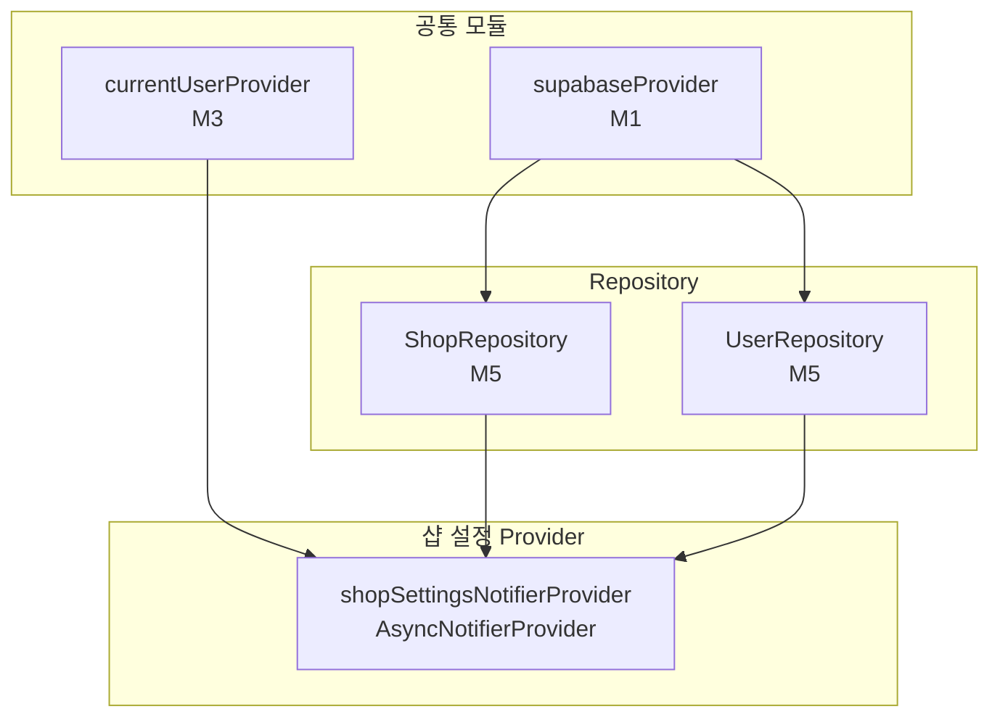

# 샵 설정 — 상태 설계

> 화면 ID: `owner-shop-settings`
> UI 스펙: `docs/ui-specs/shop-settings.md`
> 유스케이스: `docs/usecases/2-shop-register/spec.md`

---

## 상태 데이터 (State)

| 이름 | 타입 | 초기값 | 설명 |
|------|------|--------|------|
| `shopName` | `String` | `""` | 샵 이름 (1~30자) |
| `shopAddress` | `String` | `""` | 샵 주소 (읽기 전용, 주소 검색으로만 입력) |
| `shopLatitude` | `double?` | `null` | 위도 (주소 검색 시 자동 설정) |
| `shopLongitude` | `double?` | `null` | 경도 (주소 검색 시 자동 설정) |
| `shopPhone` | `String` | `""` | 샵 연락처 |
| `shopDescription` | `String` | `""` | 샵 소개글 (0~200자, 선택) |
| `ownerName` | `String` | `""` | 사장님 이름 (1~20자) |
| `ownerPhone` | `String` | `""` | 사장님 연락처 |
| `isLoading` | `bool` | `true` | 초기 데이터 로딩 중 여부 |
| `isSaving` | `bool` | `false` | 저장 API 호출 중 여부 |
| `hasChanges` | `bool` | `false` | 원래 값 대비 변경사항 존재 여부 |
| `error` | `AppException?` | `null` | 에러 발생 시 에러 객체 |
| `shopNameError` | `String?` | `null` | 샵 이름 유효성 에러 메시지 |
| `shopPhoneError` | `String?` | `null` | 샵 연락처 유효성 에러 메시지 |
| `shopAddressError` | `String?` | `null` | 주소 미입력 에러 메시지 |
| `ownerNameError` | `String?` | `null` | 사장님 이름 유효성 에러 메시지 |
| `ownerPhoneError` | `String?` | `null` | 사장님 연락처 유효성 에러 메시지 |

---

## 비-상태 데이터 (Non-State)

| 이름 | 출처 | 설명 |
|------|------|------|
| `userId` | `currentUserProvider` (M3) | 현재 사용자 ID. shops/users 테이블 조회 및 수정에 사용 |
| `originalShop` | 최초 조회 결과 캐싱 | 원래 샵 정보. `hasChanges` 계산 시 비교 기준 |
| `originalOwner` | 최초 조회 결과 캐싱 | 원래 사장님 정보. `hasChanges` 계산 시 비교 기준 |
| `supabaseClient` | `supabaseProvider` (M1) | Supabase 클라이언트 인스턴스 |
| `shopRepository` | `shopRepositoryProvider` (M5) | 샵 CRUD 리포지토리 |
| `userRepository` | `userRepositoryProvider` (M5) | 사용자 CRUD 리포지토리 |

---

## 상태 변화 조건표

| 트리거 | 상태 변화 | UI 변화 |
|--------|-----------|---------|
| 화면 진입 | `isLoading = true` → shops + users 동시 조회 → `isLoading = false`, 모든 필드에 기존 값 세팅, `originalShop` / `originalOwner` 캐싱 | 스켈레톤 shimmer → 입력 필드에 기존 값 채워짐, 저장 버튼 비활성 (`#CBD5E1`) |
| 데이터 로드 실패 | `error = AppException(...)`, `isLoading = false` | ErrorView 위젯 표시 ("설정을 불러올 수 없습니다" + 재시도 버튼) |
| 샵 이름 수정 | `shopName = 입력값`, `shopNameError = null`, `hasChanges` 재계산 | 저장 버튼 활성/비활성 갱신 |
| 주소 검색 완료 | `shopAddress = 선택된 주소`, `shopLatitude = 위도`, `shopLongitude = 경도`, `shopAddressError = null`, `hasChanges` 재계산 | 주소 필드에 텍스트 표시, 지도 미리보기에 마커 표시 |
| 샵 연락처 수정 | `shopPhone = 입력값`, `shopPhoneError = null`, `hasChanges` 재계산 | 저장 버튼 활성/비활성 갱신 |
| 소개글 수정 | `shopDescription = 입력값`, `hasChanges` 재계산 | 저장 버튼 활성/비활성 갱신 |
| 사장님 이름 수정 | `ownerName = 입력값`, `ownerNameError = null`, `hasChanges` 재계산 | 저장 버튼 활성/비활성 갱신 |
| 사장님 연락처 수정 | `ownerPhone = 입력값`, `ownerPhoneError = null`, `hasChanges` 재계산 | 저장 버튼 활성/비활성 갱신 |
| 저장 버튼 탭 (검증 성공) | `isSaving = true` → shops UPDATE + users UPDATE 병렬 호출 → `isSaving = false`, `hasChanges = false`, `originalShop` / `originalOwner` 갱신 | 저장 버튼에 로딩 인디케이터, 입력 필드 비활성화 |
| 저장 성공 | `isSaving = false`, `hasChanges = false` | "설정이 저장되었습니다" 스낵바 표시, 저장 버튼 비활성 (`#CBD5E1`) |
| 저장 실패 | `isSaving = false`, `error = AppException(...)` | 에러 스낵바 표시, 저장 버튼 재활성화 |
| 저장 버튼 탭 (검증 실패) | 에러 필드별 `shopNameError` / `shopPhoneError` / `shopAddressError` / `ownerNameError` / `ownerPhoneError` 갱신 | 해당 필드 에러 테두리 (`#EF4444`) + 에러 메시지 표시 |
| 뒤로가기 (변경사항 있음) | 상태 변화 없음 | "저장하지 않은 변경사항이 있습니다. 저장하시겠습니까?" 확인 다이얼로그 표시 |
| 뒤로가기 (변경사항 없음) | 상태 변화 없음 | 이전 화면으로 즉시 복귀 |
| 하단 탭 전환 (변경사항 있음) | 상태 변화 없음 | 확인 다이얼로그 표시 후 사용자 선택에 따라 저장 또는 이탈 |
| 재시도 버튼 탭 | `isLoading = true`, `error = null` → 재조회 | 스켈레톤 shimmer → 입력 필드 또는 에러 |

---

## Provider 구조

### Provider 상세

| Provider | 타입 | 역할 |
|----------|------|------|
| `shopSettingsNotifierProvider` | `AsyncNotifierProvider<ShopSettingsNotifier, ShopSettingsState>` | 샵 설정 전체 상태 관리. 초기 데이터 로드, 필드 갱신, 변경 감지, 유효성 검증, 저장 (shops + users 병렬 UPDATE) |

---

## 노출 인터페이스

### 읽기 (State)

| 항목 | 타입 | 설명 |
|------|------|------|
| `state.shopName` | `String` | 샵 이름 |
| `state.shopAddress` | `String` | 샵 주소 |
| `state.shopLatitude` | `double?` | 위도 |
| `state.shopLongitude` | `double?` | 경도 |
| `state.shopPhone` | `String` | 샵 연락처 |
| `state.shopDescription` | `String` | 샵 소개글 |
| `state.ownerName` | `String` | 사장님 이름 |
| `state.ownerPhone` | `String` | 사장님 연락처 |
| `state.isLoading` | `bool` | 초기 로딩 중 여부 |
| `state.isSaving` | `bool` | 저장 중 여부 |
| `state.hasChanges` | `bool` | 변경사항 존재 여부 (저장 버튼 활성화 조건) |
| `state.error` | `AppException?` | 에러 객체 |
| `state.shopNameError` | `String?` | 샵 이름 에러 메시지 |
| `state.shopPhoneError` | `String?` | 샵 연락처 에러 메시지 |
| `state.shopAddressError` | `String?` | 주소 에러 메시지 |
| `state.ownerNameError` | `String?` | 사장님 이름 에러 메시지 |
| `state.ownerPhoneError` | `String?` | 사장님 연락처 에러 메시지 |
| `state.hasCoordinates` | `bool` (computed) | 좌표 존재 여부 (지도 미리보기 표시 조건) |

### 쓰기 (Actions)

| 메서드 | 파라미터 | 설명 |
|--------|----------|------|
| `setShopName(name)` | `String name` | 샵 이름 갱신 + 변경 감지 |
| `setShopAddress(address, lat, lng)` | `String address`, `double lat`, `double lng` | 주소 검색 결과 반영 (주소 텍스트 + 좌표 동시 설정) |
| `setShopPhone(phone)` | `String phone` | 샵 연락처 갱신 + 변경 감지 |
| `setShopDescription(description)` | `String description` | 소개글 갱신 + 변경 감지 |
| `setOwnerName(name)` | `String name` | 사장님 이름 갱신 + 변경 감지 |
| `setOwnerPhone(phone)` | `String phone` | 사장님 연락처 갱신 + 변경 감지 |
| `save()` | 없음 | 유효성 검증 → shops UPDATE + users UPDATE 병렬 호출. 성공 시 스낵바 표시 + 원본 데이터 갱신 |
| `retry()` | 없음 | 초기 데이터 재조회 (에러 상태에서 재시도) |

---

## 참조하는 공통 모듈

| 모듈 | 용도 |
|------|------|
| M1 (supabaseProvider) | Supabase 클라이언트 |
| M3 (currentUserProvider) | 현재 사용자 정보 → userId 조회 |
| M4 (Shop, User) | 샵/사용자 모델 |
| M5 (ShopRepository, UserRepository) | 샵/사용자 조회 및 수정 |
| M6 (AppException, ErrorHandler) | 에러 처리 |
| M9 (SkeletonShimmer, ErrorView, ConfirmDialog, AppToast, PhoneInputField) | 스켈레톤 로딩, 에러 화면, 확인 다이얼로그, 토스트, 전화번호 입력 |
| M10 (Validators.shopName, Validators.phone, Validators.name, Validators.description) | 샵 이름/연락처/사장님 이름/소개글 유효성 검증 |
