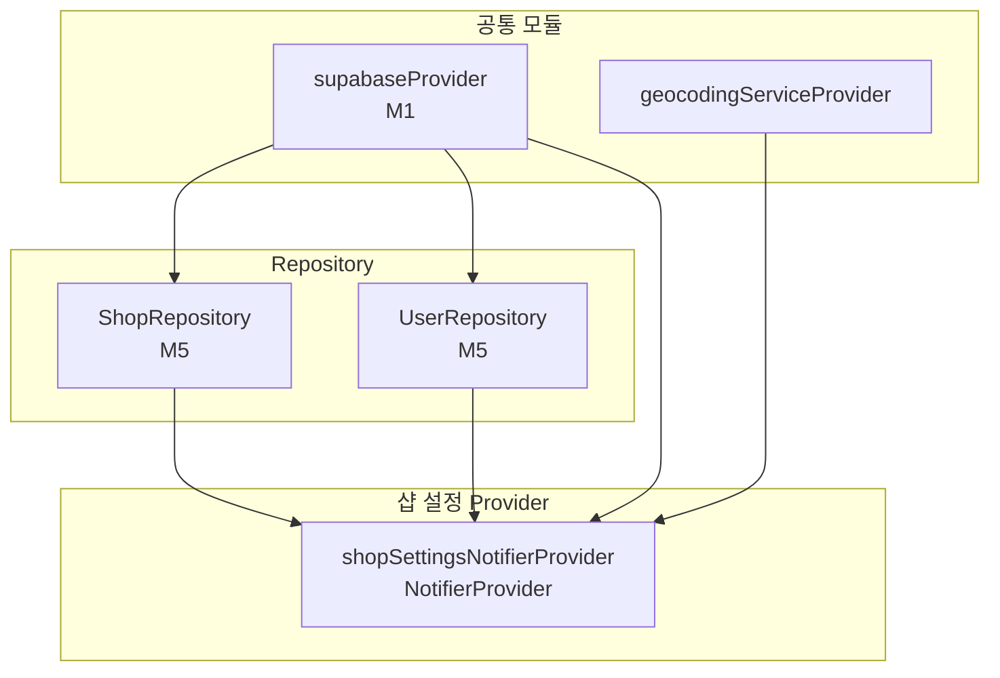

# 샵 설정 — 상태 설계

> 화면 ID: `owner-shop-settings`
> UI 스펙: `docs/ui-specs/shop-settings.md`
> 유스케이스: `docs/usecases/9-profile-edit/spec.md` (3.2 사장님 샵 정보 + 개인정보 수정)

---

## 상태 데이터 (State)

| 이름 | 타입 | 초기값 | 설명 |
|------|------|--------|------|
| `shop` | `Shop?` | `null` | 샵 정보 전체 (Shop 모델 객체, name/address/latitude/longitude/phone/description 포함) |
| `ownerName` | `String` | `""` | 사장님 이름 |
| `ownerPhone` | `String` | `""` | 사장님 연락처 |
| `isLoading` | `bool` | `false` | 초기 데이터 로딩 중 여부 |
| `isSubmitting` | `bool` | `false` | 저장 API 호출 중 여부 |
| `errorMessage` | `String?` | `null` | 에러 발생 시 사용자 메시지 |

---

## 비-상태 데이터 (Non-State)

| 이름 | 출처 | 설명 |
|------|------|------|
| `userId` | `supabaseProvider.auth.currentUser?.id` (M1) | 현재 사용자 ID. shops/users 테이블 조회 및 수정에 사용 |
| `supabaseClient` | `supabaseProvider` (M1) | Supabase 클라이언트 인스턴스 |
| `shopRepository` | `shopRepositoryProvider` (M5) | 샵 CRUD 리포지토리 |
| `userRepository` | `userRepositoryProvider` (M5) | 사용자 CRUD 리포지토리 |
| `geocodingService` | `geocodingServiceProvider` | 주소 → 좌표 변환 서비스 |

---

## 상태 변화 조건표

| 트리거 | 상태 변화 | UI 변화 |
|--------|-----------|---------|
| 화면 진입 (`build`) | `isLoading = true` → shops + users 동시 조회 → `shop = Shop(...)`, `ownerName`, `ownerPhone` 세팅, `isLoading = false` | 로딩 인디케이터 → 입력 필드에 기존 값 채워짐, 지도에 기존 좌표 마커 표시 |
| 데이터 로드 실패 | `errorMessage = '샵 정보를 불러올 수 없습니다'`, `isLoading = false` | 에러 토스트 표시 |
| 로그인 안 됨 | `errorMessage = '로그인이 필요합니다'`, `isLoading = false` | 에러 토스트 표시 |
| 샵 이름 수정 | `shop = shop.copyWith(name: 입력값)` | 입력 필드 갱신 |
| 주소 검색 완료 | `shop = shop.copyWith(address: 주소)` → geocoding → `shop = shop.copyWith(latitude: lat, longitude: lng)` | 주소 필드 텍스트 갱신, 지도 미리보기에 마커 표시 |
| 샵 연락처 수정 | `shop = shop.copyWith(phone: 입력값)` | 입력 필드 갱신 |
| 소개글 수정 | `shop = shop.copyWith(description: 입력값)` | 입력 필드 갱신 |
| 사장님 이름 수정 | `ownerName = 입력값` | 입력 필드 갱신 |
| 사장님 연락처 수정 | `ownerPhone = 입력값` | 입력 필드 갱신 |
| 저장 버튼 탭 | `isSubmitting = true` → shops UPDATE (name, address, latitude, longitude, phone, description) + users UPDATE (name, phone) 병렬 호출 → `isSubmitting = false`, `shop`/`ownerName`/`ownerPhone` 갱신 | 저장 버튼에 로딩 인디케이터 |
| 저장 성공 | `isSubmitting = false` | "샵 설정이 저장되었습니다" 토스트 표시, 이전 화면으로 복귀 |
| 저장 실패 | `isSubmitting = false`, `errorMessage = '샵 설정 저장에 실패했습니다'` | 에러 토스트 표시 |

---

## Provider 구조

### Provider 상세

| Provider | 타입 | 역할 |
|----------|------|------|
| `shopSettingsNotifierProvider` | `NotifierProvider<ShopSettingsNotifier, ShopSettingsState>` | 샵 설정 전체 상태 관리. 초기 데이터 로드, 필드 갱신, 주소 검색/geocoding, 저장 (shops + users 병렬 UPDATE) |

---

## 노출 인터페이스

### 읽기 (State)

| 항목 | 타입 | 설명 |
|------|------|------|
| `state.shop` | `Shop?` | 샵 정보 전체 (null이면 미로드) |
| `state.shop?.name` | `String` | 샵 이름 |
| `state.shop?.address` | `String` | 샵 주소 |
| `state.shop?.latitude` | `double` | 위도 |
| `state.shop?.longitude` | `double` | 경도 |
| `state.shop?.phone` | `String` | 샵 연락처 |
| `state.shop?.description` | `String?` | 샵 소개글 |
| `state.ownerName` | `String` | 사장님 이름 |
| `state.ownerPhone` | `String` | 사장님 연락처 |
| `state.isLoading` | `bool` | 초기 로딩 중 여부 |
| `state.isSubmitting` | `bool` | 저장 중 여부 |
| `state.errorMessage` | `String?` | 에러 메시지 |

### 쓰기 (Actions)

| 메서드 | 파라미터 | 설명 |
|--------|----------|------|
| `loadShop()` | 없음 | 초기 데이터 로드 (build에서 자동 호출) |
| `updateShopName(name)` | `String name` | 샵 이름 갱신 |
| `updateAddress(address)` | `String address` | 주소 직접 갱신 |
| `searchAddress(context)` | `BuildContext context` | 주소 검색 바텀시트 열기 → 선택 시 주소 + geocoding 좌표 자동 반영 |
| `updatePhone(phone)` | `String phone` | 샵 연락처 갱신 |
| `updateDescription(description)` | `String description` | 소개글 갱신 |
| `updateOwnerName(name)` | `String name` | 사장님 이름 갱신 |
| `updateOwnerPhone(phone)` | `String phone` | 사장님 연락처 갱신 |
| `submit()` | 없음 | 유효성 검증 → shops UPDATE + users UPDATE 병렬 호출. 성공 시 `true` 반환 |

---

## 참조하는 공통 모듈

| 모듈 | 용도 |
|------|------|
| M1 (supabaseProvider) | Supabase 클라이언트, 현재 사용자 ID 조회 |
| M4 (Shop, User) | 샵/사용자 모델 |
| M5 (ShopRepository, UserRepository) | 샵/사용자 조회 및 수정 |
| M6 (AppException, ErrorHandler) | 에러 처리 |
| M9 (LoadingIndicator, AppToast, PhoneInputField, MapPreview) | 로딩, 토스트, 전화번호 입력, 지도 미리보기 |
| M10 (Validators.shopName, Validators.phone, Validators.description) | 샵 이름/연락처/소개글 유효성 검증 |
| AddressSearchService | 카카오 주소 검색 바텀시트 |
| GeocodingService | 주소 → 좌표 변환 |
