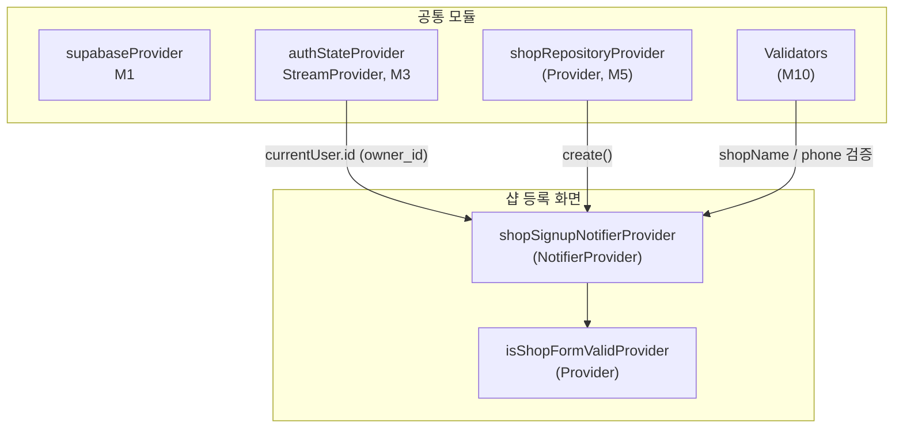

# 샵 등록 (사장님 가입 2단계) — 상태 설계

> 화면 ID: `owner-shop-signup`
> UI 스펙: `docs/ui-specs/shop-signup.md`
> 유스케이스: UC-2 샵 등록

---

## 상태 데이터 (State)

| 이름 | 타입 | 초기값 | 설명 |
|------|------|--------|------|
| `shopSignupState` | `ShopSignupState` | `ShopSignupState.initial()` | 샵 등록 화면의 전체 상태 |

### ShopSignupState (freezed)

| 필드 | 타입 | 초기값 | 설명 |
|------|------|--------|------|
| `shopName` | `String` | `""` | 샵 이름 입력값 |
| `address` | `String` | `""` | 주소 텍스트 (검색으로만 입력) |
| `latitude` | `double?` | `null` | 위도 (주소 검색 시 Geocoding으로 자동 설정) |
| `longitude` | `double?` | `null` | 경도 (주소 검색 시 Geocoding으로 자동 설정) |
| `phone` | `String` | `""` | 샵 연락처 입력값 (하이픈 포함 포맷) |
| `businessNumber` | `String` | `""` | 사업자등록번호 입력값 (선택, 하이픈 포함 포맷) |
| `description` | `String` | `""` | 샵 소개글 입력값 (선택, 최대 200자) |
| `isResubmitMode` | `bool` | `false` | 재신청 모드 여부 (거절된 샵이 있을 때 true) |
| `rejectReason` | `String?` | `null` | 이전 거절 사유 (재신청 모드에서 표시용) |
| `existingShopId` | `String?` | `null` | 기존 샵 ID (재신청 모드에서 UPDATE용) |
| `status` | `ShopSignupStatus` | `idle` | 현재 제출 상태 |
| `shopNameError` | `String?` | `null` | 샵 이름 필드 유효성 에러 메시지 |
| `addressError` | `String?` | `null` | 주소 필드 유효성 에러 메시지 |
| `phoneError` | `String?` | `null` | 연락처 필드 유효성 에러 메시지 |
| `businessNumberError` | `String?` | `null` | 사업자등록번호 필드 유효성 에러 메시지 |

### ShopSignupStatus (Enum)

| 값 | 설명 |
|----|------|
| `idle` | 기본 상태 (입력 대기) |
| `submitting` | shops 테이블 INSERT API 호출 중 |
| `error` | API 호출 실패 |

---

## 비-상태 데이터 (Non-State)

| 이름 | 출처 | 설명 |
|------|------|------|
| `authState` | `authStateProvider` (M3) | 현재 인증된 사용자. `auth.currentUser.id`를 shops.owner_id로 사용 |
| `shopRepository` | `shopRepositoryProvider` (M5) | shops 테이블 CRUD. `create()` 호출 |
| `validators` | `Validators` (M10) | 샵 이름/연락처/소개글 유효성 검증 함수 |

---

## 상태 변화 조건표

| 트리거 | 상태 변화 | UI 변화 |
|--------|----------|---------|
| 화면 진입 (신규) | `idle`, 모든 필드 빈 값 | 빈 폼 표시, 지도 미리보기에 안내 텍스트, 등록 버튼 비활성, 스텝 인디케이터 2/2 표시 |
| 화면 진입 (재신청) | `idle`, `isResubmitMode` = true, 기존 샵 데이터로 프리필 | 거절 사유 배너 + 프리필된 폼 표시, "재신청" 버튼 |
| 샵 이름 입력 | `shopName` 갱신 | 실시간 텍스트 반영 |
| 샵 이름 포커스 해제 | `shopNameError` = `Validators.shopName(value)` 결과 | 에러 메시지 표시 또는 해제 |
| 주소 검색 버튼/필드 탭 | - | 주소 검색 바텀시트 표시 (카카오 주소 API 웹뷰) |
| 주소 선택 완료 | `address` = 선택 주소 텍스트, `latitude`/`longitude` = Geocoding 결과, `addressError` = null | 주소 필드에 텍스트 표시, 지도 미리보기에 마커 표시, 바텀시트 닫힘 |
| Geocoding 실패 | `address` = 선택 주소 텍스트, `latitude`/`longitude` = null | 에러 스낵바 "주소의 좌표를 확인할 수 없습니다. 다른 주소로 다시 검색해주세요", 등록 버튼 비활성 유지 |
| 연락처 입력 | `phone` 갱신 (자동 하이픈 포맷) | 포맷팅된 연락처 표시 |
| 연락처 포커스 해제 | `phoneError` = `Validators.phone(value)` 결과 | 에러 메시지 표시 또는 해제 |
| 사업자등록번호 입력 | `businessNumber` 갱신 (자동 하이픈 포맷 3-2-5) | 포맷팅된 사업자등록번호 표시 |
| 사업자등록번호 포커스 해제 | `businessNumberError` = 유효성 검증 결과 (입력한 경우만) | 에러 메시지 표시 또는 해제 |
| 소개글 입력 | `description` 갱신 | 실시간 텍스트 반영 + 글자 수 카운터 "N/200" 갱신 |
| 등록/재신청 버튼 탭 (유효) | `status` = `submitting` | 버튼에 스피너 표시, 모든 입력 비활성 |
| 등록/재신청 버튼 탭 (무효) | 각 필드 에러 갱신 | 첫 번째 에러 필드로 스크롤 + 에러 메시지 표시 |
| API 성공 (신규) | `status` = `idle` | 성공 토스트 "샵 등록 요청이 완료되었습니다" + 마이페이지로 이동 |
| API 성공 (재신청) | `status` = `idle` | 성공 토스트 "샵 등록 재신청이 완료되었습니다" + 마이페이지로 이동 |
| API 실패 (네트워크) | `status` = `error` | 에러 스낵바 "네트워크 연결을 확인해주세요" + 버튼 재활성화 |
| API 실패 (중복) | `status` = `error` | 에러 스낵바 "이미 등록된 샵이 있습니다" + 마이페이지로 이동 |
| API 실패 (기타) | `status` = `error` | 에러 스낵바 "등록에 실패했습니다. 다시 시도해주세요" + 버튼 재활성화 |

---

## Provider 구조

### Provider 상세

| Provider | 타입 | 역할 |
|----------|------|------|
| `shopSignupNotifierProvider` | `NotifierProvider<ShopSignupNotifier, ShopSignupState>` | 샵 등록 화면 전체 상태 관리. 폼 입력, 주소 검색 결과 반영, 유효성 검증, 등록 API 호출 |
| `isShopFormValidProvider` | `Provider<bool>` | 필수 필드(샵 이름 + 주소 + 좌표 + 연락처) 모두 유효한지 여부. 등록 버튼 활성/비활성 결정 |

---

## 노출 인터페이스

### 읽기 (State)

| Provider | 타입 | 설명 |
|----------|------|------|
| `shopSignupNotifierProvider` | `NotifierProvider<ShopSignupNotifier, ShopSignupState>` | 샵 등록 화면의 전체 상태 |
| `isShopFormValidProvider` | `Provider<bool>` | 샵 이름 + 주소(좌표 포함) + 연락처 모두 유효한지 여부 |

### 쓰기 (Actions)

| 메서드 | 파라미터 | 설명 |
|--------|---------|------|
| `updateShopName(String value)` | `String` | 샵 이름 입력값 갱신 |
| `validateShopName()` | - | 샵 이름 유효성 검증 (`Validators.shopName` 사용). 포커스 해제 시 호출 |
| `setAddress(String address, double lat, double lng)` | `String`, `double`, `double` | 주소 검색 결과 반영. 주소 텍스트 + Geocoding 좌표를 상태에 저장 |
| `setAddressWithoutCoords(String address)` | `String` | Geocoding 실패 시 주소 텍스트만 저장. 좌표는 null 유지 |
| `updatePhone(String value)` | `String` | 연락처 입력값 갱신 (자동 하이픈 포맷 적용) |
| `validatePhone()` | - | 연락처 유효성 검증 (`Validators.phone` 사용). 포커스 해제 시 호출 |
| `updateBusinessNumber(String value)` | `String` | 사업자등록번호 입력값 갱신 (자동 하이픈 포맷 적용) |
| `validateBusinessNumber()` | - | 사업자등록번호 유효성 검증 (입력한 경우 10자리 숫자). 포커스 해제 시 호출 |
| `updateDescription(String value)` | `String` | 소개글 입력값 갱신 (최대 200자) |
| `submit()` | - | 전체 유효성 검증 후 신규: shops INSERT (status='pending'), 재신청: shops UPDATE (status='pending'). 성공 시 마이페이지로 라우팅 |

---

## 참조하는 공통 모듈

| 모듈 | 용도 |
|------|------|
| M1 (supabaseProvider) | Supabase 클라이언트 |
| M3 (authStateProvider) | 현재 인증 사용자 정보 (owner_id 획득) |
| M4 (Shop) | 샵 데이터 모델 |
| M5 (ShopRepository) | shops 테이블 INSERT |
| M6 (AppException, ErrorHandler) | 에러 처리 및 사용자 메시지 매핑 (네트워크/중복/기타) |
| M9 (AppToast, PhoneInputField) | 성공/에러 토스트, 전화번호 입력 필드 |
| M10 (Validators.shopName, Validators.phone, Validators.description) | 샵 이름/연락처/소개글 유효성 검증 |
| M11 (Formatters.phone) | 연락처 하이픈 자동 포맷 |
