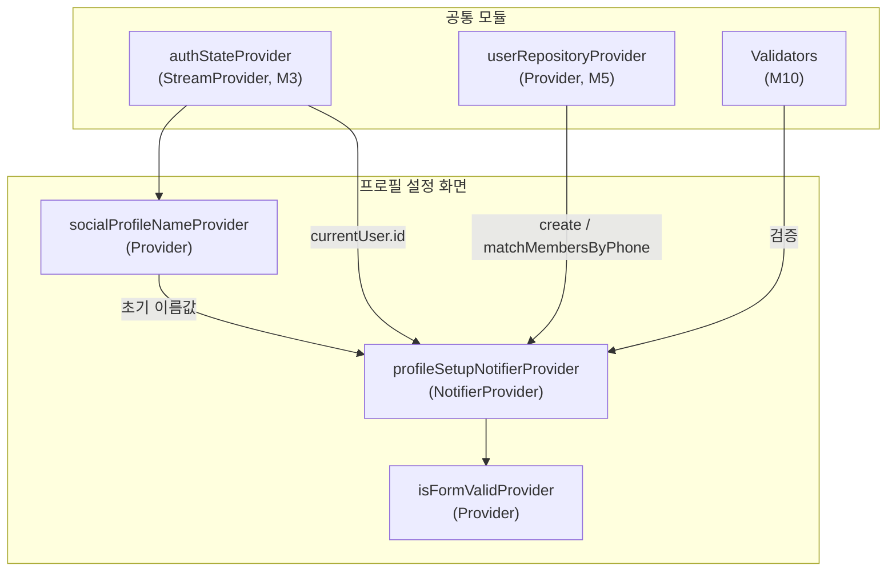

# 프로필 설정 (회원가입) — 상태 설계

> 화면 ID: `profile-setup`
> UI 스펙: `docs/ui-specs/signup.md`
> 유스케이스: UC-1 소셜 로그인 + 프로필 설정

---

## 상태 데이터 (State)

| 이름 | 타입 | 초기값 | 설명 |
|------|------|--------|------|
| `profileSetupState` | `ProfileSetupState` | `ProfileSetupState.initial()` | 프로필 설정 화면의 전체 상태 |

### ProfileSetupState (freezed)

| 필드 | 타입 | 초기값 | 설명 |
|------|------|--------|------|
| `selectedRole` | `UserRole?` | `null` | 선택된 역할 (customer / shopOwner) |
| `name` | `String` | 소셜 프로필 이름 | 이름 입력값 |
| `phone` | `String` | `""` | 연락처 입력값 (하이픈 포함 포맷) |
| `status` | `ProfileSetupStatus` | `idle` | 현재 제출 상태 |
| `nameError` | `String?` | `null` | 이름 필드 유효성 에러 메시지 |
| `phoneError` | `String?` | `null` | 연락처 필드 유효성 에러 메시지 |
| `roleError` | `String?` | `null` | 역할 미선택 에러 메시지 |

### ProfileSetupStatus (Enum)

| 값 | 설명 |
|----|------|
| `idle` | 기본 상태 (입력 대기) |
| `submitting` | users 테이블 INSERT + members 매칭 API 호출 중 |
| `error` | API 호출 실패 |

---

## 비-상태 데이터 (Non-State)

| 이름 | 출처 | 설명 |
|------|------|------|
| `authState` | `authStateProvider` (M3) | 현재 인증된 사용자 정보. `auth.currentUser.id`를 users 테이블 PK로 사용 |
| `socialProfileName` | Supabase Auth `currentUser.userMetadata` | 소셜 로그인 시 수신한 프로필 이름. 이름 필드 초기값으로 사용 |
| `userRepository` | `userRepositoryProvider` (M5) | users 테이블 CRUD. `create()`, `matchMembersByPhone()` 호출 |
| `validators` | `Validators` (M10) | 이름/연락처 유효성 검증 함수 |

---

## 상태 변화 조건표

| 트리거 | 상태 변화 | UI 변화 |
|--------|----------|---------|
| 화면 진입 | `idle`, name = 소셜 프로필 이름 | 역할 미선택, 이름 필드에 기본값, 연락처 빈 값, 버튼 비활성 |
| 고객 카드 탭 | `selectedRole` = `customer`, `roleError` = null | 고객 카드 강조 (그린 테두리 + 배경), 버튼 텍스트 "시작하기", 스텝 인디케이터 숨김 |
| 사장님 카드 탭 | `selectedRole` = `shopOwner`, `roleError` = null | 사장님 카드 강조, 버튼 텍스트 "다음", 스텝 인디케이터 표시 (1/2) |
| 이름 입력 | `name` 갱신 | 실시간 텍스트 반영 |
| 이름 포커스 해제 | `nameError` = `Validators.name(value)` 결과 | 에러 메시지 표시 또는 해제 |
| 연락처 입력 | `phone` 갱신 (자동 하이픈 포맷) | "010-1234-5678" 형식 자동 포맷 |
| 연락처 포커스 해제 | `phoneError` = `Validators.phone(value)` 결과 | 에러 메시지 표시 또는 해제 |
| 시작하기/다음 버튼 탭 (유효) | `status` = `submitting` | 버튼에 스피너 표시, 모든 입력 비활성 |
| 시작하기/다음 버튼 탭 (무효) | 각 필드 에러 갱신 | 첫 번째 에러 필드로 스크롤 + 에러 메시지 표시 |
| API 성공 (고객) | `status` = `idle` | 성공 토스트 "프로필 설정이 완료되었습니다!" + 고객 홈으로 이동 |
| API 성공 (사장님) | `status` = `idle` | 성공 토스트 + 샵 등록 화면(2단계)으로 이동 |
| API 실패 (네트워크) | `status` = `error` | 에러 스낵바 "네트워크 연결을 확인해주세요" + 버튼 재활성화 |
| API 실패 (기타) | `status` = `error` | 에러 스낵바 "프로필 설정에 실패했습니다. 다시 시도해주세요" + 버튼 재활성화 |

---

## Provider 구조

---

## 노출 인터페이스

### 읽기 (State)

| Provider | 타입 | 설명 |
|----------|------|------|
| `profileSetupNotifierProvider` | `NotifierProvider<ProfileSetupNotifier, ProfileSetupState>` | 프로필 설정 화면의 전체 상태 |
| `socialProfileNameProvider` | `Provider<String>` | 소셜 로그인에서 가져온 프로필 이름. `auth.currentUser.userMetadata['full_name']` |
| `isFormValidProvider` | `Provider<bool>` | 역할 선택 + 이름 + 연락처 모두 유효한지 여부. 버튼 활성/비활성 결정에 사용 |

### 쓰기 (Actions)

| 메서드 | 파라미터 | 설명 |
|--------|---------|------|
| `selectRole(UserRole role)` | `UserRole` | 역할 선택. customer 또는 shopOwner |
| `updateName(String value)` | `String` | 이름 입력값 갱신 |
| `updatePhone(String value)` | `String` | 연락처 입력값 갱신 (자동 하이픈 포맷 적용) |
| `validateName()` | - | 이름 필드 유효성 검증 (`Validators.name` 사용). 포커스 해제 시 호출 |
| `validatePhone()` | - | 연락처 필드 유효성 검증 (`Validators.phone` 사용). 포커스 해제 시 호출 |
| `submit()` | - | 전체 유효성 검증 후 users 테이블 INSERT 실행. 고객인 경우 `matchMembersByPhone` 추가 호출. 성공 시 역할에 따라 라우팅 |

---

## 참조하는 공통 모듈

| 모듈 | 용도 |
|------|------|
| M1 (supabaseProvider) | Supabase 클라이언트 |
| M3 (authStateProvider) | 현재 인증 사용자 정보, socialProfileName 추출 |
| M4 (User, UserRole) | 사용자 모델 및 역할 Enum |
| M5 (UserRepository) | users 테이블 INSERT, members 매칭 |
| M6 (AppException, ErrorHandler) | 에러 처리 및 사용자 메시지 매핑 |
| M9 (AppToast, PhoneInputField) | 성공/에러 토스트, 전화번호 입력 필드 |
| M10 (Validators.name, Validators.phone) | 이름/연락처 유효성 검증 |
| M11 (Formatters.phone) | 연락처 하이픈 자동 포맷 |
