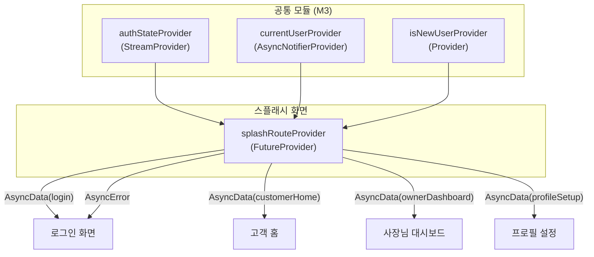

# 스플래시 — 상태 설계

> 최종 수정일: 2026-02-24

---

## 상태 데이터 (State)

| 이름 | 타입 | 초기값 | 설명 |
|------|------|--------|------|
| `splashRouteState` | `AsyncValue<SplashRoute>` | `AsyncLoading` | 인증 확인 결과에 따른 라우팅 목적지 |

### SplashRoute (Enum)

| 값 | 조건 | 라우팅 목적지 |
|----|------|-------------|
| `login` | 세션 없음 (미인증) | `/login` |
| `customerHome` | 세션 있음 + role = `customer` | `/customer/home` |
| `ownerDashboard` | 세션 있음 + role = `shop_owner` | `/owner/dashboard` |
| `profileSetup` | 세션 있음 + users 테이블에 레코드 없음 | `/profile-setup` |

---

## 비-상태 데이터 (Non-State)

| 이름 | 출처 | 설명 |
|------|------|------|
| `authState` | `authStateProvider` (M3) | Supabase Auth 세션 스트림. 공통 모듈에서 관리하므로 이 화면에서 별도로 관리하지 않음 |
| `currentUser` | `currentUserProvider` (M3) | users 테이블의 현재 사용자 레코드. role 판별에 사용 |
| `isNewUser` | `isNewUserProvider` (M3) | 신규 사용자 여부 (users 테이블에 레코드 없음) |

---

## 상태 변화 조건표

| 트리거 | 상태 변화 | UI 변화 |
|--------|----------|---------|
| 화면 진입 | `AsyncLoading` | 로고 페이드인 애니메이션 + 로딩 스피너 표시 |
| 인증 확인 완료 (미인증) | `AsyncData(SplashRoute.login)` | 최소 1.5초 대기 후 로그인 화면으로 페이드아웃 전환 |
| 인증 확인 완료 (기존 고객) | `AsyncData(SplashRoute.customerHome)` | 최소 1.5초 대기 후 고객 홈으로 페이드아웃 전환 |
| 인증 확인 완료 (기존 사장님) | `AsyncData(SplashRoute.ownerDashboard)` | 최소 1.5초 대기 후 대시보드로 페이드아웃 전환 |
| 인증 확인 완료 (신규 사용자) | `AsyncData(SplashRoute.profileSetup)` | 최소 1.5초 대기 후 프로필 설정으로 페이드아웃 전환 |
| 인증 확인 실패 (네트워크 오류 등) | `AsyncError` | 5초 타임아웃 후 로그인 화면으로 폴백 이동 |

---

## Provider 구조

---

## 노출 인터페이스

### 읽기 (State)

| Provider | 타입 | 설명 |
|----------|------|------|
| `splashRouteProvider` | `FutureProvider<SplashRoute>` | 인증 상태 확인 후 라우팅 목적지를 반환. 최소 1.5초 대기를 포함하며, 5초 타임아웃 시 `login`으로 폴백 |

### 쓰기 (Actions)

이 화면은 사용자 입력이 없는 표시 전용 화면이므로 쓰기 액션이 없다. 라우팅은 `splashRouteProvider`의 결과에 따라 go_router 리다이렉트에서 자동 처리한다.
