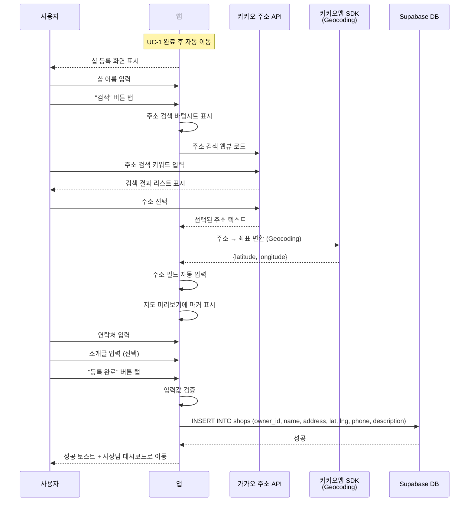

# 유스케이스: UC-2 샵 등록

## 1. 개요

### 1.1 목적
샵 사장님이 프로필 설정(UC-1) 완료 후, 운영할 샵의 기본 정보(이름, 주소, 연락처, 소개글)를 등록하여 서비스 이용을 시작한다. 주소 입력 시 카카오 주소 API + 카카오맵 Geocoding으로 좌표를 자동 변환하여 고객의 주변 샵 검색과 길찾기 기능을 지원한다.

### 1.2 범위
- **포함**: 샵 정보 입력(이름, 주소, 연락처, 소개글), 카카오 주소 API를 통한 주소 검색, 카카오맵 Geocoding으로 좌표 변환, 지도 미리보기, `shops` 테이블 생성
- **제외**: 소셜 로그인 및 프로필 설정(UC-1에서 다룸), 샵 정보 수정, QR코드 생성, 샵 페이지 관리

### 1.3 액터
- **주요 액터**: 샵 사장님 (role=`shop_owner`, 프로필 설정 완료 상태)
- **부 액터**: 카카오 주소 API (Daum 우편번호 서비스), 카카오맵 SDK (Geocoding), Supabase DB (`shops` 테이블)

---

## 2. 선행 조건

- UC-1(소셜 로그인 + 프로필 설정)이 완료되었다
- `users` 테이블에 `role='shop_owner'`인 레코드가 존재한다
- Supabase Auth 세션이 활성 상태이다
- `shops` 테이블에 해당 사용자의 샵이 등록되어 있지 않다 (`owner_id`에 대한 레코드 없음)
- 네트워크에 연결되어 있다

---

## 3. 기본 흐름

> 샵 정보 입력 → 주소 검색 + 좌표 변환 → 등록 완료 → 사장님 대시보드

### 3.1 단계별 흐름

1. **앱**: 프로필 설정(UC-1) 완료 후 샵 등록 화면(`owner-shop-signup`)으로 자동 이동한다
   - **입력**: 없음
   - **처리**: 스텝 인디케이터를 2단계 활성 상태로 표시 (`✓ 정보 입력 ─── ● 샵 등록`)
   - **출력**: 빈 샵 등록 폼 표시, 지도 미리보기 비활성, 등록 버튼 비활성

2. **사용자**: 샵 이름을 입력한다
   - **입력**: 샵 이름 (1~50자)
   - **처리**: `shopName` 상태 업데이트, 실시간 검증
   - **출력**: 입력된 샵 이름 표시

3. **사용자**: "검색" 버튼 또는 주소 입력 필드를 탭한다
   - **입력**: 탭 이벤트
   - **처리**: 주소 검색 바텀시트를 표시한다
   - **출력**: 카카오 주소 API(Daum 우편번호 서비스) 웹뷰가 로드된 바텀시트 표시

4. **사용자**: 주소 검색 바텀시트에서 도로명, 건물명 또는 지번으로 주소를 검색한다
   - **입력**: 검색 키워드
   - **처리**: 카카오 주소 API가 검색 결과 목록을 반환한다
   - **출력**: 주소 검색 결과 리스트 표시

5. **사용자**: 검색 결과에서 주소를 선택한다
   - **입력**: 선택된 주소
   - **처리**: 카카오맵 SDK의 Geocoding API로 주소를 좌표(위도, 경도)로 변환한다
   - **출력**: 주소 텍스트가 주소 필드에 자동 입력, 좌표(`latitude`, `longitude`) 자동 설정, 바텀시트 닫힘

6. **앱**: 지도 미리보기에 해당 좌표를 마커로 표시한다
   - **입력**: latitude, longitude
   - **처리**: 카카오맵을 줌 레벨 16으로 해당 좌표 중심에 표시, 샵 마커를 배치한다
   - **출력**: 지도 미리보기에 샵 위치 마커가 표시됨

7. **사용자**: 샵 연락처를 입력한다
   - **입력**: 전화번호 (010-XXXX-XXXX 또는 02-XXX-XXXX 등)
   - **처리**: `phone` 상태 업데이트, 자동 하이픈 삽입, 실시간 검증
   - **출력**: 포맷팅된 연락처 표시

8. **사용자**: 소개글을 입력한다 (선택)
   - **입력**: 소개글 (0~200자)
   - **처리**: `description` 상태 업데이트, 글자 수 카운터 갱신
   - **출력**: 실시간 텍스트 반영, "N/200" 카운터 표시

9. **앱**: 필수 필드(샵 이름, 주소, 연락처)가 모두 입력되면 "등록 완료" 버튼을 활성화한다
   - **출력**: 등록 버튼이 활성 상태로 전환 (배경색 `#F97316`)

10. **사용자**: "등록 완료" 버튼을 탭한다
    - **입력**: 등록 버튼 탭
    - **처리**: 클라이언트 전체 입력값 검증 수행
    - **출력**: 검증 성공 시 버튼 로딩 상태 전환, 모든 입력 필드 비활성화

11. **앱**: `shops` 테이블에 샵 정보를 INSERT한다
    - **입력**: `{owner_id: auth.currentUser.id, name, address, latitude, longitude, phone, description}`
    - **처리**: Supabase `shops` 테이블에 INSERT
    - **출력**: 레코드 생성 성공

12. **앱**: "샵이 등록되었습니다!" 성공 토스트를 표시하고 사장님 대시보드로 이동한다
    - **출력**: 사장님 대시보드 화면 (`owner-dashboard`) 표시

### 3.2 시퀀스 다이어그램

---

## 4. 대안 흐름

### 4.1 주소 재검색

**분기 조건**: 기본 흐름 6단계 이후, 사용자가 주소를 잘못 선택하여 다시 검색하고 싶은 경우

1. 사용자가 "검색" 버튼을 다시 탭한다
2. 주소 검색 바텀시트가 다시 표시된다
3. 새로운 주소를 검색하고 선택한다
4. 기존 주소 텍스트와 좌표가 새로운 값으로 덮어씌워진다
5. 지도 미리보기가 새로운 좌표로 갱신된다

**결과**: 주소와 좌표가 새로운 값으로 변경됨

### 4.2 소개글 미입력

**분기 조건**: 기본 흐름 8단계에서 사용자가 소개글을 입력하지 않는 경우

1. 소개글 필드를 비워둔 채 "등록 완료" 버튼을 탭한다
2. `description`이 `null`로 저장된다
3. 나머지 처리는 기본 흐름과 동일하다

**결과**: 소개글이 NULL인 상태로 샵 등록 완료

---

## 5. 예외 흐름

### 5.1 카카오 주소 API 검색 실패

**발생 조건**: 주소 검색 바텀시트에서 카카오 주소 API 웹뷰 로딩에 실패한 경우

**처리**:
1. 바텀시트 내에 "주소 검색을 사용할 수 없습니다" 안내 메시지를 표시한다
2. 사용자가 바텀시트를 닫고 재시도할 수 있도록 한다

**사용자 메시지**: "주소 검색에 실패했습니다. 다시 시도해주세요"

### 5.2 Geocoding 좌표 변환 실패

**발생 조건**: 카카오맵 SDK의 Geocoding API가 선택된 주소에 대한 좌표 변환에 실패한 경우

**처리**:
1. 주소 텍스트는 필드에 입력하되, 좌표가 미설정 상태임을 안내한다
2. 에러 스낵바를 표시한다
3. 사용자가 주소를 다시 검색하여 재시도할 수 있도록 한다
4. 좌표가 미설정 상태에서는 "등록 완료" 버튼을 비활성 상태로 유지한다

**사용자 메시지**: "주소의 좌표를 확인할 수 없습니다. 다른 주소로 다시 검색해주세요"

### 5.3 네트워크 오류 (등록 시)

**발생 조건**: `shops` 테이블 INSERT 중 네트워크 연결이 끊긴 경우

**처리**:
1. 버튼 로딩 상태를 해제한다
2. 에러 스낵바를 표시한다
3. 입력값을 그대로 유지하여 재시도할 수 있도록 한다

**사용자 메시지**: "네트워크 연결을 확인해주세요"

### 5.4 샵 등록 서버 오류

**발생 조건**: `shops` 테이블 INSERT 중 서버 측 오류가 발생한 경우 (DB 제약조건 위반 등)

**처리**:
1. 버튼 로딩 상태를 해제한다
2. 에러 스낵바를 표시한다
3. 입력값을 그대로 유지하여 재시도할 수 있도록 한다

**사용자 메시지**: "등록에 실패했습니다. 다시 시도해주세요"

### 5.5 중복 샵 등록 시도

**발생 조건**: `shops` 테이블의 `owner_id` UNIQUE 제약조건에 의해 동일 사용자가 이미 샵을 등록한 경우

**처리**:
1. DB에서 UNIQUE 위반 에러가 반환된다
2. 에러 스낵바를 표시한다
3. 사장님 대시보드로 이동한다 (이미 등록된 샵이 있으므로)

**사용자 메시지**: "이미 등록된 샵이 있습니다"

### 5.6 입력값 검증 실패

**발생 조건**: "등록 완료" 버튼 탭 시 필수 입력값이 유효하지 않은 경우

**처리**:
1. 첫 번째 에러 필드로 스크롤한다
2. 에러 메시지를 해당 필드 아래에 표시한다
   - 샵 이름 빈 값: "샵 이름을 입력해주세요"
   - 샵 이름 길이 초과: "샵 이름은 1자 이상 50자 이하로 입력해주세요"
   - 주소 미검색: "주소를 검색해주세요"
   - 연락처 빈 값: "연락처를 입력해주세요"
   - 연락처 형식 오류: "올바른 연락처를 입력해주세요"

**사용자 메시지**: 각 필드별 에러 메시지 (위 참조)

---

## 6. 후행 조건

### 6.1 성공 시
- **DB 변경**: `shops` 테이블에 신규 레코드 생성 (`id`=UUIDv7, `owner_id`=현재 사용자 ID, `name`, `address`, `latitude`, `longitude`, `phone`, `description`)
- **시스템 상태**: 사장님 대시보드 화면 표시, 샵 등록 완료 상태
- **부수 효과**: 없음 (QR코드는 대시보드에서 별도로 확인)

### 6.2 실패 시
- **롤백**: `shops` INSERT 실패 시 DB 변경 없음
- **시스템 상태**: 샵 등록 화면에 머무름, 입력값 유지 (재시도 가능)

---

## 7. 테스트 시나리오

### 7.1 성공 케이스

| ID | 시나리오 | 입력값 | 기대 결과 |
|----|----------|--------|----------|
| TC-2-01 | 기본 샵 등록 (모든 필드 입력) | name="OO 거트 스트링샵", address="서울시 강남구 역삼동 123", phone="010-1234-5678", description="최고의 거트 전문점" | `shops` 테이블에 레코드 생성, 좌표 포함, 대시보드로 이동 |
| TC-2-02 | 소개글 미입력으로 등록 | name="배드민턴 프로샵", address="서울시 서초구...", phone="02-123-4567", description="" | `shops` 테이블에 레코드 생성 (description=NULL), 대시보드로 이동 |
| TC-2-03 | 주소 검색 후 지도 미리보기 확인 | 주소 검색으로 "서울시 강남구 테헤란로 123" 선택 | 지도 미리보기에 해당 좌표의 마커가 표시됨 |
| TC-2-04 | 주소 재검색 | 첫 번째 주소 선택 후 다시 검색하여 두 번째 주소 선택 | 두 번째 주소와 좌표로 덮어씌워짐, 지도 갱신 |
| TC-2-05 | 일반 전화번호 형식 | phone="02-123-4567" | 유효한 연락처로 인정, 등록 성공 |
| TC-2-06 | 스텝 인디케이터 표시 | 화면 진입 시 | "✓ 정보 입력 ─── ● 샵 등록" 2단계 활성 표시 |

### 7.2 실패 케이스

| ID | 시나리오 | 입력값 | 기대 결과 |
|----|----------|--------|----------|
| TC-2-07 | 샵 이름 빈 값으로 제출 | name="", address 입력 완료, phone 입력 완료 | "샵 이름을 입력해주세요" 에러 메시지 |
| TC-2-08 | 주소 미검색으로 제출 | name 입력 완료, address="", phone 입력 완료 | "주소를 검색해주세요" 에러 메시지 |
| TC-2-09 | 연락처 빈 값으로 제출 | name 입력 완료, address 입력 완료, phone="" | "연락처를 입력해주세요" 에러 메시지 |
| TC-2-10 | 잘못된 연락처 형식 | phone="1234" | "올바른 연락처를 입력해주세요" 에러 메시지 |
| TC-2-11 | Geocoding 좌표 변환 실패 | 주소 선택 후 Geocoding API 오류 | "주소의 좌표를 확인할 수 없습니다. 다른 주소로 다시 검색해주세요" 에러 표시, 등록 버튼 비활성 |
| TC-2-12 | 네트워크 오류로 등록 실패 | 유효한 입력값, 네트워크 미연결 | "네트워크 연결을 확인해주세요" 에러 스낵바, 입력값 유지 |
| TC-2-13 | 중복 샵 등록 시도 | 이미 shops에 owner_id로 레코드 존재 | "이미 등록된 샵이 있습니다" 에러 스낵바, 대시보드로 이동 |
| TC-2-14 | 샵 이름 50자 초과 | name="가"x51 | "샵 이름은 1자 이상 50자 이하로 입력해주세요" 에러 메시지 |
| TC-2-15 | 소개글 200자 초과 시도 | description 200자 이상 입력 시도 | 200자에서 입력이 차단됨 (maxLength) |

---

## 8. 관련 유스케이스

- **선행**: UC-1 소셜 로그인 + 프로필 설정 (사장님 역할로 프로필 설정 완료 필수)
- **후행**: 없음 (대시보드에서 작업 관리, QR코드 확인 등 시작)
- **연관**: 없음
