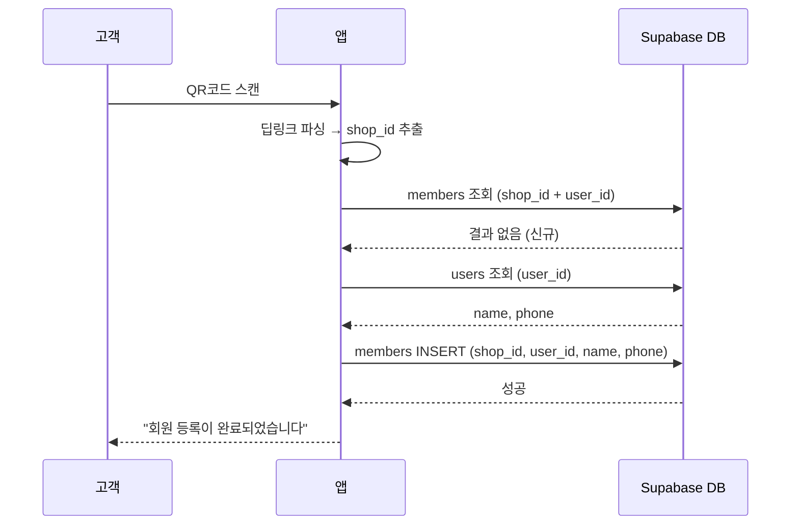
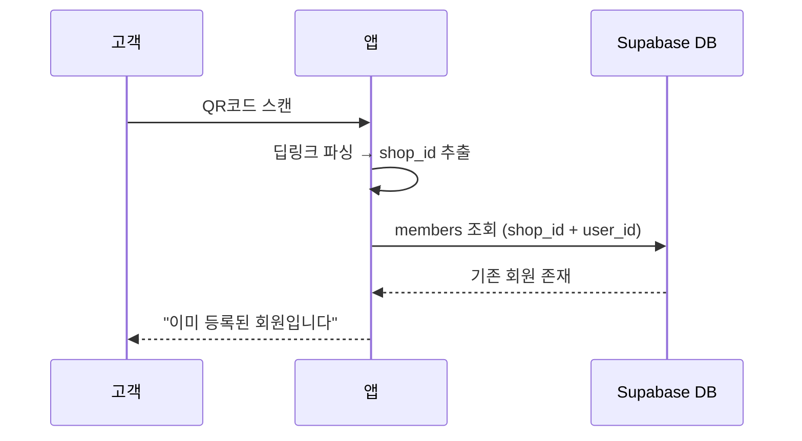
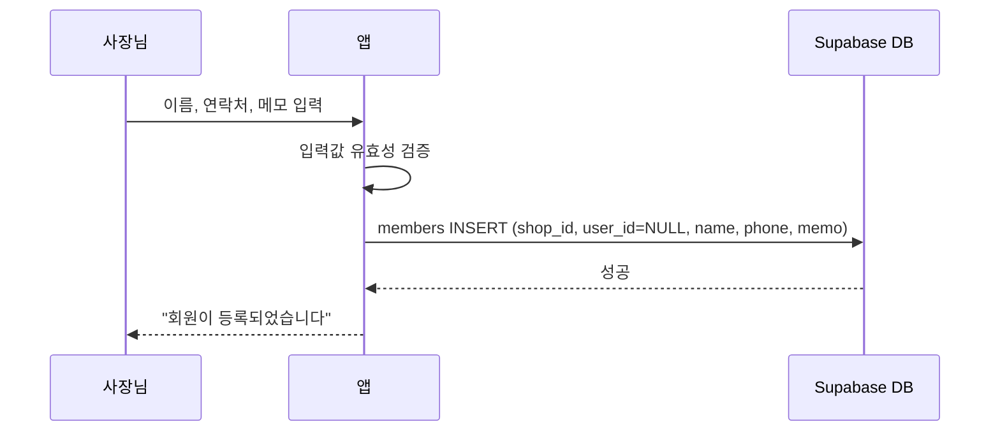
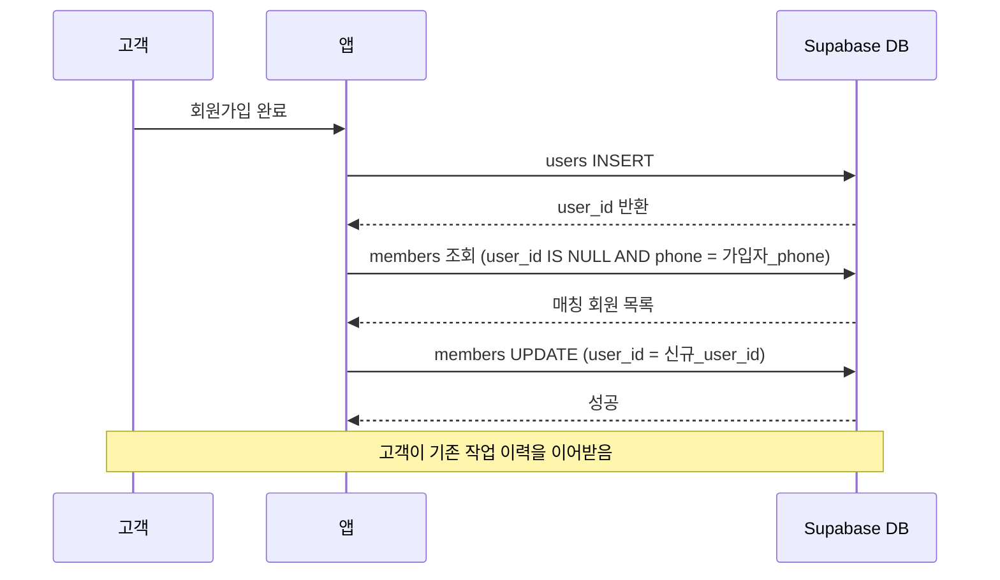

# 유스케이스: UC-3 회원 등록 (QR + 수동)

## 1. 개요

### 1.1 목적
고객이 샵의 QR코드를 스캔하거나, 사장님이 수동으로 입력하여 샵에 회원을 등록한다. 앱 미가입 고객도 수동 등록 후 추후 앱 가입 시 전화번호 기반으로 자동 매칭되어, 기존 작업 이력을 이어받을 수 있도록 한다.

### 1.2 범위
- **포함**: QR 스캔 회원 등록, 수동 회원 등록, 전화번호 기반 자동 매칭
- **제외**: 회원 정보 수정, 회원 삭제, 회원 목록 조회, 앱 회원가입(인증)

### 1.3 액터
- **주요 액터**: 고객 (QR 스캔), 샵 사장님 (수동 등록)
- **부 액터**: Supabase (DB, Auth), 딥링크 서비스

---

## 2. 선행 조건

- 사장님이 앱에 가입하고 샵을 등록한 상태 (`shops` 레코드 존재)
- QR 스캔 등록의 경우: 고객이 앱에 가입한 상태 (`users` 레코드 존재, role = 'customer')
- 수동 등록의 경우: 사장님이 로그인한 상태

---

## 3. 기본 흐름 — QR 스캔 회원 등록

### 3.1 단계별 흐름

1. **고객**: 샵에 비치된 QR코드를 스캔한다
   - **입력**: QR코드 (딥링크 URL: `https://gutalarm.app/shop/{shop_id}`)
   - **처리**: 앱이 딥링크를 파싱하여 `shop_id`를 추출한다
   - **출력**: `shop_id` 식별

2. **앱**: 현재 로그인된 사용자의 기존 회원 여부를 확인한다
   - **입력**: `shop_id`, 현재 사용자의 `user_id`
   - **처리**: `members` 테이블에서 `shop_id + user_id` 조합으로 조회한다
   - **출력**: 기존 회원 없음 (NULL)

3. **앱**: `users` 테이블에서 사용자 정보를 가져온다
   - **입력**: 현재 사용자의 `user_id`
   - **처리**: `users` 테이블에서 `name`, `phone`을 조회한다
   - **출력**: 사용자 이름, 연락처

4. **앱**: `members` 테이블에 신규 회원을 등록한다
   - **입력**: `shop_id`, `user_id`, `name`, `phone`
   - **처리**: `members` 테이블에 INSERT (visit_count = 0)
   - **출력**: 신규 `member` 레코드 생성

5. **앱**: 등록 완료 화면을 표시한다
   - **처리**: "회원 등록이 완료되었습니다" 안내 메시지 표시
   - **출력**: 샵 이름과 함께 등록 완료 화면

### 3.2 시퀀스 다이어그램

---

## 4. 대안 흐름

### 4.1 이미 등록된 회원 (QR 스캔)

**분기 조건**: 기본 흐름 2단계에서 `members` 테이블에 기존 레코드가 존재하는 경우

1. **앱**: `members` 테이블 조회 결과 기존 회원이 존재한다
2. **앱**: "이미 등록된 회원입니다" 안내 메시지를 표시한다

**결과**: 추가 등록 없이 안내 메시지만 표시

### 4.2 수동 회원 등록 (사장님)

**분기 조건**: 고객이 앱에 가입하지 않은 상태이거나, QR 스캔이 불가능한 상황

1. **사장님**: 회원 등록 화면에서 이름과 연락처를 입력한다
   - **입력**: `name` (필수), `phone` (필수), `memo` (선택)
   - **처리**: 입력값 유효성 검증

2. **앱**: `members` 테이블에서 동일 연락처 중복을 확인한다
   - **입력**: `shop_id`, `phone`
   - **처리**: `UNIQUE(shop_id, phone)` 제약조건으로 중복 확인

3. **앱**: `members` 테이블에 신규 회원을 등록한다
   - **입력**: `shop_id`, `user_id = NULL`, `name`, `phone`, `memo`
   - **처리**: `members` 테이블에 INSERT
   - **출력**: 신규 `member` 레코드 생성 (user_id = NULL)

4. **앱**: 등록 완료 메시지를 표시한다
   - **출력**: "회원이 등록되었습니다" 토스트

**결과**: `user_id = NULL`인 회원 레코드가 생성됨. 추후 고객이 앱에 가입하면 자동 매칭 가능

### 4.3 전화번호 기반 자동 매칭

**분기 조건**: 수동 등록된 회원(user_id = NULL)의 고객이 추후 앱에 가입하는 경우

1. **고객**: 앱에 회원가입을 완료한다
   - **입력**: 이름, 이메일, 비밀번호, 연락처
   - **처리**: `users` 테이블에 INSERT

2. **시스템**: `members` 테이블에서 동일 전화번호를 가진 미매칭 레코드를 검색한다
   - **입력**: 가입된 사용자의 `phone`
   - **처리**: `members` 테이블에서 `user_id IS NULL AND phone = 가입자_phone` 조회

3. **시스템**: 매칭되는 회원 레코드의 `user_id`를 업데이트한다
   - **입력**: 매칭된 `member.id`, 신규 `user_id`
   - **처리**: `members` 테이블 UPDATE (`user_id = 신규_user_id`)
   - **출력**: 기존 회원 레코드와 사용자 계정이 연결됨

**결과**: 고객이 기존 작업 이력을 포함한 회원 정보를 이어받음

---

## 5. 예외 흐름

### 5.1 유효하지 않은 QR코드

**발생 조건**: QR코드가 거트알림 딥링크 형식이 아니거나 존재하지 않는 `shop_id`를 포함하는 경우

**처리**:
1. 앱이 딥링크 URL 형식을 검증한다
2. `shop_id`가 유효하지 않으면 에러 처리

**에러 코드**: `INVALID_QR` (400)
**사용자 메시지**: "유효하지 않은 QR코드입니다"

### 5.2 카메라 권한 거부

**발생 조건**: 고객이 QR 스캔을 시도하지만 카메라 권한이 없는 경우

**처리**:
1. 카메라 권한 요청 다이얼로그를 표시한다
2. 거부 시 안내 메시지와 설정 이동 링크를 제공한다

**사용자 메시지**: "카메라 권한이 필요합니다. 설정에서 권한을 허용해주세요."

### 5.3 동일 연락처 중복 등록

**발생 조건**: 수동 등록 시 동일 `shop_id + phone` 조합이 이미 존재하는 경우

**처리**:
1. `UNIQUE(shop_id, phone)` 제약조건 위반 에러를 감지한다
2. 사용자에게 중복 안내 메시지를 표시한다

**에러 코드**: `DUPLICATE_PHONE` (409)
**사용자 메시지**: "이미 등록된 연락처입니다"

### 5.4 네트워크 오류

**발생 조건**: 회원 등록 중 네트워크 연결이 끊어진 경우

**처리**:
1. 등록 요청이 실패한다
2. 에러 스낵바를 표시한다

**사용자 메시지**: "네트워크 연결을 확인해주세요"

---

## 6. 후행 조건

### 6.1 성공 시
- **DB 변경**: `members` 테이블에 신규 레코드 INSERT
- **시스템 상태**: 고객이 해당 샵의 회원으로 등록됨
- **부수 효과**: 없음 (회원 등록 시 별도 알림 없음)

### 6.2 실패 시
- **롤백**: `members` INSERT가 롤백됨 (트랜잭션)
- **시스템 상태**: 변경 없음

---

## 7. 테스트 시나리오

### 7.1 성공 케이스

| ID | 시나리오 | 입력값 | 기대 결과 |
|----|----------|--------|-----------|
| TC-3-01 | QR 스캔 신규 회원 등록 | 유효한 shop_id, 로그인된 고객 | `members` INSERT 성공, user_id 연결됨 |
| TC-3-02 | QR 스캔 기존 회원 | 이미 등록된 shop_id + user_id | "이미 등록된 회원입니다" 표시, 추가 INSERT 없음 |
| TC-3-03 | 수동 등록 (앱 미가입 고객) | name="홍길동", phone="010-1234-5678" | `members` INSERT 성공, user_id = NULL |
| TC-3-04 | 수동 등록 + 메모 | name, phone, memo="단골 고객" | `members` INSERT 성공, memo 저장됨 |
| TC-3-05 | 전화번호 자동 매칭 | 수동 등록 후 동일 phone으로 앱 가입 | `members.user_id` UPDATE 성공 |
| TC-3-06 | 여러 샵에 동일 고객 등록 | 같은 user_id, 다른 shop_id | 각 샵에 별도 member 레코드 생성 |

### 7.2 실패 케이스

| ID | 시나리오 | 입력값 | 기대 결과 |
|----|----------|--------|-----------|
| TC-3-07 | 유효하지 않은 QR코드 | 잘못된 URL 형식 | "유효하지 않은 QR코드입니다" 에러 |
| TC-3-08 | 존재하지 않는 shop_id | 삭제된 샵의 QR코드 | "유효하지 않은 QR코드입니다" 에러 |
| TC-3-09 | 카메라 권한 거부 | 권한 없음 | 권한 요청 → 설정 이동 안내 |
| TC-3-10 | 동일 연락처 중복 등록 | 같은 shop_id + phone | "이미 등록된 연락처입니다" 에러 |
| TC-3-11 | 수동 등록 이름 미입력 | name="" | 유효성 검증 실패, 필드 에러 표시 |
| TC-3-12 | 수동 등록 연락처 미입력 | phone="" | 유효성 검증 실패, 필드 에러 표시 |
| TC-3-13 | 네트워크 오류 | 네트워크 끊김 상태 | "네트워크 연결을 확인해주세요" 에러 |

---

## 8. 관련 유스케이스

- **선행**: UC-1 회원가입 (고객/사장님), UC-2 샵 등록
- **후행**: UC-4 작업 접수 (회원 등록 후 작업 접수 가능)
- **연관**: UC-5 회원 관리 (등록된 회원 조회/수정)
